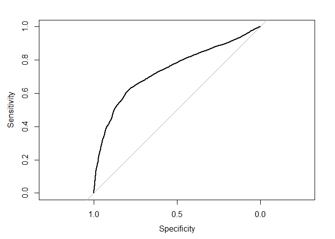

Actividad Ayudantia 10
================

## Objetivo

Para esta ayudantia tendran que realizar el metodo de analisis bayesiano
para el data set de tarjetas de credito (dentro del bloc de notas podran
encontrar el link que la explicacion de las variables del data set). El
objetivo para ese data set es determinar si la persona fallara o no en
el pago de su credito a partir de las variables del dataset

## Importar Librerías

Estas son las librerías necesarias para trabajar en la actividad de esta
ayudantía.

``` r
library(tidyverse)
library(e1071)
library(caret)
library(rstan)
library(rstanarm)
library(pROC)
library(ROCR)
```

## Cargar Datos

Luego debemos cargar los datos necesarios para poder trabajar. En donde
primero establecemos nuestro directorio de trabajo y luego cargar la
base de datos en una variable.

``` r
setwd("C:/Users/amanh/OneDrive/Documentos/GitHub/Actividades-Ayudantia/Actividad10")
credit_card <- read.csv("UCI_Credit_Card.csv", sep = ",")
```

## Limpieza de datos

En este punto tenemos que realizar la limpieza de datos, para poder
trabajar de manera correcta sin tener ningun tipo de inconvenientes por
alguna situación de la base de datos.

### Búsqueda de datos faltantes

Lo primero que debemos hacer es revisar si existen datos faltantes en
nuestra base de datos, esto es si tienen el valor de NA.

Para esto utilizamos la función summary de R base y verificamos si es
que hay datos NA.

``` r
summary(credit_card)
```

    ##        ID          LIMIT_BAL            SEX          EDUCATION    
    ##  Min.   :    1   Min.   :  10000   Min.   :1.000   Min.   :0.000  
    ##  1st Qu.: 7501   1st Qu.:  50000   1st Qu.:1.000   1st Qu.:1.000  
    ##  Median :15000   Median : 140000   Median :2.000   Median :2.000  
    ##  Mean   :15000   Mean   : 167484   Mean   :1.604   Mean   :1.853  
    ##  3rd Qu.:22500   3rd Qu.: 240000   3rd Qu.:2.000   3rd Qu.:2.000  
    ##  Max.   :30000   Max.   :1000000   Max.   :2.000   Max.   :6.000  
    ##     MARRIAGE          AGE            PAY_0             PAY_2        
    ##  Min.   :0.000   Min.   :21.00   Min.   :-2.0000   Min.   :-2.0000  
    ##  1st Qu.:1.000   1st Qu.:28.00   1st Qu.:-1.0000   1st Qu.:-1.0000  
    ##  Median :2.000   Median :34.00   Median : 0.0000   Median : 0.0000  
    ##  Mean   :1.552   Mean   :35.49   Mean   :-0.0167   Mean   :-0.1338  
    ##  3rd Qu.:2.000   3rd Qu.:41.00   3rd Qu.: 0.0000   3rd Qu.: 0.0000  
    ##  Max.   :3.000   Max.   :79.00   Max.   : 8.0000   Max.   : 8.0000  
    ##      PAY_3             PAY_4             PAY_5             PAY_6        
    ##  Min.   :-2.0000   Min.   :-2.0000   Min.   :-2.0000   Min.   :-2.0000  
    ##  1st Qu.:-1.0000   1st Qu.:-1.0000   1st Qu.:-1.0000   1st Qu.:-1.0000  
    ##  Median : 0.0000   Median : 0.0000   Median : 0.0000   Median : 0.0000  
    ##  Mean   :-0.1662   Mean   :-0.2207   Mean   :-0.2662   Mean   :-0.2911  
    ##  3rd Qu.: 0.0000   3rd Qu.: 0.0000   3rd Qu.: 0.0000   3rd Qu.: 0.0000  
    ##  Max.   : 8.0000   Max.   : 8.0000   Max.   : 8.0000   Max.   : 8.0000  
    ##    BILL_AMT1         BILL_AMT2        BILL_AMT3         BILL_AMT4      
    ##  Min.   :-165580   Min.   :-69777   Min.   :-157264   Min.   :-170000  
    ##  1st Qu.:   3559   1st Qu.:  2985   1st Qu.:   2666   1st Qu.:   2327  
    ##  Median :  22382   Median : 21200   Median :  20089   Median :  19052  
    ##  Mean   :  51223   Mean   : 49179   Mean   :  47013   Mean   :  43263  
    ##  3rd Qu.:  67091   3rd Qu.: 64006   3rd Qu.:  60165   3rd Qu.:  54506  
    ##  Max.   : 964511   Max.   :983931   Max.   :1664089   Max.   : 891586  
    ##    BILL_AMT5        BILL_AMT6          PAY_AMT1         PAY_AMT2      
    ##  Min.   :-81334   Min.   :-339603   Min.   :     0   Min.   :      0  
    ##  1st Qu.:  1763   1st Qu.:   1256   1st Qu.:  1000   1st Qu.:    833  
    ##  Median : 18105   Median :  17071   Median :  2100   Median :   2009  
    ##  Mean   : 40311   Mean   :  38872   Mean   :  5664   Mean   :   5921  
    ##  3rd Qu.: 50191   3rd Qu.:  49198   3rd Qu.:  5006   3rd Qu.:   5000  
    ##  Max.   :927171   Max.   : 961664   Max.   :873552   Max.   :1684259  
    ##     PAY_AMT3         PAY_AMT4         PAY_AMT5           PAY_AMT6       
    ##  Min.   :     0   Min.   :     0   Min.   :     0.0   Min.   :     0.0  
    ##  1st Qu.:   390   1st Qu.:   296   1st Qu.:   252.5   1st Qu.:   117.8  
    ##  Median :  1800   Median :  1500   Median :  1500.0   Median :  1500.0  
    ##  Mean   :  5226   Mean   :  4826   Mean   :  4799.4   Mean   :  5215.5  
    ##  3rd Qu.:  4505   3rd Qu.:  4013   3rd Qu.:  4031.5   3rd Qu.:  4000.0  
    ##  Max.   :896040   Max.   :621000   Max.   :426529.0   Max.   :528666.0  
    ##  default.payment.next.month
    ##  Min.   :0.0000            
    ##  1st Qu.:0.0000            
    ##  Median :0.0000            
    ##  Mean   :0.2212            
    ##  3rd Qu.:0.0000            
    ##  Max.   :1.0000

Al observar el resultado de la funcion summary podemos verificar que no
hay datos faltantes, por ende podemos empezar con los análisis asignados
para esta actividad.

# Modelo Batesiano

## Eliminar filas que no se van a utilizar

Segun lo visto en la ayudantía, procederé primero a eliminar aquellas
variables que no aportarán para nuestro análisis. Estas son las que son
de status de pago y el monto de pago.

``` r
credit_card$LIMIT_BAL = NULL
credit_card$BILL_AMT1 = NULL
credit_card$BILL_AMT2 = NULL
credit_card$BILL_AMT3 = NULL
credit_card$BILL_AMT4 = NULL
credit_card$BILL_AMT5 = NULL
credit_card$BILL_AMT6 = NULL
credit_card$PAY_AMT1 = NULL
credit_card$PAY_AMT2 = NULL
credit_card$PAY_AMT3 = NULL
credit_card$PAY_AMT4 = NULL
credit_card$PAY_AMT5 = NULL
credit_card$PAY_AMT6 = NULL
```

Ahora se realizará el análisis segun bayes, a partir de lo visto en
clases.

``` r
modeloNB<- naiveBayes(default.payment.next.month ~ ., data = credit_card)
pred <- predict(modeloNB, credit_card, type ="raw")
modeloNB
```

    ## 
    ## Naive Bayes Classifier for Discrete Predictors
    ## 
    ## Call:
    ## naiveBayes.default(x = X, y = Y, laplace = laplace)
    ## 
    ## A-priori probabilities:
    ## Y
    ##      0      1 
    ## 0.7788 0.2212 
    ## 
    ## Conditional probabilities:
    ##    ID
    ## Y       [,1]     [,2]
    ##   0 15064.89 8684.552
    ##   1 14773.78 8571.617
    ## 
    ##    SEX
    ## Y       [,1]      [,2]
    ##   0 1.614150 0.4868058
    ##   1 1.567058 0.4955201
    ## 
    ##    EDUCATION
    ## Y       [,1]     [,2]
    ##   0 1.841337 0.806780
    ##   1 1.894665 0.728096
    ## 
    ##    MARRIAGE
    ## Y       [,1]      [,2]
    ##   0 1.558637 0.5207942
    ##   1 1.528029 0.5254326
    ## 
    ##    AGE
    ## Y       [,1]     [,2]
    ##   0 35.41727 9.077355
    ##   1 35.72574 9.693438
    ## 
    ##    PAY_0
    ## Y         [,1]      [,2]
    ##   0 -0.2112224 0.9524638
    ##   1  0.6681736 1.3832521
    ## 
    ##    PAY_2
    ## Y         [,1]     [,2]
    ##   0 -0.3019175 1.035191
    ##   1  0.4582580 1.502243
    ## 
    ##    PAY_3
    ## Y         [,1]     [,2]
    ##   0 -0.3162558 1.048378
    ##   1  0.3621157 1.499401
    ## 
    ##    PAY_4
    ## Y         [,1]     [,2]
    ##   0 -0.3556326 1.013162
    ##   1  0.2545208 1.508535
    ## 
    ##    PAY_5
    ## Y         [,1]      [,2]
    ##   0 -0.3894881 0.9775912
    ##   1  0.1678722 1.4828327
    ## 
    ##    PAY_6
    ## Y         [,1]     [,2]
    ##   0 -0.4056240 1.005930
    ##   1  0.1121157 1.485757

## Evaluación del modelo

Calculamos el AUC para evaluar la capacidad del modelo de predecir.

``` r
credit_card$prob <- pred[,2]
curva_roc <- roc(default.payment.next.month ~ prob, data = credit_card)
```

    ## Setting levels: control = 0, case = 1

    ## Setting direction: controls < cases

``` r
plot(curva_roc)    
```

<!-- -->

``` r
auc(curva_roc)
```

    ## Area under the curve: 0.7358

Podemos ver que el valor del AUC es de 74%, si bien no se encuentra en
un rango tan alto, obtuvimos un valor que se acerca bastante a 1. Por
ende, el modelo predice de buena manera.
