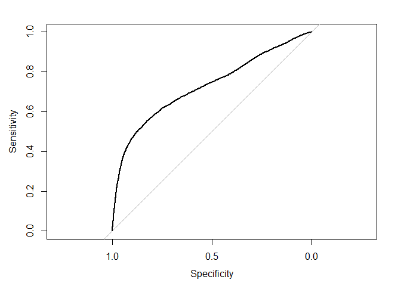

Ayudantía 11
================
Alejandro Manhood

## Actividad Ayudantía N°11

-   Para la actividad de esta ayudantía realizarán el análisis de árbol
    de decisión a partir de alguno de los dos data sets que quedaron
    subidos. Para el caso de Credit Card el objetivo será clasificar si
    el cliente va a pagar o no el credito que adeuda. Mientras para el
    caso de Hotel Bookings el objetivo será determinar si la reserva del
    hotel será o no cancelada. (Comparen los resultados obtenidos
    mediante árboles de decisión con los modelos de regresión logística,
    naive bayes y KNN)

## Cargamos las librerías

Cargamos las librerías que seran utilizadas para esta actividad.

``` r
library(plyr)
library(ggplot2)
library(tidyverse)
library(tidymodels)
library(discrim)
library(caret)
library(pROC)
library(ROCR)
library(e1071)
library(naivebayes)
```

## Cargar Datos

Luego debemos cargar los datos necesarios para poder trabajar. En donde
primero establecemos nuestro directorio de trabajo y luego cargar la
base de datos en una variable.

``` r
setwd("C:/Users/amanh/OneDrive/Documentos/GitHub/Actividades-Ayudantia/Actividad11")
credit_card <- read.csv("UCI_Credit_Card.csv", sep = ",")
```

Luego de esto se escala la data para que de esta manera no hayan
problemas por alguna diferencia de magnitud en los valores.

``` r
creditScale <- credit_card 
creditScale <- data.frame(scale(creditScale))
creditScale$default.payment.next.month <- rescale(creditScale$default.payment.next.month)
```

Teniendo esta data escalada, se procede a separar el data set en dos
nuevos, para de esta manera tener uno que sera para entrenar y otro para
testear.

``` r
creditSplit <- initial_split(credit_card,
                             prop = 0.7,
                             strata = NULL)
creditTrain <- training(creditSplit) %>% as.data.frame() 
creditTest <- testing(creditSplit) %>% as.data.frame()
```

## Pre Procesamiento de los datos

Antes de comenzar el análisis, es necesario hacer una limpieza de la
data para sacar todos los valores que sean NA. De esta manera evitaremos
problemas al momento de realizar los análisis futuros de este trabajo.

Esto se revisará con la función summary.

``` r
summary(creditTrain)
```

    ##        ID          LIMIT_BAL            SEX          EDUCATION    
    ##  Min.   :    1   Min.   :  10000   Min.   :1.000   Min.   :0.000  
    ##  1st Qu.: 7520   1st Qu.:  50000   1st Qu.:1.000   1st Qu.:1.000  
    ##  Median :15004   Median : 140000   Median :2.000   Median :2.000  
    ##  Mean   :14997   Mean   : 166994   Mean   :1.603   Mean   :1.854  
    ##  3rd Qu.:22467   3rd Qu.: 240000   3rd Qu.:2.000   3rd Qu.:2.000  
    ##  Max.   :29999   Max.   :1000000   Max.   :2.000   Max.   :6.000  
    ##     MARRIAGE          AGE            PAY_0              PAY_2        
    ##  Min.   :0.000   Min.   :21.00   Min.   :-2.00000   Min.   :-2.0000  
    ##  1st Qu.:1.000   1st Qu.:28.00   1st Qu.:-1.00000   1st Qu.:-1.0000  
    ##  Median :2.000   Median :34.00   Median : 0.00000   Median : 0.0000  
    ##  Mean   :1.554   Mean   :35.53   Mean   :-0.02595   Mean   :-0.1369  
    ##  3rd Qu.:2.000   3rd Qu.:42.00   3rd Qu.: 0.00000   3rd Qu.: 0.0000  
    ##  Max.   :3.000   Max.   :79.00   Max.   : 8.00000   Max.   : 8.0000  
    ##      PAY_3            PAY_4             PAY_5             PAY_6        
    ##  Min.   :-2.000   Min.   :-2.0000   Min.   :-2.0000   Min.   :-2.0000  
    ##  1st Qu.:-1.000   1st Qu.:-1.0000   1st Qu.:-1.0000   1st Qu.:-1.0000  
    ##  Median : 0.000   Median : 0.0000   Median : 0.0000   Median : 0.0000  
    ##  Mean   :-0.166   Mean   :-0.2231   Mean   :-0.2695   Mean   :-0.2985  
    ##  3rd Qu.: 0.000   3rd Qu.: 0.0000   3rd Qu.: 0.0000   3rd Qu.: 0.0000  
    ##  Max.   : 8.000   Max.   : 8.0000   Max.   : 8.0000   Max.   : 8.0000  
    ##    BILL_AMT1         BILL_AMT2        BILL_AMT3         BILL_AMT4      
    ##  Min.   :-165580   Min.   :-67526   Min.   : -61506   Min.   :-170000  
    ##  1st Qu.:   3494   1st Qu.:  2944   1st Qu.:   2686   1st Qu.:   2284  
    ##  Median :  22344   Median : 21181   Median :  20110   Median :  19000  
    ##  Mean   :  51006   Mean   : 48986   Mean   :  46963   Mean   :  43137  
    ##  3rd Qu.:  67033   3rd Qu.: 63871   3rd Qu.:  60191   3rd Qu.:  53995  
    ##  Max.   : 964511   Max.   :983931   Max.   :1664089   Max.   : 891586  
    ##    BILL_AMT5        BILL_AMT6          PAY_AMT1         PAY_AMT2      
    ##  Min.   :-81334   Min.   :-339603   Min.   :     0   Min.   :      0  
    ##  1st Qu.:  1747   1st Qu.:   1222   1st Qu.:  1000   1st Qu.:    836  
    ##  Median : 18184   Median :  17134   Median :  2100   Median :   2012  
    ##  Mean   : 40280   Mean   :  38813   Mean   :  5756   Mean   :   6073  
    ##  3rd Qu.: 50150   3rd Qu.:  49055   3rd Qu.:  5015   3rd Qu.:   5000  
    ##  Max.   :927171   Max.   : 961664   Max.   :873552   Max.   :1684259  
    ##     PAY_AMT3         PAY_AMT4           PAY_AMT5         PAY_AMT6     
    ##  Min.   :     0   Min.   :     0.0   Min.   :     0   Min.   :     0  
    ##  1st Qu.:   390   1st Qu.:   297.5   1st Qu.:   255   1st Qu.:   139  
    ##  Median :  1800   Median :  1500.0   Median :  1500   Median :  1500  
    ##  Mean   :  5290   Mean   :  4923.0   Mean   :  4827   Mean   :  5192  
    ##  3rd Qu.:  4505   3rd Qu.:  4027.0   3rd Qu.:  4057   3rd Qu.:  4000  
    ##  Max.   :896040   Max.   :621000.0   Max.   :417990   Max.   :527143  
    ##  default.payment.next.month
    ##  Min.   :0.000             
    ##  1st Qu.:0.000             
    ##  Median :0.000             
    ##  Mean   :0.221             
    ##  3rd Qu.:0.000             
    ##  Max.   :1.000

``` r
summary(creditTest)
```

    ##        ID          LIMIT_BAL           SEX          EDUCATION    
    ##  Min.   :   11   Min.   : 10000   Min.   :1.000   Min.   :0.000  
    ##  1st Qu.: 7482   1st Qu.: 50000   1st Qu.:1.000   1st Qu.:1.000  
    ##  Median :14988   Median :140000   Median :2.000   Median :2.000  
    ##  Mean   :15009   Mean   :168629   Mean   :1.605   Mean   :1.851  
    ##  3rd Qu.:22577   3rd Qu.:240000   3rd Qu.:2.000   3rd Qu.:2.000  
    ##  Max.   :30000   Max.   :800000   Max.   :2.000   Max.   :6.000  
    ##     MARRIAGE          AGE            PAY_0               PAY_2        
    ##  Min.   :0.000   Min.   :21.00   Min.   :-2.000000   Min.   :-2.0000  
    ##  1st Qu.:1.000   1st Qu.:28.00   1st Qu.:-1.000000   1st Qu.:-1.0000  
    ##  Median :2.000   Median :34.00   Median : 0.000000   Median : 0.0000  
    ##  Mean   :1.547   Mean   :35.38   Mean   : 0.004889   Mean   :-0.1264  
    ##  3rd Qu.:2.000   3rd Qu.:41.00   3rd Qu.: 0.000000   3rd Qu.: 0.0000  
    ##  Max.   :3.000   Max.   :75.00   Max.   : 8.000000   Max.   : 7.0000  
    ##      PAY_3             PAY_4            PAY_5             PAY_6        
    ##  Min.   :-2.0000   Min.   :-2.000   Min.   :-2.0000   Min.   :-2.0000  
    ##  1st Qu.:-1.0000   1st Qu.:-1.000   1st Qu.:-1.0000   1st Qu.:-1.0000  
    ##  Median : 0.0000   Median : 0.000   Median : 0.0000   Median : 0.0000  
    ##  Mean   :-0.1666   Mean   :-0.215   Mean   :-0.2584   Mean   :-0.2738  
    ##  3rd Qu.: 0.0000   3rd Qu.: 0.000   3rd Qu.: 0.0000   3rd Qu.: 0.0000  
    ##  Max.   : 8.0000   Max.   : 8.000   Max.   : 7.0000   Max.   : 7.0000  
    ##    BILL_AMT1        BILL_AMT2        BILL_AMT3         BILL_AMT4     
    ##  Min.   : -9802   Min.   :-69777   Min.   :-157264   Min.   :-15910  
    ##  1st Qu.:  3660   1st Qu.:  3094   1st Qu.:   2646   1st Qu.:  2415  
    ##  Median : 22443   Median : 21316   Median :  20030   Median : 19192  
    ##  Mean   : 51731   Mean   : 49629   Mean   :  47130   Mean   : 43557  
    ##  3rd Qu.: 67720   3rd Qu.: 64150   3rd Qu.:  59892   3rd Qu.: 55567  
    ##  Max.   :746814   Max.   :671563   Max.   : 689627   Max.   :706864  
    ##    BILL_AMT5        BILL_AMT6         PAY_AMT1           PAY_AMT2        
    ##  Min.   :-37594   Min.   :-57060   Min.   :     0.0   Min.   :      0.0  
    ##  1st Qu.:  1798   1st Qu.:  1320   1st Qu.:   917.2   1st Qu.:    830.8  
    ##  Median : 17945   Median : 16933   Median :  2100.0   Median :   2001.0  
    ##  Mean   : 40385   Mean   : 39008   Mean   :  5449.2   Mean   :   5566.9  
    ##  3rd Qu.: 50298   3rd Qu.: 49529   3rd Qu.:  5000.0   3rd Qu.:   5000.0  
    ##  Max.   :547880   Max.   :527711   Max.   :493358.0   Max.   :1227082.0  
    ##     PAY_AMT3         PAY_AMT4         PAY_AMT5           PAY_AMT6       
    ##  Min.   :     0   Min.   :     0   Min.   :     0.0   Min.   :     0.0  
    ##  1st Qu.:   390   1st Qu.:   291   1st Qu.:   250.8   1st Qu.:    96.5  
    ##  Median :  1900   Median :  1500   Median :  1600.0   Median :  1500.0  
    ##  Mean   :  5075   Mean   :  4600   Mean   :  4734.1   Mean   :  5269.2  
    ##  3rd Qu.:  4502   3rd Qu.:  4000   3rd Qu.:  4012.0   3rd Qu.:  4075.5  
    ##  Max.   :508229   Max.   :292962   Max.   :426529.0   Max.   :528666.0  
    ##  default.payment.next.month
    ##  Min.   :0.0000            
    ##  1st Qu.:0.0000            
    ##  Median :0.0000            
    ##  Mean   :0.2216            
    ##  3rd Qu.:0.0000            
    ##  Max.   :1.0000

Podemos apreciar que los dos datasets estan libres de datos NA, por
ende, es posible comenzar con los análisis pertinentes. Por otra parte,
se tomo la decisión de eliminar la variable ID, ya que esta no aporta
valor al momento de los análisis.

``` r
creditTest$ID <- NULL
creditTrain$ID <- NULL
```

## Crear modelo

Primero es necesario crear la receta para el modelo.

``` r
receta <- 
  recipe(default.payment.next.month ~ ., data = creditTrain)
receta
```

    ## Data Recipe
    ## 
    ## Inputs:
    ## 
    ##       role #variables
    ##    outcome          1
    ##  predictor         23

Luego ya se puede crear el modelo del árbol de decisión.

``` r
modeloTrees <-
  decision_tree(tree_depth = 5, min_n = 10) %>% 
  set_engine("rpart") %>% 
  set_mode("classification")
modeloTrees
```

    ## Decision Tree Model Specification (classification)
    ## 
    ## Main Arguments:
    ##   tree_depth = 5
    ##   min_n = 10
    ## 
    ## Computational engine: rpart

Luego es necesario realizar el fit del modelo, calculando sus
predicciones y su AUC.

``` r
fitModel <- function(modelo){
  
  modeloFit <- 
  workflow() %>% 
  add_model(modelo) %>% 
  add_recipe(receta) %>% 
  fit(data = creditTrain)
modelPredictor <- 
  predict(modeloFit, creditTest, type = "prob") %>% 
  bind_cols(creditTest) 
return(modelPredictor %>% 
  roc_auc(truth = default.payment.next.month , .pred_0))
}
```

## Regresión Logística

A continuacion se realizara una regresión logistica

``` r
library(rstanarm)
```

    ## Loading required package: Rcpp

    ## 
    ## Attaching package: 'Rcpp'

    ## The following object is masked from 'package:rsample':
    ## 
    ##     populate

    ## This is rstanarm version 2.21.1

    ## - See https://mc-stan.org/rstanarm/articles/priors for changes to default priors!

    ## - Default priors may change, so it's safest to specify priors, even if equivalent to the defaults.

    ## - For execution on a local, multicore CPU with excess RAM we recommend calling

    ##   options(mc.cores = parallel::detectCores())

    ## 
    ## Attaching package: 'rstanarm'

    ## The following objects are masked from 'package:caret':
    ## 
    ##     compare_models, R2

``` r
modeloRegLog <- glm(default.payment.next.month ~ ., data = creditScale , family = "binomial")
```

    ## Warning: glm.fit: fitted probabilities numerically 0 or 1 occurred

``` r
prob <- predict(modeloRegLog, type = c("response"), )
creditScale$prob <- prob
curvaROC <- roc(default.payment.next.month ~ prob, data = credit_card)
```

    ## Setting levels: control = 0, case = 1

    ## Setting direction: controls < cases

``` r
plot(curvaROC)
```

<!-- -->

``` r
auc(curvaROC)
```

    ## Area under the curve: 0.7244

``` r
creditTrain$prob <- NULL
```

Este modelo entrega un área bajo la curva de 0.7342, lo que si bien es
un porcentaje alto de explicación, sería mejor que este valor fuese más
alto, para que así elmodelo explicara de mejor manera si el cliente
pagara o no el credito que debe.

## Naive Bayes

se procede a realizar el modelo de Naive Bayes. Junto con su curva ROC y
AUC

``` r
modeloNaiveBayes <- naiveBayes(default.payment.next.month ~  AGE + SEX + as.factor(EDUCATION) + as.factor(MARRIAGE) + LIMIT_BAL +
                                PAY_0 + PAY_2 + PAY_3 + PAY_4 + PAY_5 + PAY_6 + 
                                BILL_AMT1 + BILL_AMT2 + BILL_AMT3 + BILL_AMT4 + BILL_AMT5 + BILL_AMT6 +
                                PAY_AMT1 + PAY_AMT2 + PAY_AMT3 + PAY_AMT4 + PAY_AMT5 + PAY_AMT6, creditTrain, laplace=1)
modelPredictionTest <- predict(modeloNaiveBayes, newdata = creditTest, type="raw")
predictionNB <- prediction(modelPredictionTest[,2], creditTest$default.payment.next.month)
performanceNB <- performance(predictionNB, "tpr", "fpr")
plot(performanceNB, colorize = T)
```

<!-- -->

``` r
performance(predictionNB, "auc")@y.values
```

    ## [[1]]
    ## [1] 0.7248415

Como se puede ver, el valor del área bajo la curva corresponde a 0.7448,
lo cual es bastante cercano a lo obtenido con el modelo de regresión
logística.

## KNN

Para el modelo KNN se utilizará un K igual a 100. Además, se utiliza la
funcion accuracy para determinar la precision de nuestro modelo.

``` r
library(class)
set.seed(123)
modeloKNN <- knn(creditTrain, creditTest, cl = creditTrain$default.payment.next.month, k = 100)
defaultPayments <- creditTest[,24]
tablaKNN <- table(modeloKNN, defaultPayments)
accuracy(tablaKNN)
```

    ## # A tibble: 1 x 3
    ##   .metric  .estimator .estimate
    ##   <chr>    <chr>          <dbl>
    ## 1 accuracy binary         0.780

Así, el modelo KNN obtenido entrega una precisión de un 78.22%, lo que
es mayor a lo obtenido con los modelos anteriores que rondaban un 73 -
74%.

``` r
library(rpart)
```

    ## 
    ## Attaching package: 'rpart'

    ## The following object is masked from 'package:dials':
    ## 
    ##     prune

``` r
library(rpart.plot)
arbol <- rpart( default.payment.next.month ~., data = creditTest, method = "class")
rpart.plot(arbol)
```

<!-- -->

Teniendo en cuenta que la variable PAY\_0 indica los meses de retraso de
los clientes, se puede interpretar que aquellos clientes que tengan a lo
más 1 mes de retraso en sus pagos no caerán en default con una
probabilidad de un 89%, mientras que aquellos clientes con 2 o más meses
de retraso en sus pagos tendrán tan solo un 11% de probabilidad de no
pagar.
