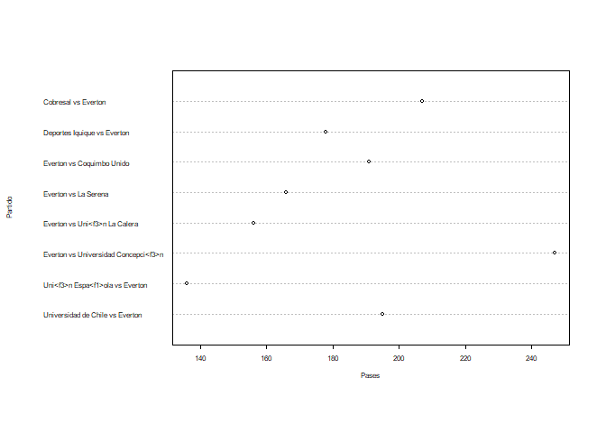
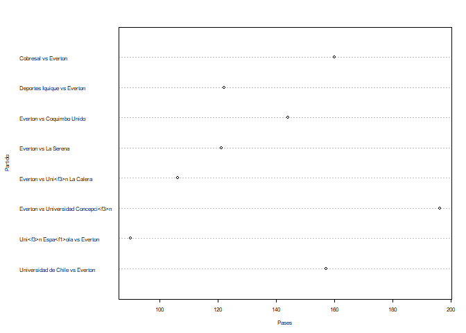
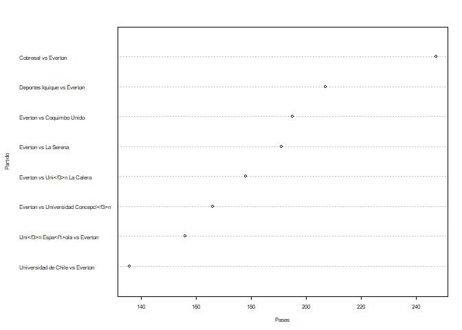
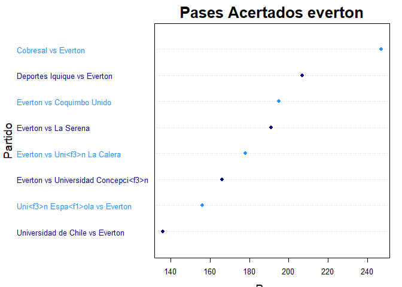

Ayudantia 2
================

## Actividad Ayudantia 2

Replicar lo realizado en la ayudantia (analisis exploratorio de los
datos, limpieza, sub dataframes, filtro y graficar ), pueden elegir otro
equipo para que puedan explorar otros datos

## Analisis Exploratorio de Datos

El objetivo de esta parte es primero cargar la base de datos de futbol.
Para luego generar un resumen de esta, revisar las diferentes tablas,
sacar los datos que no tienen información y finalmente determinar que
atributos nos interesan.

``` r
library(quanteda)
```

    ## Package version: 3.0.0
    ## Unicode version: 10.0
    ## ICU version: 61.1

    ## Parallel computing: 12 of 12 threads used.

    ## See https://quanteda.io for tutorials and examples.

``` r
library(dplyr)
```

    ## 
    ## Attaching package: 'dplyr'

    ## The following objects are masked from 'package:stats':
    ## 
    ##     filter, lag

    ## The following objects are masked from 'package:base':
    ## 
    ##     intersect, setdiff, setequal, union

``` r
library(tidyverse)
```

    ## -- Attaching packages --------------------------------------- tidyverse 1.3.0 --

    ## v ggplot2 3.3.3     v purrr   0.3.4
    ## v tibble  3.1.0     v stringr 1.4.0
    ## v tidyr   1.1.3     v forcats 0.5.1
    ## v readr   1.4.0

    ## -- Conflicts ------------------------------------------ tidyverse_conflicts() --
    ## x dplyr::filter() masks stats::filter()
    ## x dplyr::lag()    masks stats::lag()

``` r
library(utf8)
library(ggplot2)
setwd("C:/Users/amanh/OneDrive/Documentos/GitHub/Actividades-Ayudantia/Actividad2")
primer_tiempo2020 <- read_csv("Primer_Tiempo2020.csv", col_names = TRUE)
```

    ## 
    ## -- Column specification --------------------------------------------------------
    ## cols(
    ##   .default = col_double(),
    ##   torneo = col_character(),
    ##   equipo = col_character(),
    ##   id_partido = col_character(),
    ##   partido = col_character(),
    ##   fasepartido = col_character(),
    ##   local = col_logical(),
    ##   tiempo = col_character()
    ## )
    ## i Use `spec()` for the full column specifications.

``` r
#str(primer_tiempo2020)
#attach(primer_tiempo2020)
summary(primer_tiempo2020)
```

    ##     torneo             equipo           id_partido          partido         
    ##  Length:130         Length:130         Length:130         Length:130        
    ##  Class :character   Class :character   Class :character   Class :character  
    ##  Mode  :character   Mode  :character   Mode  :character   Mode  :character  
    ##                                                                             
    ##                                                                             
    ##                                                                             
    ##  fasepartido          local            tiempo           accuratePass  
    ##  Length:130         Mode :logical   Length:130         Min.   : 62.0  
    ##  Class :character   FALSE:65        Class :character   1st Qu.:115.2  
    ##  Mode  :character   TRUE :65        Mode  :character   Median :143.5  
    ##                                                        Mean   :147.5  
    ##                                                        3rd Qu.:181.2  
    ##                                                        Max.   :269.0  
    ##    wonTackle       lostCorners    goalsConceded        saves    
    ##  Min.   : 0.000   Min.   :0.000   Min.   :0.0000   Min.   :0.0  
    ##  1st Qu.: 3.000   1st Qu.:1.000   1st Qu.:0.0000   1st Qu.:1.0  
    ##  Median : 5.000   Median :2.000   Median :0.0000   Median :1.0  
    ##  Mean   : 5.154   Mean   :2.277   Mean   :0.5923   Mean   :1.5  
    ##  3rd Qu.: 7.000   3rd Qu.:3.000   3rd Qu.:1.0000   3rd Qu.:2.0  
    ##  Max.   :14.000   Max.   :7.000   Max.   :3.0000   Max.   :5.0  
    ##  ontargetScoringAtt totalScoringAtt     subsMade       totalThrows   
    ##  Min.   :0.000      Min.   : 0.000   Min.   :0.0000   Min.   : 3.00  
    ##  1st Qu.:1.000      1st Qu.: 4.000   1st Qu.:0.0000   1st Qu.: 8.00  
    ##  Median :2.000      Median : 6.000   Median :0.0000   Median :11.00  
    ##  Mean   :2.108      Mean   : 5.938   Mean   :0.1077   Mean   :10.98  
    ##  3rd Qu.:3.000      3rd Qu.: 7.750   3rd Qu.:0.0000   3rd Qu.:13.00  
    ##  Max.   :5.000      Max.   :14.000   Max.   :1.0000   Max.   :26.00  
    ##  totalYellowCard    goalKicks        totalPass       fkFoulWon     
    ##  Min.   :0.0000   Min.   : 0.000   Min.   : 93.0   Min.   : 2.000  
    ##  1st Qu.:0.0000   1st Qu.: 2.000   1st Qu.:159.5   1st Qu.: 5.000  
    ##  Median :1.0000   Median : 4.000   Median :189.0   Median : 6.000  
    ##  Mean   :0.9077   Mean   : 3.962   Mean   :190.9   Mean   : 6.338  
    ##  3rd Qu.:1.0000   3rd Qu.: 5.000   3rd Qu.:222.5   3rd Qu.: 8.000  
    ##  Max.   :3.0000   Max.   :11.000   Max.   :304.0   Max.   :12.000  
    ##   totalTackle       fkFoulLost     possessionPercentage totalClearance  
    ##  Min.   : 1.000   Min.   : 2.000   Min.   :23.60        Min.   : 0.000  
    ##  1st Qu.: 5.000   1st Qu.: 6.000   1st Qu.:45.62        1st Qu.: 4.000  
    ##  Median : 7.000   Median : 7.000   Median :50.00        Median : 7.000  
    ##  Mean   : 7.192   Mean   : 7.054   Mean   :50.00        Mean   : 7.385  
    ##  3rd Qu.: 9.000   3rd Qu.: 9.000   3rd Qu.:54.38        3rd Qu.:10.000  
    ##  Max.   :15.000   Max.   :13.000   Max.   :76.40        Max.   :16.000  
    ##  formationUsed blockedScoringAtt   goalAssist         goals       
    ##  Min.   :0     Min.   :0.000     Min.   :0.0000   Min.   :0.0000  
    ##  1st Qu.:0     1st Qu.:0.000     1st Qu.:0.0000   1st Qu.:0.0000  
    ##  Median :0     Median :1.000     Median :0.0000   Median :0.0000  
    ##  Mean   :0     Mean   :1.262     Mean   :0.3769   Mean   :0.5923  
    ##  3rd Qu.:0     3rd Qu.:2.000     3rd Qu.:1.0000   3rd Qu.:1.0000  
    ##  Max.   :0     Max.   :6.000     Max.   :2.0000   Max.   :3.0000  
    ##   totalOffside   shotOffTarget     wonCorners     cornerTaken   
    ##  Min.   :0.000   Min.   :0.000   Min.   :0.000   Min.   :0.000  
    ##  1st Qu.:0.000   1st Qu.:1.000   1st Qu.:1.000   1st Qu.:1.000  
    ##  Median :1.000   Median :2.000   Median :2.000   Median :2.000  
    ##  Mean   :1.038   Mean   :2.569   Mean   :2.277   Mean   :2.269  
    ##  3rd Qu.:2.000   3rd Qu.:4.000   3rd Qu.:3.000   3rd Qu.:3.000  
    ##  Max.   :5.000   Max.   :7.000   Max.   :7.000   Max.   :7.000  
    ##  penaltyConceded   penaltyFaced    penGoalsConceded   penaltyWon    
    ##  Min.   :0.0000   Min.   :0.0000   Min.   :0.0000   Min.   :0.0000  
    ##  1st Qu.:0.0000   1st Qu.:0.0000   1st Qu.:0.0000   1st Qu.:0.0000  
    ##  Median :0.0000   Median :0.0000   Median :0.0000   Median :0.0000  
    ##  Mean   :0.1692   Mean   :0.1692   Mean   :0.1308   Mean   :0.1692  
    ##  3rd Qu.:0.0000   3rd Qu.:0.0000   3rd Qu.:0.0000   3rd Qu.:0.0000  
    ##  Max.   :2.0000   Max.   :2.0000   Max.   :1.0000   Max.   :2.0000  
    ##     ownGoals        penaltySave       secondYellow      totalRedCard    
    ##  Min.   :0.00000   Min.   :0.00000   Min.   :0.00000   Min.   :0.00000  
    ##  1st Qu.:0.00000   1st Qu.:0.00000   1st Qu.:0.00000   1st Qu.:0.00000  
    ##  Median :0.00000   Median :0.00000   Median :0.00000   Median :0.00000  
    ##  Mean   :0.02308   Mean   :0.02308   Mean   :0.01538   Mean   :0.04615  
    ##  3rd Qu.:0.00000   3rd Qu.:0.00000   3rd Qu.:0.00000   3rd Qu.:0.00000  
    ##  Max.   :1.00000   Max.   :1.00000   Max.   :1.00000   Max.   :1.00000  
    ##  posesion_Rival  precision_pases precision_tiros  minutos_juego  
    ##  Min.   :23.60   Min.   :50.68   Min.   :  0.00   Min.   :10.62  
    ##  1st Qu.:45.62   1st Qu.:70.71   1st Qu.: 25.00   1st Qu.:20.53  
    ##  Median :50.00   Median :76.40   Median : 40.00   Median :22.50  
    ##  Mean   :50.00   Mean   :75.99   Mean   : 41.20   Mean   :22.50  
    ##  3rd Qu.:54.38   3rd Qu.:82.28   3rd Qu.: 57.14   3rd Qu.:24.47  
    ##  Max.   :76.40   Max.   :89.43   Max.   :100.00   Max.   :34.38  
    ##  minutos_juegorival golesSalvados   foulsInofensivos cortarJuegoContrario
    ##  Min.   :10.62      Min.   :0.000   Min.   : 1.000   Min.   : 4.00       
    ##  1st Qu.:20.53      1st Qu.:1.000   1st Qu.: 5.000   1st Qu.:10.00       
    ##  Median :22.50      Median :1.000   Median : 6.000   Median :12.00       
    ##  Mean   :22.50      Mean   :1.523   Mean   : 6.146   Mean   :12.21       
    ##  3rd Qu.:24.47      3rd Qu.:2.000   3rd Qu.: 8.000   3rd Qu.:15.00       
    ##  Max.   :34.38      Max.   :5.000   Max.   :11.000   Max.   :24.00       
    ##   juegoCortado  
    ##  Min.   : 8.00  
    ##  1st Qu.:17.00  
    ##  Median :20.00  
    ##  Mean   :20.64  
    ##  3rd Qu.:25.00  
    ##  Max.   :40.00

## Borrar Datos Char

En esta parte se procede con eliminar columnas que no nos sirven para
nuestro trabajo, ya que al hacer esto podremos concentrarnos en las
variables que son de interés para esta actividad y así trabajar en ellas
de manera mas ordenada.

``` r
primer_tiempo2020
```

    ## # A tibble: 130 x 49
    ##    torneo   equipo   id_partido  partido   fasepartido local tiempo accuratePass
    ##    <chr>    <chr>    <chr>       <chr>     <chr>       <lgl> <chr>         <dbl>
    ##  1 Primera~ Uni<f3>~ 6xszsf73jq~ Universi~ Regular Se~ FALSE fh              235
    ##  2 Primera~ Univers~ 6xszsf73jq~ Universi~ Regular Se~ TRUE  fh              199
    ##  3 Primera~ Everton  e88gat05jr~ Universi~ Regular Se~ FALSE fh              157
    ##  4 Primera~ Univers~ e88gat05jr~ Universi~ Regular Se~ TRUE  fh              192
    ##  5 Primera~ Curic<f~ 35ijq76er8~ Universi~ Regular Se~ FALSE fh              142
    ##  6 Primera~ Univers~ 35ijq76er8~ Universi~ Regular Se~ TRUE  fh              168
    ##  7 Primera~ Coquimb~ 9o9ji2f68p~ Universi~ Regular Se~ FALSE fh              190
    ##  8 Primera~ Univers~ 9o9ji2f68p~ Universi~ Regular Se~ TRUE  fh              200
    ##  9 Primera~ Santiag~ 357wqv3701~ Universi~ Regular Se~ FALSE fh              156
    ## 10 Primera~ Univers~ 357wqv3701~ Universi~ Regular Se~ TRUE  fh               92
    ## # ... with 120 more rows, and 41 more variables: wonTackle <dbl>,
    ## #   lostCorners <dbl>, goalsConceded <dbl>, saves <dbl>,
    ## #   ontargetScoringAtt <dbl>, totalScoringAtt <dbl>, subsMade <dbl>,
    ## #   totalThrows <dbl>, totalYellowCard <dbl>, goalKicks <dbl>, totalPass <dbl>,
    ## #   fkFoulWon <dbl>, totalTackle <dbl>, fkFoulLost <dbl>,
    ## #   possessionPercentage <dbl>, totalClearance <dbl>, formationUsed <dbl>,
    ## #   blockedScoringAtt <dbl>, goalAssist <dbl>, goals <dbl>, totalOffside <dbl>,
    ## #   shotOffTarget <dbl>, wonCorners <dbl>, cornerTaken <dbl>,
    ## #   penaltyConceded <dbl>, penaltyFaced <dbl>, penGoalsConceded <dbl>,
    ## #   penaltyWon <dbl>, ownGoals <dbl>, penaltySave <dbl>, secondYellow <dbl>,
    ## #   totalRedCard <dbl>, posesion_Rival <dbl>, precision_pases <dbl>,
    ## #   precision_tiros <dbl>, minutos_juego <dbl>, minutos_juegorival <dbl>,
    ## #   golesSalvados <dbl>, foulsInofensivos <dbl>, cortarJuegoContrario <dbl>,
    ## #   juegoCortado <dbl>

``` r
primer_tiempo2020 <- primer_tiempo2020[,!(colnames(primer_tiempo2020) %in% c("id_partido", "fasepartido", "local", "tiempo","formationUsed", "torneo"))]
primer_tiempo2020
```

    ## # A tibble: 130 x 43
    ##    equipo    partido      accuratePass wonTackle lostCorners goalsConceded saves
    ##    <chr>     <chr>               <dbl>     <dbl>       <dbl>         <dbl> <dbl>
    ##  1 Uni<f3>n~ Universidad~          235         2           3             1     4
    ##  2 Universi~ Universidad~          199         2           0             0     1
    ##  3 Everton   Universidad~          157         7           6             0     3
    ##  4 Universi~ Universidad~          192         4           1             0     2
    ##  5 Curic<f3~ Universidad~          142         6           3             2     2
    ##  6 Universi~ Universidad~          168         8           1             1     2
    ##  7 Coquimbo~ Universidad~          190         3           0             0     2
    ##  8 Universi~ Universidad~          200         5           0             0     0
    ##  9 Santiago~ Universidad~          156         4           3             0     0
    ## 10 Universi~ Universidad~           92         4           1             1     1
    ## # ... with 120 more rows, and 36 more variables: ontargetScoringAtt <dbl>,
    ## #   totalScoringAtt <dbl>, subsMade <dbl>, totalThrows <dbl>,
    ## #   totalYellowCard <dbl>, goalKicks <dbl>, totalPass <dbl>, fkFoulWon <dbl>,
    ## #   totalTackle <dbl>, fkFoulLost <dbl>, possessionPercentage <dbl>,
    ## #   totalClearance <dbl>, blockedScoringAtt <dbl>, goalAssist <dbl>,
    ## #   goals <dbl>, totalOffside <dbl>, shotOffTarget <dbl>, wonCorners <dbl>,
    ## #   cornerTaken <dbl>, penaltyConceded <dbl>, penaltyFaced <dbl>,
    ## #   penGoalsConceded <dbl>, penaltyWon <dbl>, ownGoals <dbl>,
    ## #   penaltySave <dbl>, secondYellow <dbl>, totalRedCard <dbl>,
    ## #   posesion_Rival <dbl>, precision_pases <dbl>, precision_tiros <dbl>,
    ## #   minutos_juego <dbl>, minutos_juegorival <dbl>, golesSalvados <dbl>,
    ## #   foulsInofensivos <dbl>, cortarJuegoContrario <dbl>, juegoCortado <dbl>

## Analisis descriptivo

En esta parte es guardan en orden descendente la precision de los pases
de los diferentes equipos presentes en la base de datos.

``` r
fh2020 <- primer_tiempo2020[order(primer_tiempo2020$accuratePass, decreasing = TRUE),]
fh2020
```

    ## # A tibble: 130 x 43
    ##    equipo    partido      accuratePass wonTackle lostCorners goalsConceded saves
    ##    <chr>     <chr>               <dbl>     <dbl>       <dbl>         <dbl> <dbl>
    ##  1 Universi~ Universidad~          269         2           3             0     2
    ##  2 Deportiv~ Deportivo A~          253        11           1             1     1
    ##  3 Uni<f3>n~ Uni<f3>n La~          252         6           3             1     3
    ##  4 Curic<f3~ Universidad~          245         5           2             0     2
    ##  5 Uni<f3>n~ Uni<f3>n La~          237         5           2             0     0
    ##  6 Uni<f3>n~ Universidad~          235         2           3             1     4
    ##  7 Colo Colo Colo Colo v~          231         4           0             0     0
    ##  8 Uni<f3>n~ Uni<f3>n Es~          224         7           0             1     0
    ##  9 Audax It~ Audax Itali~          220         2           1             1     1
    ## 10 Audax It~ Audax Itali~          219         6           1             0     0
    ## # ... with 120 more rows, and 36 more variables: ontargetScoringAtt <dbl>,
    ## #   totalScoringAtt <dbl>, subsMade <dbl>, totalThrows <dbl>,
    ## #   totalYellowCard <dbl>, goalKicks <dbl>, totalPass <dbl>, fkFoulWon <dbl>,
    ## #   totalTackle <dbl>, fkFoulLost <dbl>, possessionPercentage <dbl>,
    ## #   totalClearance <dbl>, blockedScoringAtt <dbl>, goalAssist <dbl>,
    ## #   goals <dbl>, totalOffside <dbl>, shotOffTarget <dbl>, wonCorners <dbl>,
    ## #   cornerTaken <dbl>, penaltyConceded <dbl>, penaltyFaced <dbl>,
    ## #   penGoalsConceded <dbl>, penaltyWon <dbl>, ownGoals <dbl>,
    ## #   penaltySave <dbl>, secondYellow <dbl>, totalRedCard <dbl>,
    ## #   posesion_Rival <dbl>, precision_pases <dbl>, precision_tiros <dbl>,
    ## #   minutos_juego <dbl>, minutos_juegorival <dbl>, golesSalvados <dbl>,
    ## #   foulsInofensivos <dbl>, cortarJuegoContrario <dbl>, juegoCortado <dbl>

## Sub DataFrames

Ahora lo que se realiza es crear una nueva variable para de esta manera
ordenar los datos de interés y tener las variables mas ordenadas.
Posteriormente se re ordenan estos datos.

``` r
fh2020_pases = fh2020[,colnames(primer_tiempo2020) %in% c("equipo", "partido", "accuratePass", "totalPass", "precision_pases")]
fh2020_pases = fh2020_pases[order(fh2020_pases$precision_pases, decreasing = TRUE),]
fh2020_pases
```

    ## # A tibble: 130 x 5
    ##    equipo        partido                  accuratePass totalPass precision_pases
    ##    <chr>         <chr>                           <dbl>     <dbl>           <dbl>
    ##  1 Audax Italia~ Audax Italiano vs Cobre~          220       246            89.4
    ##  2 Universidad ~ Universidad Cat<f3>lica~          269       304            88.5
    ##  3 Uni<f3>n La ~ Uni<f3>n La Calera vs L~          252       285            88.4
    ##  4 Deportivo An~ Deportivo Antofagasta v~          253       289            87.5
    ##  5 Uni<f3>n La ~ Universidad de Chile vs~          235       271            86.7
    ##  6 Universidad ~ Huachipato vs Universid~          202       233            86.7
    ##  7 Colo Colo     Colo Colo vs Universida~          231       267            86.5
    ##  8 Deportivo An~ Deportivo Antofagasta v~          162       188            86.2
    ##  9 Universidad ~ Deportivo Antofagasta v~          202       235            86.0
    ## 10 Uni<f3>n La ~ Uni<f3>n La Calera vs U~          176       205            85.9
    ## # ... with 120 more rows

``` r
fh2020_tiros <- NULL
fh2020_tiros = fh2020[,colnames(primer_tiempo2020) %in% c("equipo", "partido", "goals", "ontargetScoringAtt", "totalScoringAtt", "blockedScoringAtt", "shotOffTarget", "precision_tiros")]
fh2020_tiros = fh2020_tiros[order(fh2020_tiros$goals, decreasing = TRUE),]
fh2020_tiros
```

    ## # A tibble: 130 x 8
    ##    equipo   partido      ontargetScoring~ totalScoringAtt blockedScoringA~ goals
    ##    <chr>    <chr>                   <dbl>           <dbl>            <dbl> <dbl>
    ##  1 Uni<f3>~ Uni<f3>n Es~                4               5                0     3
    ##  2 Univers~ Universidad~                3               8                2     2
    ##  3 Colo Co~ Colo Colo v~                4              10                2     2
    ##  4 Audax I~ Audax Itali~                3               9                2     2
    ##  5 Univers~ Deportivo A~                5               9                2     2
    ##  6 Univers~ Universidad~                4               7                1     2
    ##  7 Deporti~ Deportivo A~                5              14                4     2
    ##  8 Uni<f3>~ O'Higgins v~                3               4                1     2
    ##  9 Deporte~ Deportes Iq~                2               7                2     2
    ## 10 La Sere~ La Serena v~                4               7                1     2
    ## # ... with 120 more rows, and 2 more variables: shotOffTarget <dbl>,
    ## #   precision_tiros <dbl>

## Filtrar Datos

En esta parte se filtran los datos de acuerdo al equipo de interes, el
cual es Everton de Viña del Mar. Se guardan las estadisticas respectos
de tiros, pases y sobre su rendimiento en el primer tiempo del torneo
nacional pasado.

``` r
everton <- filter(primer_tiempo2020, equipo == "Everton")
everton_tiros <- filter(fh2020_tiros, equipo == "Everton")
everton_pases <- filter(fh2020_pases, equipo == "Everton")
```

## Agregar Promedio/Suma Total/Min/…

En esta parte se sacan medidas descriptivas respecto del rendimiento del
equipo en analisis.

``` r
everton_pases <- everton_pases[,!(colnames(everton_pases) %in% c("equipo"))] 
Promedios_Pas <- c("Promedio Pases",mean(everton_pases$accuratePass),mean(everton_pases$totalPass),mean(everton_pases$precision_pases))
everton_pases <- rbind(everton_pases, Promedios_Pas)
Max_Pas <- c("Max Pases",max(everton_pases$accuratePass),max(everton_pases$totalPass),max(everton_pases$precision_pases))
everton_pases <- rbind(everton_pases, Max_Pas)
Min_Pas <- c("Min Pases",min(everton_pases$accuratePass),min(everton_pases$totalPass),min(everton_pases$precision_pases))
everton_pases <- rbind(everton_pases, Min_Pas)
everton_pases
```

    ## # A tibble: 11 x 4
    ##    partido                              accuratePass totalPass precision_pases 
    ##    <chr>                                <chr>        <chr>     <chr>           
    ##  1 Universidad de Chile vs Everton      157          195       80.5128205128205
    ##  2 Everton vs Universidad Concepci<f3>n 196          247       79.3522267206478
    ##  3 Cobresal vs Everton                  160          207       77.2946859903382
    ##  4 Everton vs Coquimbo Unido            144          191       75.3926701570681
    ##  5 Everton vs La Serena                 121          166       72.8915662650602
    ##  6 Deportes Iquique vs Everton          122          178       68.5393258426966
    ##  7 Everton vs Uni<f3>n La Calera        106          156       67.948717948718 
    ##  8 Uni<f3>n Espa<f1>ola vs Everton      90           136       66.1764705882353
    ##  9 Promedio Pases                       137          184.5     73.5135605031981
    ## 10 Max Pases                            90           247       80.5128205128205
    ## 11 Min Pases                            106          136       66.1764705882353

## Graficos

Finalmente se procede a graficar las variables de interés para saber el
comportamiento del equipo en términos de pases y precisión de estos.

En donde se puede desprender que a medida que el nivel del equipo rival
aumenta (esto se sabe producto de que tengo algo de conocimiento de
futbol) la precisión de los pases disminuye, ya sea por factores que hay
una mejor defensa, entre otros.

``` r
pases_eve <- everton$accuratePass
everton2 <- everton[order(everton$accuratePass, decreasing = FALSE),]
#dotchart(everton$totalPass, labels = everton$partido, cex=0.5, xlab = "Pases", ylab = "Partido")
dotchart(everton$totalPass, labels = utf8_encode(everton$partido), cex=0.5, xlab = "Pases", ylab = "Partido")
```

<!-- -->

``` r
dotchart(everton$accuratePass, labels = utf8_encode(everton$partido), cex=0.5, xlab = "Pases", ylab = "Partido")
```

<!-- -->

``` r
dotchart(everton2$totalPass, labels = utf8_encode(everton$partido), cex=0.5, xlab = "Pases", ylab = "Partido")
```

<!-- -->

``` r
dotchart(everton2$totalPass, labels = utf8_encode(everton$partido), main="Pases Acertados everton", pch = 16, col=c("darkblue","dodgerblue"),lcolor="gray90", cex=0.8, xlab = "Pases", ylab = "Partido", cex.main=2,cex.lab=1.5)
```

<!-- -->

\`
