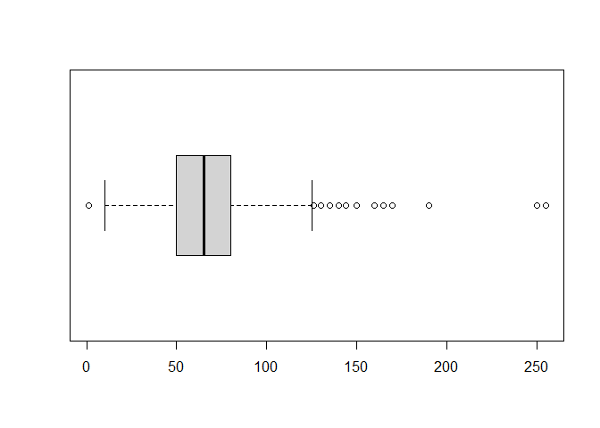
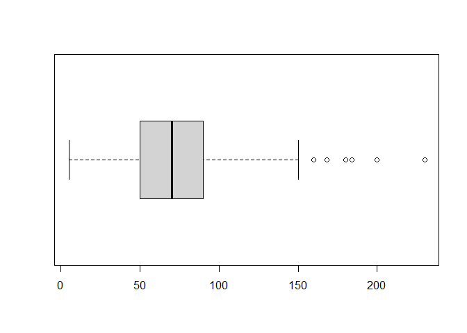

Actividad 3
================

## Actividad Ayudantia 3: Replicar el analisis de outliers, debes elegir uno de los dos csv disponibles (pokemon o titanic) y realizar el analisis con algunas de las variables numericas y realizar un pequeño analisis en relacion a los datos encontrados como outliers (en caso de que eligas el csv del titanic solo debes evaluar las columnas AGE y FNLWGT)

## Carga de datos y grafico de datos:

En esta parte se cargan los datos de la base de los pokemones, para
posteriormente realizar un boxplot de su HP (HitPoints), para poder ver
datos que sean outliers de esta variable.

``` r
library(dplyr)
```

    ## 
    ## Attaching package: 'dplyr'

    ## The following objects are masked from 'package:stats':
    ## 
    ##     filter, lag

    ## The following objects are masked from 'package:base':
    ## 
    ##     intersect, setdiff, setequal, union

``` r
wd = setwd("C:/Users/amanh/OneDrive/Documentos/GitHub/Actividades-Ayudantia/Actividad3")
pk = read.csv("pokemon.csv")

#pk123 = filter(pk, pk$Generation %in% c(1, 2, 3))
#pk123
attach(pk)
hp = boxplot(HP, horizontal = TRUE)
```

<!-- -->

``` r
stats_hp = boxplot.stats(HP)
```

## Filtro de datos de acuerdo a outliers:

En este punto se procede a filtrar los datos que aparecen en el boxplot,
filtrando en primera instancia aquellos pokemones que tienen hp menores
a 125 y mayores a 15, para de esta manera quedarnos sin datos atípicos.

``` r
pk1 <- HP[HP < 125 & HP > 15]
length(HP) - length(pk1)
```

    ## [1] 24

``` r
boxplot(pk1, horizontal = TRUE)
```

<!-- -->

``` r
hp_out <- filter(pk, pk$HP > 20)
```

## Segundo análisis a varibale de interés:

Se procede a graficar otra variable de interés, la cual es la de
defensa.

``` r
def = boxplot(Defense, horizontal = TRUE)
```

<!-- -->

``` r
stats_def = boxplot.stats(Defense)
```

En esta se encuentran datos atípicos que son mayores a 160, por ende, se
procede con filtrar estos para quedarnos con los datos que son de
interés y finalmente realizar conclusiones respecto de los dos análisis.

``` r
pk2 <- Defense[Defense < 160]
length(Defense) - length(pk2)
```

    ## [1] 13

``` r
boxplot(pk2, horizontal = TRUE)
```

<!-- -->

``` r
def_out <- filter(pk, pk$Defense > 159 )
```

## Conclusiones:

Lo que se puede desprender de este análisis es que los valores de HP
(HitPoints) se mueven entre valores de 25 y 80, lo cual se relaciona por
la cantidad de daño que puede recibir un pokemon, ya que esta es su
“vida”.

Luego tenemos el caso del nivel de defensa de los pokemones, el cual se
relaciona con la capacidad del pokemon atacado de dismiuir los hitpoint
(hp) recibidos.

Finalmente, lo que se puede sacar en análisis de esta situación es que
la defensa cambia la cantidad de daño causado por un ataque. Por lo
tanto, un pokemon con muy poca defensa perdería mucho HP por un ataque,
pero con una defensa más alta, el mismo ataque daría como resultado una
menor pérdida de HP. Para ser un tanque como Blissey, necesitas un alto
HP y defensa.
