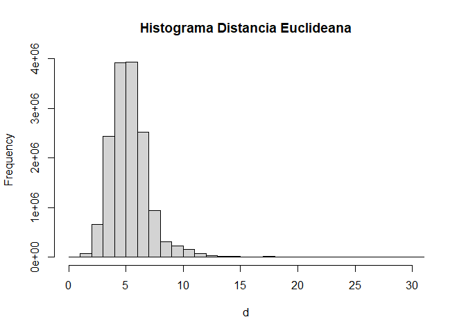
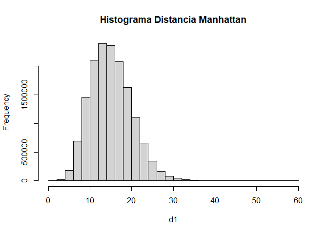

Actividad Ayudantía 6
================

# Actividad de Ayudantia 6

Para la actividad de esta semana deberan generar un sample (subconjunto
al azar de los datos de spotify) de la data del proyecto 2 (de unas
10.000 observaciones para que sea parecido a lo trabajado aqui)
(consideren que esta tarea les puede ser de gran ayuda para cuando
tengan que hacer el proyecto 2) y realizar el analisis de clustering
jerarquico (exploren los distintos tipos de distancia, metodos que se
pueden utilizar para hacer clustering jerarquico, probar cortar el arbol
para distintos h, distintos k, y va variando la cantidad de cluster
segun el h que eligan, caracterizar los clusters que encuentren).

## Cargar Datos Actividad

-   Dado el formato con el que estan subidos los datos, para cargar los
    datos debemos ir a Session, luego a Load Workspace y seleccionamos
    el archivo .RData que subio el profe

# Actividad 6: Base de Datos Proyecto 2

## Carga de Librerías

Se añaden a nuestro código las librerías a utilizar para los análisis
que realizaremos.

``` r
library(tidyverse)
```

    ## -- Attaching packages --------------------------------------- tidyverse 1.3.0 --

    ## v ggplot2 3.3.3     v purrr   0.3.4
    ## v tibble  3.1.0     v dplyr   1.0.5
    ## v tidyr   1.1.3     v stringr 1.4.0
    ## v readr   1.4.0     v forcats 0.5.1

    ## -- Conflicts ------------------------------------------ tidyverse_conflicts() --
    ## x dplyr::filter() masks stats::filter()
    ## x dplyr::lag()    masks stats::lag()

``` r
library(cluster)
library(factoextra)
```

    ## Welcome! Want to learn more? See two factoextra-related books at https://goo.gl/ve3WBa

``` r
library(janitor)
```

    ## 
    ## Attaching package: 'janitor'

    ## The following objects are masked from 'package:stats':
    ## 
    ##     chisq.test, fisher.test

``` r
setwd("C:/Users/amanh/OneDrive/Documentos/GitHub/Actividades-Ayudantia/Actividad6")
datos <- read.csv("spotify.csv",header= TRUE, sep="")
```

## Selección temprana de data:

En esta actividad se realizará tempranamente una selección de datos, la
cuál consistirá en una muestra de 10.000, para que de esta manera sea
más sencillo y no tener que utilizar la data completa, que son casi
500.000 observaciones.

``` r
sample_spotify <- datos %>% slice_sample(n=10000)
```

Luego de esto se procede con hacer un summary y ver los head de nuestra
data, para así tener una idea de con que se trabaja.

``` r
summary(sample_spotify)
```

    ##  artist_name         artist_id           album_id          album_type       
    ##  Length:10000       Length:10000       Length:10000       Length:10000      
    ##  Class :character   Class :character   Class :character   Class :character  
    ##  Mode  :character   Mode  :character   Mode  :character   Mode  :character  
    ##                                                                             
    ##                                                                             
    ##                                                                             
    ##                                                                             
    ##  album_release_date album_release_year album_release_date_precision
    ##  Length:10000       Min.   :1919       Length:10000                
    ##  Class :character   1st Qu.:2010       Class :character            
    ##  Mode  :character   Median :2018       Mode  :character            
    ##                     Mean   :2013                                   
    ##                     3rd Qu.:2020                                   
    ##                     Max.   :2021                                   
    ##                     NA's   :11                                     
    ##   danceability        energy               key           loudness      
    ##  Min.   :0.0000   Min.   :0.0000234   Min.   : 0.00   Min.   :-48.231  
    ##  1st Qu.:0.2540   1st Qu.:0.0769000   1st Qu.: 2.00   1st Qu.:-24.245  
    ##  Median :0.3710   Median :0.2090000   Median : 5.00   Median :-19.409  
    ##  Mean   :0.3908   Mean   :0.3374605   Mean   : 5.13   Mean   :-18.602  
    ##  3rd Qu.:0.5110   3rd Qu.:0.5680000   3rd Qu.: 8.00   3rd Qu.:-11.700  
    ##  Max.   :0.9570   Max.   :1.0000000   Max.   :11.00   Max.   : -0.826  
    ##                                                                        
    ##       mode        speechiness       acousticness       instrumentalness 
    ##  Min.   :0.000   Min.   :0.00000   Min.   :0.0000015   Min.   :0.00000  
    ##  1st Qu.:0.000   1st Qu.:0.03800   1st Qu.:0.4190000   1st Qu.:0.00174  
    ##  Median :1.000   Median :0.04450   Median :0.9250000   Median :0.70300  
    ##  Mean   :0.676   Mean   :0.06929   Mean   :0.7037776   Mean   :0.50255  
    ##  3rd Qu.:1.000   3rd Qu.:0.05840   3rd Qu.:0.9860000   3rd Qu.:0.90000  
    ##  Max.   :1.000   Max.   :0.96600   Max.   :0.9960000   Max.   :0.99800  
    ##                                                                         
    ##     liveness          valence           tempo         track_id        
    ##  Min.   :0.00000   Min.   :0.0000   Min.   :  0.0   Length:10000      
    ##  1st Qu.:0.09717   1st Qu.:0.0919   1st Qu.: 82.4   Class :character  
    ##  Median :0.12300   Median :0.2710   Median :105.8   Mode  :character  
    ##  Mean   :0.22225   Mean   :0.3377   Mean   :108.4                     
    ##  3rd Qu.:0.25400   3rd Qu.:0.5390   3rd Qu.:130.6                     
    ##  Max.   :0.99700   Max.   :0.9890   Max.   :240.7                     
    ##                                                                       
    ##  analysis_url       time_signature   disc_number      duration_ms     
    ##  Length:10000       Min.   :0.000   Min.   : 1.000   Min.   :   7733  
    ##  Class :character   1st Qu.:4.000   1st Qu.: 1.000   1st Qu.: 121593  
    ##  Mode  :character   Median :4.000   Median : 1.000   Median : 195546  
    ##                     Mean   :3.727   Mean   : 1.226   Mean   : 229641  
    ##                     3rd Qu.:4.000   3rd Qu.: 1.000   3rd Qu.: 272680  
    ##                     Max.   :5.000   Max.   :25.000   Max.   :4463120  
    ##                                                                       
    ##   explicit        track_href         is_local        track_name       
    ##  Mode :logical   Length:10000       Mode :logical   Length:10000      
    ##  FALSE:9883      Class :character   FALSE:10000     Class :character  
    ##  TRUE :117       Mode  :character                   Mode  :character  
    ##                                                                       
    ##                                                                       
    ##                                                                       
    ##                                                                       
    ##  track_preview_url   track_number        type            track_uri        
    ##  Length:10000       Min.   :  1.00   Length:10000       Length:10000      
    ##  Class :character   1st Qu.:  5.00   Class :character   Class :character  
    ##  Mode  :character   Median : 11.00   Mode  :character   Mode  :character  
    ##                     Mean   : 43.02                                        
    ##                     3rd Qu.: 28.00                                        
    ##                     Max.   :538.00                                        
    ##                                                                           
    ##  external_urls.spotify  album_name          key_name          mode_name        
    ##  Length:10000          Length:10000       Length:10000       Length:10000      
    ##  Class :character      Class :character   Class :character   Class :character  
    ##  Mode  :character      Mode  :character   Mode  :character   Mode  :character  
    ##                                                                                
    ##                                                                                
    ##                                                                                
    ##                                                                                
    ##    key_mode        
    ##  Length:10000      
    ##  Class :character  
    ##  Mode  :character  
    ##                    
    ##                    
    ##                    
    ## 

# Pre Procesamiento de los Datos

## Limpieza de los Datos

### Observaciones que tengan datos faltantes

Se realizará un proceso que será extenso, ya que se tienen que
identificar y borrar las observaciones en las que hayan datos faltantes.

Luego se debe realizar un filtrado para remover todos los datos que sean
repetidos, y esto en para la varibale que contiene el nombre de las
canciones.

Primero comenzamos con asignarle a todos los datos faltantes el valor de
NA

``` r
sample_spotify[sample_spotify == ""] <- NA
```

Verificamos donde hay valores NAs

``` r
sample_spotify %>% 
  summarise_all(funs(sum(is.na(.))))
```

    ## Warning: `funs()` was deprecated in dplyr 0.8.0.
    ## Please use a list of either functions or lambdas: 
    ## 
    ##   # Simple named list: 
    ##   list(mean = mean, median = median)
    ## 
    ##   # Auto named with `tibble::lst()`: 
    ##   tibble::lst(mean, median)
    ## 
    ##   # Using lambdas
    ##   list(~ mean(., trim = .2), ~ median(., na.rm = TRUE))

    ##   artist_name artist_id album_id album_type album_release_date
    ## 1           0         0        0          0                  0
    ##   album_release_year album_release_date_precision danceability energy key
    ## 1                 11                            0            0      0   0
    ##   loudness mode speechiness acousticness instrumentalness liveness valence
    ## 1        0    0           0            0                0        0       0
    ##   tempo track_id analysis_url time_signature disc_number duration_ms explicit
    ## 1     0        0            0              0           0           0        0
    ##   track_href is_local track_name track_preview_url track_number type track_uri
    ## 1          0        0          0              3830            0    0         0
    ##   external_urls.spotify album_name key_name mode_name key_mode
    ## 1                     0          0        0         0        0

De existir eliminamos todas las observaciones que presenten estos datos,
para así limpiar nuestra data.

``` r
data_pre <- sample_spotify %>% 
  filter(!(is.na(track_preview_url)|is.na(album_release_year)))
```

De esta manera eliminamos 3830 datos que no tenian valores asignados, y
así se pudo reducir el tamaño de nuestra data para trabajar. A
continuación, corroboramos que ya no queden datos que sean NA.

Corroboramos que no queden datos NA, para saber si es que no es
necesario agregar otra variable para este objetivo.

``` r
data_pre %>% 
  summarise_all(funs(sum(is.na(.))))
```

    ##   artist_name artist_id album_id album_type album_release_date
    ## 1           0         0        0          0                  0
    ##   album_release_year album_release_date_precision danceability energy key
    ## 1                  0                            0            0      0   0
    ##   loudness mode speechiness acousticness instrumentalness liveness valence
    ## 1        0    0           0            0                0        0       0
    ##   tempo track_id analysis_url time_signature disc_number duration_ms explicit
    ## 1     0        0            0              0           0           0        0
    ##   track_href is_local track_name track_preview_url track_number type track_uri
    ## 1          0        0          0                 0            0    0         0
    ##   external_urls.spotify album_name key_name mode_name key_mode
    ## 1                     0          0        0         0        0

En segundo lugar, viene la parte la eliminación de datos que se
encuentren duplicados, y esto es en específico para el nombre de las
canciones.

``` r
data_pre <- data_pre[!duplicated(data_pre$track_id),]
```

No se consigno en el código para el knit, pero al momento de mostrar en
pantalla cuantas observaciones teniamos luego de eliminar las
duplciadas, verificamos que se sacaron 2.

### Observaciones que tengan datos duplicados de otras

Ahora corroboraremos si existen canciones que esten duplicadas.

``` r
data_pre %>% count(duplicated(data_pre$track_name))
```

    ##   duplicated(data_pre$track_name)    n
    ## 1                           FALSE 5141
    ## 2                            TRUE 1019

Poder apreciar que existen canciones repetidas, por lo tanto realizamos
la consulta para obtener los valores distintos, pero este hecho obvia
que hayan canciones con el mismo nombre pero de distinto artistas.

``` r
data_pre %>% distinct(track_name, .keep_all = TRUE, ) %>% head()
```

    ##                 artist_name              artist_id               album_id
    ## 1591    Sergei Rachmaninoff 0Kekt6CKSo0m5mivKcoH51 5qO1hjJfygB9jkRwPommqZ
    ## 9517 Mother Nature Sound FX 4lrOh2SR7H3guHky2lAYOk 0k9JXTLJmC0ItVDAoCdqc1
    ## 337  Mother Nature Sound FX 4lrOh2SR7H3guHky2lAYOk 4ef7Ky8Tead5FPneaUPegh
    ## 7434         Antonín Dvorák 6n7nd5iceYpXVwcx8VPpxF 4T1sTHwE3HlTUP7c4FcGlD
    ## 5725 Mother Nature Sound FX 4lrOh2SR7H3guHky2lAYOk 1ZH1mIVHMJorMbiblyP8TF
    ## 2711         Antonín Dvorák 6n7nd5iceYpXVwcx8VPpxF 2xuwB3ui4LRCDw7inBJh5m
    ##      album_type album_release_date album_release_year
    ## 1591      album         2019-03-29               2019
    ## 9517      album         2020-02-20               2020
    ## 337       album         2020-10-17               2020
    ## 7434      album         2009-05-26               2009
    ## 5725      album         2021-03-19               2021
    ## 2711      album         1997-01-01               1997
    ##      album_release_date_precision danceability energy key loudness mode
    ## 1591                          day        0.343 0.1100   3  -25.112    0
    ## 9517                          day        0.302 0.8790   1  -22.914    1
    ## 337                           day        0.184 0.0311   8  -31.472    1
    ## 7434                          day        0.314 0.1070   2  -17.963    1
    ## 5725                          day        0.280 0.9020   7  -19.758    1
    ## 2711                          day        0.405 0.3220   2  -22.302    1
    ##      speechiness acousticness instrumentalness liveness valence   tempo
    ## 1591      0.0377      0.99200            0.914   0.1290  0.7580  74.093
    ## 9517      0.6200      0.46600            0.783   0.2860  0.0388 117.035
    ## 337       0.0377      0.98300            0.982   0.0734  0.0303  62.348
    ## 7434      0.0514      0.87800            0.180   0.0665  0.2270 111.273
    ## 5725      0.0761      0.00403            0.987   0.4430  0.0340 147.041
    ## 2711      0.0400      0.99600            0.840   0.1500  0.6090 162.198
    ##                    track_id
    ## 1591 01jK7p4YIxXkc4A8JJrEU4
    ## 9517 2EDNBTcgUXY3eeN66ZILTd
    ## 337  46QMBTVcKEM1OulefP5FvY
    ## 7434 7HeUig4bq7bm7ZcwaciEId
    ## 5725 4jueXWrJbukGujzsqDmCxp
    ## 2711 3B0fDagxTPnzEqiotu4A46
    ##                                                          analysis_url
    ## 1591 https://api.spotify.com/v1/audio-analysis/01jK7p4YIxXkc4A8JJrEU4
    ## 9517 https://api.spotify.com/v1/audio-analysis/2EDNBTcgUXY3eeN66ZILTd
    ## 337  https://api.spotify.com/v1/audio-analysis/46QMBTVcKEM1OulefP5FvY
    ## 7434 https://api.spotify.com/v1/audio-analysis/7HeUig4bq7bm7ZcwaciEId
    ## 5725 https://api.spotify.com/v1/audio-analysis/4jueXWrJbukGujzsqDmCxp
    ## 2711 https://api.spotify.com/v1/audio-analysis/3B0fDagxTPnzEqiotu4A46
    ##      time_signature disc_number duration_ms explicit
    ## 1591              4           1       92426    FALSE
    ## 9517              4           1      217205    FALSE
    ## 337               4           1      165607    FALSE
    ## 7434              4           1     1427626    FALSE
    ## 5725              3           1      138205    FALSE
    ## 2711              3           1       50933    FALSE
    ##                                                    track_href is_local
    ## 1591 https://api.spotify.com/v1/tracks/01jK7p4YIxXkc4A8JJrEU4    FALSE
    ## 9517 https://api.spotify.com/v1/tracks/2EDNBTcgUXY3eeN66ZILTd    FALSE
    ## 337  https://api.spotify.com/v1/tracks/46QMBTVcKEM1OulefP5FvY    FALSE
    ## 7434 https://api.spotify.com/v1/tracks/7HeUig4bq7bm7ZcwaciEId    FALSE
    ## 5725 https://api.spotify.com/v1/tracks/4jueXWrJbukGujzsqDmCxp    FALSE
    ## 2711 https://api.spotify.com/v1/tracks/3B0fDagxTPnzEqiotu4A46    FALSE
    ##                                                       track_name
    ## 1591                  10 Preludes, Op. 23: No. 9 in E-Flat Minor
    ## 9517                                    Birds Over Distant Storm
    ## 337                                               Lounging About
    ## 7434 String Quartet No. 3 in D Major, B. 18: I. Allegro con brio
    ## 5725                                                   Calm Rain
    ## 2711        Silhouettes, Op. 8, B. 98: No. 7 in D Major, Allegro
    ##                                                                                                track_preview_url
    ## 1591 https://p.scdn.co/mp3-preview/e33a7bfcfcc678bb71277e20390384481633e7fd?cid=ac26d97eca664234ab133e5208ea5737
    ## 9517 https://p.scdn.co/mp3-preview/d5022912a74c25a9d2967dc9a5573ab3981e5b1f?cid=ac26d97eca664234ab133e5208ea5737
    ## 337  https://p.scdn.co/mp3-preview/b76131ff109613dd41a464c4e8dbfb462403d4d4?cid=ac26d97eca664234ab133e5208ea5737
    ## 7434 https://p.scdn.co/mp3-preview/641f00ffb91e5c581f73dfb4ce9618cdf5a18c54?cid=ac26d97eca664234ab133e5208ea5737
    ## 5725 https://p.scdn.co/mp3-preview/d12b7deffc8fc9c2bf1eb9ca51dde54e07d0770a?cid=ac26d97eca664234ab133e5208ea5737
    ## 2711 https://p.scdn.co/mp3-preview/498562e96eddffef0da4b6f8baf9f28748cfdf8a?cid=ac26d97eca664234ab133e5208ea5737
    ##      track_number  type                            track_uri
    ## 1591           10 track spotify:track:01jK7p4YIxXkc4A8JJrEU4
    ## 9517           27 track spotify:track:2EDNBTcgUXY3eeN66ZILTd
    ## 337             2 track spotify:track:46QMBTVcKEM1OulefP5FvY
    ## 7434            1 track spotify:track:7HeUig4bq7bm7ZcwaciEId
    ## 5725            2 track spotify:track:4jueXWrJbukGujzsqDmCxp
    ## 2711            7 track spotify:track:3B0fDagxTPnzEqiotu4A46
    ##                                      external_urls.spotify
    ## 1591 https://open.spotify.com/track/01jK7p4YIxXkc4A8JJrEU4
    ## 9517 https://open.spotify.com/track/2EDNBTcgUXY3eeN66ZILTd
    ## 337  https://open.spotify.com/track/46QMBTVcKEM1OulefP5FvY
    ## 7434 https://open.spotify.com/track/7HeUig4bq7bm7ZcwaciEId
    ## 5725 https://open.spotify.com/track/4jueXWrJbukGujzsqDmCxp
    ## 2711 https://open.spotify.com/track/3B0fDagxTPnzEqiotu4A46
    ##                                                            album_name key_name
    ## 1591                       Sergei Rachmaninoff: Essential Piano Music       D#
    ## 9517                                                  " " Seasons " "       C#
    ## 337  Summer Heatwave | Calm Compilation | Zen Meditation & Relaxation       G#
    ## 7434      Dvorak, A.: String Quartets, Vol. 8 (Vlach Quartet) - No. 3        D
    ## 5725                                                    Rain Sound FX        G
    ## 2711                                      Dvorák: Piano Works, Vol. 1        D
    ##      mode_name key_mode
    ## 1591     minor D# minor
    ## 9517     major C# major
    ## 337      major G# major
    ## 7434     major  D major
    ## 5725     major  G major
    ## 2711     major  D major

Por lo que creamos una variables que almacene si existe duplicidad en la
cacion y/o en el artista.

``` r
data_pre$duplicate <- duplicated(data_pre[,c("track_name", "artist_name")])
```

Generamos un sub data frame que almacenara solo los valores que haya
obtenido el valor TRUE a la consulta anterior.

``` r
data_dupli <- data_pre %>% 
  filter(data_pre$duplicate == TRUE) 
```

Seleciono las filas que sean distintas y borro todas las canciones que
se repiten.

``` r
data_dupli <- data_dupli %>% 
  distinct(track_name, artist_name, .keep_all = TRUE)
```

Elimino de mi data pre procesada los datos que dieron positivo a la
duplicidad, para que al momento de re insertar los datos sobrevivieron a
la limpieza de duplicidad no se genere la duplicidad que se estaba
evitando

``` r
data_pre <- data_pre[!(data_pre$duplicate == TRUE),]
```

Junto la data pre procesada con los datos que sobrevivieron a la
limpieza de duplicidad

``` r
data_pre <- rbind(data_pre, data_dupli)
```

Elimino la columna que me indicaba duplicidad ya que no sera util mas
adelante

``` r
data_pre$duplicate <- NULL
summary(data_pre)
```

    ##  artist_name         artist_id           album_id          album_type       
    ##  Length:5544        Length:5544        Length:5544        Length:5544       
    ##  Class :character   Class :character   Class :character   Class :character  
    ##  Mode  :character   Mode  :character   Mode  :character   Mode  :character  
    ##                                                                             
    ##                                                                             
    ##                                                                             
    ##  album_release_date album_release_year album_release_date_precision
    ##  Length:5544        Min.   :1919       Length:5544                 
    ##  Class :character   1st Qu.:2008       Class :character            
    ##  Mode  :character   Median :2016       Mode  :character            
    ##                     Mean   :2012                                   
    ##                     3rd Qu.:2020                                   
    ##                     Max.   :2021                                   
    ##   danceability        energy              key            loudness      
    ##  Min.   :0.0000   Min.   :0.000411   Min.   : 0.000   Min.   :-47.857  
    ##  1st Qu.:0.2460   1st Qu.:0.082575   1st Qu.: 2.000   1st Qu.:-23.797  
    ##  Median :0.3680   Median :0.236000   Median : 5.000   Median :-18.459  
    ##  Mean   :0.3943   Mean   :0.354682   Mean   : 5.164   Mean   :-17.833  
    ##  3rd Qu.:0.5230   3rd Qu.:0.618000   3rd Qu.: 8.000   3rd Qu.: -9.889  
    ##  Max.   :0.9570   Max.   :1.000000   Max.   :11.000   Max.   : -0.826  
    ##       mode         speechiness       acousticness       instrumentalness   
    ##  Min.   :0.0000   Min.   :0.00000   Min.   :0.0000015   Min.   :0.0000000  
    ##  1st Qu.:0.0000   1st Qu.:0.03770   1st Qu.:0.2960000   1st Qu.:0.0004655  
    ##  Median :1.0000   Median :0.04440   Median :0.8850000   Median :0.5445000  
    ##  Mean   :0.6553   Mean   :0.07098   Mean   :0.6656815   Mean   :0.4626547  
    ##  3rd Qu.:1.0000   3rd Qu.:0.05840   3rd Qu.:0.9810000   3rd Qu.:0.8900000  
    ##  Max.   :1.0000   Max.   :0.96600   Max.   :0.9960000   Max.   :0.9980000  
    ##     liveness         valence           tempo          track_id        
    ##  Min.   :0.0179   Min.   :0.0000   Min.   :  0.00   Length:5544       
    ##  1st Qu.:0.0965   1st Qu.:0.0853   1st Qu.: 82.31   Class :character  
    ##  Median :0.1220   Median :0.2460   Median :105.07   Mode  :character  
    ##  Mean   :0.2239   Mean   :0.3244   Mean   :108.33                     
    ##  3rd Qu.:0.2610   3rd Qu.:0.5110   3rd Qu.:130.79                     
    ##  Max.   :0.9960   Max.   :0.9890   Max.   :208.47                     
    ##  analysis_url       time_signature   disc_number      duration_ms     
    ##  Length:5544        Min.   :0.000   Min.   : 1.000   Min.   :   9133  
    ##  Class :character   1st Qu.:4.000   1st Qu.: 1.000   1st Qu.: 146507  
    ##  Mode  :character   Median :4.000   Median : 1.000   Median : 213573  
    ##                     Mean   :3.746   Mean   : 1.276   Mean   : 256385  
    ##                     3rd Qu.:4.000   3rd Qu.: 1.000   3rd Qu.: 303220  
    ##                     Max.   :5.000   Max.   :25.000   Max.   :4463120  
    ##   explicit        track_href         is_local        track_name       
    ##  Mode :logical   Length:5544        Mode :logical   Length:5544       
    ##  FALSE:5485      Class :character   FALSE:5544      Class :character  
    ##  TRUE :59        Mode  :character                   Mode  :character  
    ##                                                                       
    ##                                                                       
    ##                                                                       
    ##  track_preview_url   track_number        type            track_uri        
    ##  Length:5544        Min.   :  1.00   Length:5544        Length:5544       
    ##  Class :character   1st Qu.:  4.00   Class :character   Class :character  
    ##  Mode  :character   Median :  9.00   Mode  :character   Mode  :character  
    ##                     Mean   : 13.68                                        
    ##                     3rd Qu.: 15.00                                        
    ##                     Max.   :452.00                                        
    ##  external_urls.spotify  album_name          key_name          mode_name        
    ##  Length:5544           Length:5544        Length:5544        Length:5544       
    ##  Class :character      Class :character   Class :character   Class :character  
    ##  Mode  :character      Mode  :character   Mode  :character   Mode  :character  
    ##                                                                                
    ##                                                                                
    ##                                                                                
    ##    key_mode        
    ##  Length:5544       
    ##  Class :character  
    ##  Mode  :character  
    ##                    
    ##                    
    ## 

``` r
head(data_pre)
```

    ##                 artist_name              artist_id               album_id
    ## 1591    Sergei Rachmaninoff 0Kekt6CKSo0m5mivKcoH51 5qO1hjJfygB9jkRwPommqZ
    ## 9517 Mother Nature Sound FX 4lrOh2SR7H3guHky2lAYOk 0k9JXTLJmC0ItVDAoCdqc1
    ## 337  Mother Nature Sound FX 4lrOh2SR7H3guHky2lAYOk 4ef7Ky8Tead5FPneaUPegh
    ## 7434         Antonín Dvorák 6n7nd5iceYpXVwcx8VPpxF 4T1sTHwE3HlTUP7c4FcGlD
    ## 5725 Mother Nature Sound FX 4lrOh2SR7H3guHky2lAYOk 1ZH1mIVHMJorMbiblyP8TF
    ## 2711         Antonín Dvorák 6n7nd5iceYpXVwcx8VPpxF 2xuwB3ui4LRCDw7inBJh5m
    ##      album_type album_release_date album_release_year
    ## 1591      album         2019-03-29               2019
    ## 9517      album         2020-02-20               2020
    ## 337       album         2020-10-17               2020
    ## 7434      album         2009-05-26               2009
    ## 5725      album         2021-03-19               2021
    ## 2711      album         1997-01-01               1997
    ##      album_release_date_precision danceability energy key loudness mode
    ## 1591                          day        0.343 0.1100   3  -25.112    0
    ## 9517                          day        0.302 0.8790   1  -22.914    1
    ## 337                           day        0.184 0.0311   8  -31.472    1
    ## 7434                          day        0.314 0.1070   2  -17.963    1
    ## 5725                          day        0.280 0.9020   7  -19.758    1
    ## 2711                          day        0.405 0.3220   2  -22.302    1
    ##      speechiness acousticness instrumentalness liveness valence   tempo
    ## 1591      0.0377      0.99200            0.914   0.1290  0.7580  74.093
    ## 9517      0.6200      0.46600            0.783   0.2860  0.0388 117.035
    ## 337       0.0377      0.98300            0.982   0.0734  0.0303  62.348
    ## 7434      0.0514      0.87800            0.180   0.0665  0.2270 111.273
    ## 5725      0.0761      0.00403            0.987   0.4430  0.0340 147.041
    ## 2711      0.0400      0.99600            0.840   0.1500  0.6090 162.198
    ##                    track_id
    ## 1591 01jK7p4YIxXkc4A8JJrEU4
    ## 9517 2EDNBTcgUXY3eeN66ZILTd
    ## 337  46QMBTVcKEM1OulefP5FvY
    ## 7434 7HeUig4bq7bm7ZcwaciEId
    ## 5725 4jueXWrJbukGujzsqDmCxp
    ## 2711 3B0fDagxTPnzEqiotu4A46
    ##                                                          analysis_url
    ## 1591 https://api.spotify.com/v1/audio-analysis/01jK7p4YIxXkc4A8JJrEU4
    ## 9517 https://api.spotify.com/v1/audio-analysis/2EDNBTcgUXY3eeN66ZILTd
    ## 337  https://api.spotify.com/v1/audio-analysis/46QMBTVcKEM1OulefP5FvY
    ## 7434 https://api.spotify.com/v1/audio-analysis/7HeUig4bq7bm7ZcwaciEId
    ## 5725 https://api.spotify.com/v1/audio-analysis/4jueXWrJbukGujzsqDmCxp
    ## 2711 https://api.spotify.com/v1/audio-analysis/3B0fDagxTPnzEqiotu4A46
    ##      time_signature disc_number duration_ms explicit
    ## 1591              4           1       92426    FALSE
    ## 9517              4           1      217205    FALSE
    ## 337               4           1      165607    FALSE
    ## 7434              4           1     1427626    FALSE
    ## 5725              3           1      138205    FALSE
    ## 2711              3           1       50933    FALSE
    ##                                                    track_href is_local
    ## 1591 https://api.spotify.com/v1/tracks/01jK7p4YIxXkc4A8JJrEU4    FALSE
    ## 9517 https://api.spotify.com/v1/tracks/2EDNBTcgUXY3eeN66ZILTd    FALSE
    ## 337  https://api.spotify.com/v1/tracks/46QMBTVcKEM1OulefP5FvY    FALSE
    ## 7434 https://api.spotify.com/v1/tracks/7HeUig4bq7bm7ZcwaciEId    FALSE
    ## 5725 https://api.spotify.com/v1/tracks/4jueXWrJbukGujzsqDmCxp    FALSE
    ## 2711 https://api.spotify.com/v1/tracks/3B0fDagxTPnzEqiotu4A46    FALSE
    ##                                                       track_name
    ## 1591                  10 Preludes, Op. 23: No. 9 in E-Flat Minor
    ## 9517                                    Birds Over Distant Storm
    ## 337                                               Lounging About
    ## 7434 String Quartet No. 3 in D Major, B. 18: I. Allegro con brio
    ## 5725                                                   Calm Rain
    ## 2711        Silhouettes, Op. 8, B. 98: No. 7 in D Major, Allegro
    ##                                                                                                track_preview_url
    ## 1591 https://p.scdn.co/mp3-preview/e33a7bfcfcc678bb71277e20390384481633e7fd?cid=ac26d97eca664234ab133e5208ea5737
    ## 9517 https://p.scdn.co/mp3-preview/d5022912a74c25a9d2967dc9a5573ab3981e5b1f?cid=ac26d97eca664234ab133e5208ea5737
    ## 337  https://p.scdn.co/mp3-preview/b76131ff109613dd41a464c4e8dbfb462403d4d4?cid=ac26d97eca664234ab133e5208ea5737
    ## 7434 https://p.scdn.co/mp3-preview/641f00ffb91e5c581f73dfb4ce9618cdf5a18c54?cid=ac26d97eca664234ab133e5208ea5737
    ## 5725 https://p.scdn.co/mp3-preview/d12b7deffc8fc9c2bf1eb9ca51dde54e07d0770a?cid=ac26d97eca664234ab133e5208ea5737
    ## 2711 https://p.scdn.co/mp3-preview/498562e96eddffef0da4b6f8baf9f28748cfdf8a?cid=ac26d97eca664234ab133e5208ea5737
    ##      track_number  type                            track_uri
    ## 1591           10 track spotify:track:01jK7p4YIxXkc4A8JJrEU4
    ## 9517           27 track spotify:track:2EDNBTcgUXY3eeN66ZILTd
    ## 337             2 track spotify:track:46QMBTVcKEM1OulefP5FvY
    ## 7434            1 track spotify:track:7HeUig4bq7bm7ZcwaciEId
    ## 5725            2 track spotify:track:4jueXWrJbukGujzsqDmCxp
    ## 2711            7 track spotify:track:3B0fDagxTPnzEqiotu4A46
    ##                                      external_urls.spotify
    ## 1591 https://open.spotify.com/track/01jK7p4YIxXkc4A8JJrEU4
    ## 9517 https://open.spotify.com/track/2EDNBTcgUXY3eeN66ZILTd
    ## 337  https://open.spotify.com/track/46QMBTVcKEM1OulefP5FvY
    ## 7434 https://open.spotify.com/track/7HeUig4bq7bm7ZcwaciEId
    ## 5725 https://open.spotify.com/track/4jueXWrJbukGujzsqDmCxp
    ## 2711 https://open.spotify.com/track/3B0fDagxTPnzEqiotu4A46
    ##                                                            album_name key_name
    ## 1591                       Sergei Rachmaninoff: Essential Piano Music       D#
    ## 9517                                                  " " Seasons " "       C#
    ## 337  Summer Heatwave | Calm Compilation | Zen Meditation & Relaxation       G#
    ## 7434      Dvorak, A.: String Quartets, Vol. 8 (Vlach Quartet) - No. 3        D
    ## 5725                                                    Rain Sound FX        G
    ## 2711                                      Dvorák: Piano Works, Vol. 1        D
    ##      mode_name key_mode
    ## 1591     minor D# minor
    ## 9517     major C# major
    ## 337      major G# major
    ## 7434     major  D major
    ## 5725     major  G major
    ## 2711     major  D major

## Revisión de la estructura de los datos

Transformamos cada variables al tipo de variable que sale en el archivo
.txt con el tipo de dato que le corresponde. Para de esta manera no
tener algun problema, debido a que alguna variable se encuentre en otro
tipo de dato, y que debido a eso no pueda realizar el análisis.

``` r
data_pre$artist_name <- as.character(data_pre$artist_name)
data_pre$artist_id <- as.character(data_pre$artist_id)
data_pre$album_id <- as.character(data_pre$album_id)
data_pre$album_type <- as.character(data_pre$album_type)
data_pre$album_release_date <-  as.character(data_pre$album_release_date)
data_pre$album_release_date_precision <- as.character(data_pre$album_release_date_precision)
data_pre$track_id <- as.character(data_pre$track_id)
data_pre$analysis_url <- as.character(data_pre$analysis_url)
data_pre$track_href <- as.character(data_pre$track_href)
data_pre$track_name <- as.character(data_pre$track_name)
data_pre$track_preview_url <- as.character(data_pre$track_preview_url)
data_pre$type <- as.character(data_pre$type)
data_pre$track_uri <- as.character(data_pre$track_uri)
data_pre$external_urls.spotify <- as.character(data_pre$external_urls.spotify)
data_pre$album_name <- as.character(data_pre$album_name)
data_pre$key_name <- as.character(data_pre$key_name)
data_pre$mode_name <- as.character(data_pre$mode_name)
data_pre$key_mode <- as.character(data_pre$key_mode)

data_pre$key <- as.double(as.character(data_pre$key))
data_pre$track_number <- as.double(as.character(data_pre$track_number))
data_pre$time_signature <- as.double(as.character(data_pre$time_signature))
data_pre$disc_number <- as.double(as.character(data_pre$disc_number))
data_pre$duration_ms <- as.double(as.character(data_pre$duration_ms))
data_pre$album_release_year <- as.double(as.character(data_pre$album_release_year))
data_pre$danceability <- as.double(as.character(data_pre$danceability))
data_pre$energy <- as.double(as.character(data_pre$energy))
data_pre$loudness <- as.double(as.character(data_pre$loudness))
data_pre$mode <- as.double(as.character(data_pre$mode))
data_pre$speechiness <- as.double(as.character(data_pre$speechiness)) 
data_pre$acousticness <- as.double(as.character(data_pre$acousticness))
data_pre$instrumentalness <- as.double(as.character(data_pre$instrumentalness))
data_pre$liveness <- as.double(as.character(data_pre$liveness))
data_pre$valence <- as.double(as.character(data_pre$valence))
data_pre$tempo <- as.double(as.character(data_pre$tempo))
```

Transformacion de milisegundos a minutos, para que de esta manera tenga
sentido al momento de realizar los escalamientos y los análisis.

``` r
data_pre <- data_pre %>% mutate(duration_min = data_pre$duration_ms/60000)
```

Creo ahora una variable para las variables de tipo: Character. De esta
manera puedo tener un mejor orden de como pienso disponer las cosas.

``` r
data_char <- c("artist_name", "artist_id", "album_id", "album_type", "album_release_date",  "album_release_date_precision", "track_id", "analysis_url", "track_href", "track_name", "track_preview_url", "type", "track_uri", "external_urls.spotify", "album_name", "key_name", "mode_name", "key_mode")
```

Creo ahora una variable para las variables de tipo: Double. De esta
manera puedo tener un mejor orden de como pienso disponer las cosas.

``` r
data_dou <- c("key", "track_number", "time_signature", "disc_number", "duration_ms", "album_release_year", "danceability", "energy", "loudness", "mode", "speechiness", "acousticness", "instrumentalness", "liveness", "valence", "tempo") 
```

Separo Datos

``` r
datanum <- data_pre %>% 
  select(data_dou)
```

    ## Note: Using an external vector in selections is ambiguous.
    ## i Use `all_of(data_dou)` instead of `data_dou` to silence this message.
    ## i See <https://tidyselect.r-lib.org/reference/faq-external-vector.html>.
    ## This message is displayed once per session.

``` r
datachar <- data_pre %>% 
  select(data_char)
```

    ## Note: Using an external vector in selections is ambiguous.
    ## i Use `all_of(data_char)` instead of `data_char` to silence this message.
    ## i See <https://tidyselect.r-lib.org/reference/faq-external-vector.html>.
    ## This message is displayed once per session.

Y finalmente procedo a escalar la data que es númerica para trabajar con
ella. Y así poder generar gráficos y otros calculos con esta.

``` r
data_sca <- sapply(datanum, scale)
```

# Procesamiento de los Datos

En este punto comenzaremos con el procesamiento de datos para poder
visualizar todo lo que se nos pide en la actividad.

## Clustering Jerarquico

En esta primera parte, se realizaran tres matrices de distancias. Estas
son Euclideana, Manhattan y Minkowski

– Distancia Euclideana

``` r
d = dist(data_sca, method = "euclidean")
```

– Distancia Manhattan

``` r
d1 = dist(data_sca, method = "manhattan")
```

– Distancia Minkowski

``` r
d2 = dist(data_sca, method = "minkowski")
```

Una vez calculadas estas distancias se procede a realizar histogramas
para poder ver como es la distribución de las variables.

``` r
hist(d, main = "Histograma Distancia Euclideana")
```

<!-- -->

``` r
hist(d1, main = "Histograma Distancia Manhattan")
```

<!-- -->

``` r
hist(d2, main = "Histograma Distancia Minkowski")
```

<!-- -->

### Clustering Aglomerativo

Utilizando la funcion de R base hclust, aplicamos hierarchical
clustering, a partir de la matriz de distancias d, y utilizamos el
criterio complete linkage

-   Complete Model

``` r
# Fijamos una seed para que cada vez que ejecutemos el codigo obtengamos los mismos valores y no vayan cambiado cada vez que ejecutamos el script
set.seed(369)
model_complete <- hclust(d, method = "complete")
summary(model_complete)
```

    ##             Length Class  Mode     
    ## merge       11086  -none- numeric  
    ## height       5543  -none- numeric  
    ## order        5544  -none- numeric  
    ## labels          0  -none- NULL     
    ## method          1  -none- character
    ## call            3  -none- call     
    ## dist.method     1  -none- character

-   Ward Model

``` r
set.seed(369)
model_ward <- hclust(d, method = "ward.D")
summary(model_ward)
```

    ##             Length Class  Mode     
    ## merge       11086  -none- numeric  
    ## height       5543  -none- numeric  
    ## order        5544  -none- numeric  
    ## labels          0  -none- NULL     
    ## method          1  -none- character
    ## call            3  -none- call     
    ## dist.method     1  -none- character

Intente hacer los analisis de agnes y etc. Pero no quize seguir porque
mi computador ya llevaba un buen rato calculando las cosas, por ende
continue con lo demás.

Generamos un dendrograma para visualizar la jerarquia. La libreria
‘ggdendro’ permite hacer estos diagramas en una sintaxis equivalente a
ggplot.

``` r
library("ggdendro")
ggdendrogram(model_complete, rotate = TRUE, theme_dendro = TRUE) 
```

<!-- -->

## Cortes del árbol

El siguiente paso es ver el tema de los grupos, para estoy hay dos
formas de dividir el árbol. Puede ser mediante la altura que se desea
cortar, o la cantidad de grupos que se desean.

Es decir, se determina un valor de h, lo que nos entregará un valor
distinto de k para cada altura que escojamos. Y también es posible
definir el k, de los grupos desde un principio.

Adicionalmente, se realiza una limpieza para sacar los datos que son NA
de la variable album\_release\_year.

``` r
groups <- cutree(model_complete, h = 9)
# Se imprimen los tamaños de cada cluster
table(groups)
```

    ## groups
    ##    1    2    3    4    5    6    7    8    9   10   11   12   13   14   15   16 
    ## 3165   22   20  107 1281  235  163   25  328   60   87   15   12    9    2    4 
    ##   17   18   19 
    ##    7    1    1

``` r
# Generamos una nueva columna para almacenar a que cluster pertenece cada observacion (tanto en data_pre y datanum)
data_pre$clust <- as.factor(groups)
datanum$clust <- as.factor(groups)
# Graficamos las observaciones agrupadas por su cluster
fviz_cluster(list(data = data_sca, cluster = groups))
```

<!-- -->

## Caracteristicas de los clusters encontrados

``` r
datanum$clust <- as.numeric(as.character(datanum$clust))
# Generamos una tabla que almacenara los valores promedios para cada uno de los clusters encontrados lo que nos permitira caracterizar a cada uno de ellos
infoclusters <- aggregate(datanum, by=list(cluster=datanum$clust), mean)
# Borramos la columna clust ya que se repite esa informacion en la tabla generada
infoclusters$clust <- NULL
# Transformamos el tiempo de la cancion a minutos
infoclusters <- infoclusters %>% mutate(duration_min = infoclusters$duration_ms/60000)
# Borramos la columna de la duracion en milisegundoss
infoclusters$duration_ms <- NULL
infoclusters
```

    ##    cluster       key track_number time_signature disc_number album_release_year
    ## 1        1  4.980727    12.960506       3.775987    1.117852           2014.921
    ## 2        2  6.818182    15.409091       3.727273    1.090909           2018.773
    ## 3        3  4.750000     4.550000       3.850000    1.500000           2005.000
    ## 4        4  4.934579     9.607477       3.813084    4.897196           2012.084
    ## 5        5  5.422326     9.105386       3.948478    1.090554           2010.864
    ## 6        6  5.302128     8.506383       3.931915    1.178723           2009.949
    ## 7        7  4.950920    16.521472       1.036810    1.196319           2015.129
    ## 8        8  5.320000     9.200000       3.720000   11.880000           2010.840
    ## 9        9  5.737805     6.682927       3.911585    1.091463           1984.076
    ## 10      10  6.650000    26.433333       3.533333    1.283333           2013.400
    ## 11      11  5.103448    95.758621       3.597701    1.011494           2018.310
    ## 12      12  4.600000     5.066667       3.800000    1.133333           1962.267
    ## 13      13  5.250000   231.416667       3.750000    1.000000           2017.167
    ## 14      14  2.888889    10.777778       4.000000   20.222222           2018.111
    ## 15      15  7.000000    13.500000       4.000000    1.000000           2011.000
    ## 16      16  3.500000   398.000000       3.750000    1.000000           2019.000
    ## 17      17  5.285714    16.285714       4.000000    6.857143           1919.000
    ## 18      18  1.000000     7.000000       4.000000    2.000000           2020.000
    ## 19      19 10.000000     1.000000       3.000000    1.000000           2000.000
    ##    danceability     energy   loudness      mode speechiness acousticness
    ## 1     0.3087513 0.20038823 -22.474391 0.6710900  0.05341586    0.8609800
    ## 2     0.2761818 0.82727273 -20.241864 0.2727273  0.50327273    0.5634423
    ## 3     0.2546800 0.28981500 -16.549150 0.7500000  0.06071000    0.7057905
    ## 4     0.3527009 0.15346028 -21.560822 0.9252336  0.04814766    0.9160757
    ## 5     0.5829649 0.67074992  -8.073361 0.5940671  0.07792842    0.2571072
    ## 6     0.4332243 0.74544426  -8.135238 0.6595745  0.07903319    0.2317614
    ## 7     0.2815730 0.24864153 -22.836067 0.7239264  0.05943926    0.8225794
    ## 8     0.3534000 0.26451200 -17.828800 0.6400000  0.04570000    0.8731200
    ## 9     0.5309360 0.53955582 -11.544741 0.6006098  0.05279024    0.3871151
    ## 10    0.6556500 0.25248350 -19.080083 0.6500000  0.87401667    0.7519500
    ## 11    0.2968586 0.09794154 -25.132966 0.7586207  0.04890345    0.9547126
    ## 12    0.2792000 0.14061667 -19.851267 1.0000000  0.07835333    0.9356667
    ## 13    0.2568333 0.14979250 -23.777583 0.6666667  0.03909167    0.9104167
    ## 14    0.3690000 0.27688889 -21.657333 0.5555556  0.03810000    0.9573333
    ## 15    0.4950000 0.77650000  -8.107500 0.0000000  0.14620000    0.0627000
    ## 16    0.5502500 0.10622500 -24.413250 1.0000000  0.05252500    0.9867500
    ## 17    0.3312857 0.13258571 -23.979429 0.5714286  0.05051429    0.9888571
    ## 18    0.2480000 0.12300000 -22.272000 1.0000000  0.03840000    0.9830000
    ## 19    0.6740000 0.08890000 -28.574000 0.0000000  0.87900000    0.5740000
    ##    instrumentalness  liveness    valence     tempo duration_min
    ## 1        0.63106925 0.1952215 0.21763780 102.86921     4.314854
    ## 2        0.60411165 0.6040455 0.06497045 100.58300     2.931343
    ## 3        0.34774450 0.1711800 0.17372500  95.44060    21.761147
    ## 4        0.66387960 0.1945953 0.29463832  98.84370     4.918090
    ## 5        0.17281794 0.1857045 0.53510390 122.21059     3.874033
    ## 6        0.08195193 0.7868421 0.43307621 119.27784     5.142153
    ## 7        0.60473479 0.2515564 0.20519663  98.20034     2.689231
    ## 8        0.46992678 0.1610360 0.33419600 105.94760     5.198813
    ## 9        0.07270490 0.2413098 0.53032683 115.90683     4.380928
    ## 10       0.04553551 0.3015667 0.53802167  96.13350     1.953967
    ## 11       0.70056699 0.1430621 0.23318391  94.92951     3.035798
    ## 12       0.78953664 0.1383267 0.12648000  85.59373     8.107381
    ## 13       0.71856017 0.1443917 0.26345833  88.43242     5.080347
    ## 14       0.85866667 0.1651444 0.75511111 116.77611     2.114807
    ## 15       0.10966250 0.1610500 0.15650000 123.73300    70.894300
    ## 16       0.85125000 0.0925500 0.62950000  98.81400     1.421379
    ## 17       0.73357143 0.3062857 0.36585714 115.77586     3.317740
    ## 18       0.90300000 0.0988000 0.07930000  73.02000    40.849100
    ## 19       0.00000000 0.1930000 0.23500000  99.77900    36.660000

## Filtremos por clusters con mas datos

``` r
# 1er Cluster con mas datos
data_c1 <- data_pre %>% 
  filter(data_pre$clust == 1)
# 2do Cluster con mas datos
data_c2 <- data_pre %>% 
  filter(data_pre$clust == 4)
# 3er Cluster con mas datos
data_c3 <- data_pre %>% 
  filter(data_pre$clust == 2)
```

## Tomemos a c2

``` r
# Borramos la columna clust para escalar la datanum de c2
data_c2$clust <- NULL
# Selecciono las variables numericas, se escalan las variables y se almacenan los datos en una tabla
datanumc2 <- data_c2 %>% 
  select(data_dou) %>% 
  scale() %>% 
  as_tibble()
```

## Clustering Divisivo

``` r
# Generamos un modelo divisvo mediante la funcion diana de clusters
modelo_div <- diana(datanumc2)
# Le pedimos el coeficiente de divisivilidad al modelo
modelo_div$dc
```

    ## [1] 0.7412009

``` r
# Graficamos nuestro dendrograma divisivo
pltree(modelo_div, cex = 0.8, hang = -1.5, main = "Dendrogram of diana")
```

<!-- -->

``` r
#datanumc2[datanumc2 == ""] <- NA
#datanumc2 <- datanumc2 %>% 
  #filter(!(is.na(disc_number)))
# Corroboramos que no queden datos NA
datanumc2 <- datanumc2[,! (colnames(datanumc2) %in% c("disc_number"))]
```

## Cantidad Clusters

Me surgio un error en esta parte, ya no pude saber porque fue, limpie la
data en varias veces. Pero de todas maneras, derrepente funciona, debe
ser alguna maña de R.

``` r
# Para el caso divisivo le entregaremos el numero de clusters con los que queremos agrupar nuestros datos

groupsc2 <- cutree(modelo_div, k = 10)

# Se imprimen los tamaños de cada cluster

table(groupsc2)
```

    ## groupsc2
    ##  1  2  3  4  5  6  7  8  9 10 
    ## 39 20 13  2  6 12 11  1  2  1

``` r
# Generamos una nueva columna para almacenar a que cluster pertenece cada observacion de data_c2

data_c2$clust <- as.factor(groupsc2)

# Graficamos las observaciones agrupadas por su cluster

fviz_cluster(list(data = datanumc2, cluster = groupsc2))
```

<!-- -->

``` r
# Generamos una nueva columna para almacenar a que cluster pertenece cada observacion de datanumc2

datanumc2$clust <- as.factor(groupsc2)
```

## Caracteristicas Clusters encontrados

``` r
datanumc2$clust <- as.numeric(as.character(datanumc2$clust))
# Generamos una tabla que almacenara los valores promedios para cada uno de los clusters encontrados lo que nos permitira caracterizar a cada uno de ellos
infoclustersc2 <- aggregate(datanumc2, by=list(cluster=datanumc2$clust), mean)
# Borramos la columna clust ya que se repite esa informacion en la tabla generada
infoclustersc2$clust <- NULL
# Transformamos el tiempo de la cancion a minutos
infoclustersc2 <- infoclustersc2 %>% mutate(duration_min = infoclustersc2$duration_ms/60000)
# Borramos la columna de la duracion en milisegundoss
infoclustersc2$duration_ms <- NULL
infoclustersc2
```

    ##    cluster         key track_number time_signature album_release_year
    ## 1        1 -0.02482811  -0.28938881    -0.31949699        -0.19281700
    ## 2        2 -0.43087879  -0.09083418     0.18965885         0.26101515
    ## 3        3  0.12636097  -0.31772845    -0.09569222         0.71691487
    ## 4        4 -1.10475011  -0.42931580     0.40786850         0.22069748
    ## 5        5  0.29914849   0.35356684     0.77155124        -0.08648471
    ## 6        6  0.55652990   1.40124802    -0.13765562         0.19189915
    ## 7        7  0.40125020   0.28030243     0.60624090         0.03219932
    ## 8        8 -1.38552983  -0.63654944     0.40786850        -1.04642905
    ## 9        9 -0.68358053  -1.05101672     0.40786850        -1.96797562
    ## 10      10  0.01836877  -1.18917248    -1.77422796        -4.61742200
    ##    danceability      energy   loudness       mode speechiness acousticness
    ## 1     0.1663817 -0.36244914 -0.2216944  0.2829362 -0.23425991    0.3226335
    ## 2     0.1042451  0.55996569  0.7210973  0.2829362  0.24759380    0.1296461
    ## 3    -0.8916796 -0.63465990 -0.6522923  0.2829362 -0.07375120    0.3453045
    ## 4     1.6917221  3.07049478  2.1170982  0.2829362 -0.54606447   -4.6222068
    ## 5    -0.2097297 -0.18171445 -0.1661419 -3.5013349 -0.01802356    0.2961839
    ## 6    -1.1111362  0.04756792  0.1045935  0.2829362 -0.30679593   -0.4382638
    ## 7     1.0903706 -0.21404584 -0.6957152  0.2829362  0.02112464    0.3504570
    ## 8     0.7402375  2.15706993  0.6615711  0.2829362  8.77822251   -0.6012120
    ## 9     0.3760328  0.92759314  1.3797410 -3.5013349  0.70750040   -2.9306628
    ## 10    0.7402375  3.90751147  2.4432840  0.2829362 -0.40074676   -4.3306003
    ##    instrumentalness   liveness    valence       tempo  duration_min
    ## 1        0.44044320 -0.3428789 -0.1295887  0.06258759 -6.067569e-07
    ## 2       -1.42756714 -0.1213571  0.0192889  0.10772534 -2.980387e-06
    ## 3       -0.07810746 -0.3902346 -0.9262280 -0.48042167  2.028500e-05
    ## 4       -1.01375769  0.1899002  1.0276142  0.61028425 -5.305500e-06
    ## 5        0.59664512 -0.1925484  0.3198353  0.48480501 -9.128407e-06
    ## 6        0.70678658  0.9903982 -0.5015671 -0.55529922 -1.856779e-06
    ## 7        0.70927385  0.1275562  1.4503039  0.62492342 -1.272543e-05
    ## 8       -0.09787745 -0.8662574  0.3280749 -0.90473220 -1.430156e-05
    ## 9       -1.86160419  2.9973684  0.7680678 -0.97936372  3.275985e-05
    ## 10      -1.62526588  3.2315844  0.9361550  0.17355291 -4.009385e-06
