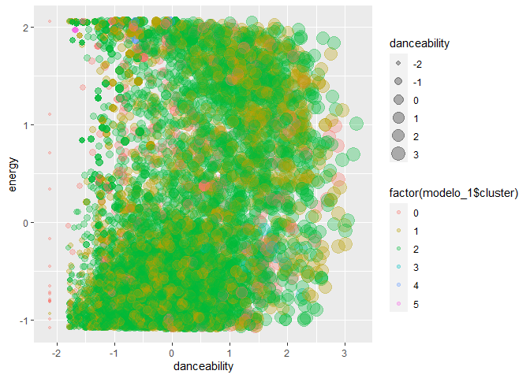
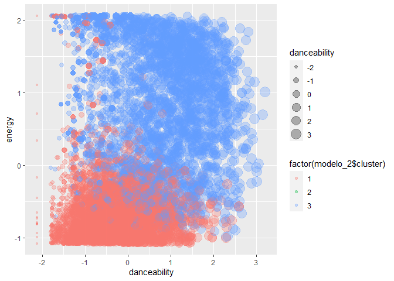
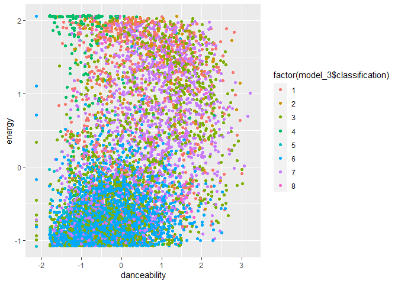
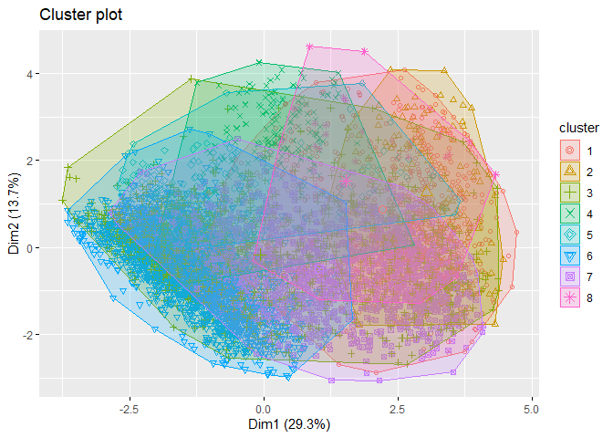
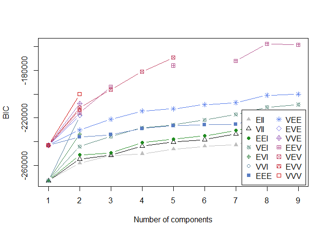
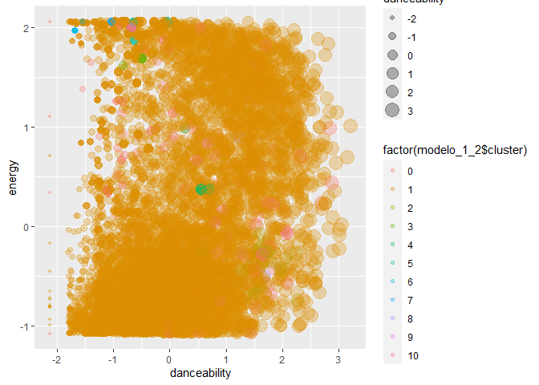
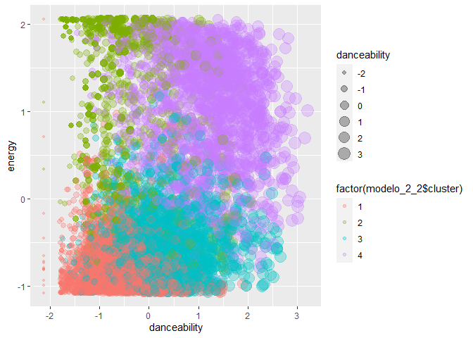
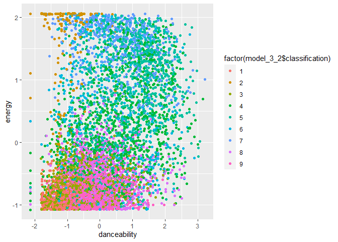
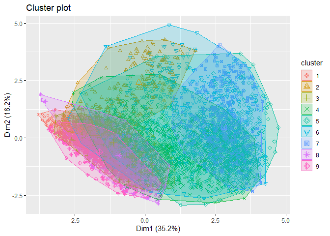
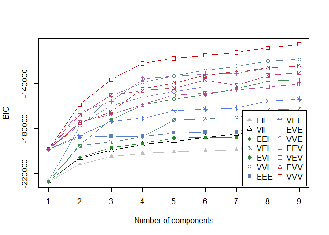

Actividad Ayudantia 8
================

## Actividad Ayudantía 8: Entrega 28/05

# Objetivo

Para esta actividad tendrán que utilizar el csv que está subido de
spotify o realizar ustedes un sample de la data del proyecto 2 de al
menos 8000 observaciones.

Para dicho dataset tendrán que realizar los tres modelos de clustering
vistos en la ayudantía y tendrán que ejecutar 3 iteraciones del análisis
mencionando que modificaron en cada iteración en la búsqueda de mejorar
los clúster que se forman.

## Carga de Librerías

Se añaden a nuestro código las librerías a utilizar para los análisis
que realizaremos.

``` r
library(tidyverse)
```

    ## -- Attaching packages --------------------------------------- tidyverse 1.3.0 --

    ## v ggplot2 3.3.3     v purrr   0.3.4
    ## v tibble  3.1.0     v dplyr   1.0.5
    ## v tidyr   1.1.3     v stringr 1.4.0
    ## v readr   1.4.0     v forcats 0.5.1

    ## -- Conflicts ------------------------------------------ tidyverse_conflicts() --
    ## x dplyr::filter() masks stats::filter()
    ## x dplyr::lag()    masks stats::lag()

``` r
library(cluster)
library(factoextra)
```

    ## Welcome! Want to learn more? See two factoextra-related books at https://goo.gl/ve3WBa

``` r
library(mclust)
```

    ## Package 'mclust' version 5.4.7
    ## Type 'citation("mclust")' for citing this R package in publications.

    ## 
    ## Attaching package: 'mclust'

    ## The following object is masked from 'package:purrr':
    ## 
    ##     map

``` r
library(readr)
library(dbscan)
library(e1071)
library(mclust)
```

## Cargar Datos Actividad

``` r
load("beats.RData")
```

## Preprocesamiento de los datos

### Selección de variables de interés

``` r
mus1 <- beats[, c(1,8:19, 23, 27)]
summary(mus1)
```

    ##  artist_name         danceability        energy            key        
    ##  Length:447622      Min.   :0.0000   Min.   :0.0000   Min.   : 0.000  
    ##  Class :character   1st Qu.:0.2520   1st Qu.:0.0756   1st Qu.: 2.000  
    ##  Mode  :character   Median :0.3700   Median :0.2100   Median : 5.000  
    ##                     Mean   :0.3911   Mean   :0.3405   Mean   : 5.061  
    ##                     3rd Qu.:0.5140   3rd Qu.:0.5820   3rd Qu.: 8.000  
    ##                     Max.   :0.9860   Max.   :1.0000   Max.   :11.000  
    ##     loudness            mode         speechiness       acousticness   
    ##  Min.   :-60.000   Min.   :0.0000   Min.   :0.00000   Min.   :0.0000  
    ##  1st Qu.:-24.445   1st Qu.:0.0000   1st Qu.:0.03780   1st Qu.:0.3940  
    ##  Median :-19.477   Median :1.0000   Median :0.04430   Median :0.9230  
    ##  Mean   :-18.672   Mean   :0.6834   Mean   :0.06892   Mean   :0.6987  
    ##  3rd Qu.:-11.644   3rd Qu.:1.0000   3rd Qu.:0.05840   3rd Qu.:0.9860  
    ##  Max.   :  0.496   Max.   :1.0000   Max.   :0.97100   Max.   :0.9960  
    ##  instrumentalness     liveness         valence           tempo       
    ##  Min.   :0.00000   Min.   :0.0000   Min.   :0.0000   Min.   :  0.00  
    ##  1st Qu.:0.00169   1st Qu.:0.0968   1st Qu.:0.0894   1st Qu.: 82.39  
    ##  Median :0.71500   Median :0.1230   Median :0.2740   Median :105.72  
    ##  Mean   :0.50607   Mean   :0.2217   Mean   :0.3374   Mean   :108.74  
    ##  3rd Qu.:0.90100   3rd Qu.:0.2530   3rd Qu.:0.5370   3rd Qu.:131.05  
    ##  Max.   :1.00000   Max.   :1.0000   Max.   :0.9960   Max.   :244.95  
    ##    track_id          duration_ms       track_name       
    ##  Length:447622      Min.   :   1066   Length:447622     
    ##  Class :character   1st Qu.: 123440   Class :character  
    ##  Mode  :character   Median : 194961   Mode  :character  
    ##                     Mean   : 229110                     
    ##                     3rd Qu.: 271560                     
    ##                     Max.   :4796395

``` r
nrow(mus1)
```

    ## [1] 447622

### Limpieza de datos NA

Al hacer el resumen de nuestra tabla filtrada, podemos ver que no
existen datos que sean NA en las variables seleccionadas. Por ende se
prosigue con el analisis para eliminar los elementos que se encuentren
duplicados.

### Limpieza de datos duplicados

``` r
mus_uni <- mus1[!duplicated(mus1$track_id),]
nrow(mus1) - nrow(mus_uni)
```

    ## [1] 2525

``` r
summary(mus_uni)
```

    ##  artist_name         danceability        energy            key        
    ##  Length:445097      Min.   :0.0000   Min.   :0.0000   Min.   : 0.000  
    ##  Class :character   1st Qu.:0.2520   1st Qu.:0.0754   1st Qu.: 2.000  
    ##  Mode  :character   Median :0.3690   Median :0.2090   Median : 5.000  
    ##                     Mean   :0.3907   Mean   :0.3400   Mean   : 5.061  
    ##                     3rd Qu.:0.5130   3rd Qu.:0.5800   3rd Qu.: 8.000  
    ##                     Max.   :0.9860   Max.   :1.0000   Max.   :11.000  
    ##     loudness            mode         speechiness       acousticness   
    ##  Min.   :-60.000   Min.   :0.0000   Min.   :0.00000   Min.   :0.0000  
    ##  1st Qu.:-24.468   1st Qu.:0.0000   1st Qu.:0.03780   1st Qu.:0.3970  
    ##  Median :-19.513   Median :1.0000   Median :0.04430   Median :0.9240  
    ##  Mean   :-18.699   Mean   :0.6836   Mean   :0.06896   Mean   :0.6993  
    ##  3rd Qu.:-11.698   3rd Qu.:1.0000   3rd Qu.:0.05840   3rd Qu.:0.9860  
    ##  Max.   :  0.496   Max.   :1.0000   Max.   :0.97100   Max.   :0.9960  
    ##  instrumentalness     liveness         valence           tempo       
    ##  Min.   :0.00000   Min.   :0.0000   Min.   :0.0000   Min.   :  0.00  
    ##  1st Qu.:0.00177   1st Qu.:0.0968   1st Qu.:0.0889   1st Qu.: 82.35  
    ##  Median :0.71900   Median :0.1230   Median :0.2730   Median :105.71  
    ##  Mean   :0.50728   Mean   :0.2215   Mean   :0.3368   Mean   :108.71  
    ##  3rd Qu.:0.90100   3rd Qu.:0.2520   3rd Qu.:0.5360   3rd Qu.:131.05  
    ##  Max.   :1.00000   Max.   :1.0000   Max.   :0.9960   Max.   :244.95  
    ##    track_id          duration_ms       track_name       
    ##  Length:445097      Min.   :   1066   Length:445097     
    ##  Class :character   1st Qu.: 123036   Class :character  
    ##  Mode  :character   Median : 194613   Mode  :character  
    ##                     Mean   : 228908                     
    ##                     3rd Qu.: 271106                     
    ##                     Max.   :4796395

## Conversión de tipo de datos

Podemos ver en el resumen de mus\_uni, que existen diversos tipos de
datos. Por este motivo procederemos a unficarlos tanto en double (para
los que son numéricos) y character para aquellos que sean palabras, de
esta manera no tendremos inconvenientes por el tipo de dato al realizar
los análisis.

``` r
mus_uni$danceability <- as.double(as.character(mus_uni$danceability))
mus_uni$energy <- as.double(as.character(mus_uni$energy))
mus_uni$key <- as.double(as.character(mus_uni$key))
mus_uni$loudness <- as.double(as.character(mus_uni$loudness))
mus_uni$mode <- as.double(as.character(mus_uni$mode))
mus_uni$speechiness <- as.double(as.character(mus_uni$speechiness)) 
mus_uni$acousticness <- as.double(as.character(mus_uni$acousticness))
mus_uni$instrumentalness <- as.double(as.character(mus_uni$instrumentalness))
mus_uni$liveness <- as.double(as.character(mus_uni$liveness))
mus_uni$valence <- as.double(as.character(mus_uni$valence))
mus_uni$tempo <- as.double(as.character(mus_uni$tempo))
mus_uni$duration_ms <- as.double(as.character(mus_uni$duration_ms))
```

Asimismo, realizamos este procedimiento para las varibales que son de
tipo character para volver a convertirlas, en el mismo tipo de dato, que
es character. Y luego se realiza un summary para verificar que no haya
quedado alguna variable NA, luego de realizar las conversiones de tipo
de datos.

``` r
mus_uni$track_id <- as.character(mus_uni$track_id)
mus_uni$track_name <- as.character(mus_uni$track_name)
mus_uni$artist_name <- as.character(mus_uni$artist_name)
summary(mus_uni)
```

    ##  artist_name         danceability        energy            key        
    ##  Length:445097      Min.   :0.0000   Min.   :0.0000   Min.   : 0.000  
    ##  Class :character   1st Qu.:0.2520   1st Qu.:0.0754   1st Qu.: 2.000  
    ##  Mode  :character   Median :0.3690   Median :0.2090   Median : 5.000  
    ##                     Mean   :0.3907   Mean   :0.3400   Mean   : 5.061  
    ##                     3rd Qu.:0.5130   3rd Qu.:0.5800   3rd Qu.: 8.000  
    ##                     Max.   :0.9860   Max.   :1.0000   Max.   :11.000  
    ##     loudness            mode         speechiness       acousticness   
    ##  Min.   :-60.000   Min.   :0.0000   Min.   :0.00000   Min.   :0.0000  
    ##  1st Qu.:-24.468   1st Qu.:0.0000   1st Qu.:0.03780   1st Qu.:0.3970  
    ##  Median :-19.513   Median :1.0000   Median :0.04430   Median :0.9240  
    ##  Mean   :-18.699   Mean   :0.6836   Mean   :0.06896   Mean   :0.6993  
    ##  3rd Qu.:-11.698   3rd Qu.:1.0000   3rd Qu.:0.05840   3rd Qu.:0.9860  
    ##  Max.   :  0.496   Max.   :1.0000   Max.   :0.97100   Max.   :0.9960  
    ##  instrumentalness     liveness         valence           tempo       
    ##  Min.   :0.00000   Min.   :0.0000   Min.   :0.0000   Min.   :  0.00  
    ##  1st Qu.:0.00177   1st Qu.:0.0968   1st Qu.:0.0889   1st Qu.: 82.35  
    ##  Median :0.71900   Median :0.1230   Median :0.2730   Median :105.71  
    ##  Mean   :0.50728   Mean   :0.2215   Mean   :0.3368   Mean   :108.71  
    ##  3rd Qu.:0.90100   3rd Qu.:0.2520   3rd Qu.:0.5360   3rd Qu.:131.05  
    ##  Max.   :1.00000   Max.   :1.0000   Max.   :0.9960   Max.   :244.95  
    ##    track_id          duration_ms       track_name       
    ##  Length:445097      Min.   :   1066   Length:445097     
    ##  Class :character   1st Qu.: 123036   Class :character  
    ##  Mode  :character   Median : 194613   Mode  :character  
    ##                     Mean   : 228908                     
    ##                     3rd Qu.: 271106                     
    ##                     Max.   :4796395

## Muestreo Aleatorio

``` r
set.seed(1000)
mus_muest <- mus_uni[sample(nrow(mus_uni), 8000),]
summary(mus_muest)
```

    ##  artist_name         danceability       energy               key        
    ##  Length:8000        Min.   :0.000   Min.   :0.0000201   Min.   : 0.000  
    ##  Class :character   1st Qu.:0.250   1st Qu.:0.0783750   1st Qu.: 2.000  
    ##  Mode  :character   Median :0.367   Median :0.2110000   Median : 5.000  
    ##                     Mean   :0.389   Mean   :0.3424122   Mean   : 5.042  
    ##                     3rd Qu.:0.510   3rd Qu.:0.5910000   3rd Qu.: 8.000  
    ##                     Max.   :0.976   Max.   :1.0000000   Max.   :11.000  
    ##     loudness            mode         speechiness       acousticness   
    ##  Min.   :-47.432   Min.   :0.0000   Min.   :0.00000   Min.   :0.0000  
    ##  1st Qu.:-24.372   1st Qu.:0.0000   1st Qu.:0.03800   1st Qu.:0.3830  
    ##  Median :-19.434   Median :1.0000   Median :0.04430   Median :0.9220  
    ##  Mean   :-18.667   Mean   :0.6866   Mean   :0.06744   Mean   :0.6967  
    ##  3rd Qu.:-11.825   3rd Qu.:1.0000   3rd Qu.:0.05770   3rd Qu.:0.9860  
    ##  Max.   : -0.203   Max.   :1.0000   Max.   :0.96400   Max.   :0.9960  
    ##  instrumentalness      liveness         valence            tempo       
    ##  Min.   :0.000000   Min.   :0.0000   Min.   :0.00000   Min.   :  0.00  
    ##  1st Qu.:0.002045   1st Qu.:0.0975   1st Qu.:0.08297   1st Qu.: 82.86  
    ##  Median :0.738000   Median :0.1230   Median :0.26200   Median :106.08  
    ##  Mean   :0.512936   Mean   :0.2241   Mean   :0.33365   Mean   :109.16  
    ##  3rd Qu.:0.901000   3rd Qu.:0.2600   3rd Qu.:0.53400   3rd Qu.:131.15  
    ##  Max.   :0.999000   Max.   :0.9940   Max.   :0.98500   Max.   :235.50  
    ##    track_id          duration_ms       track_name       
    ##  Length:8000        Min.   :   6466   Length:8000       
    ##  Class :character   1st Qu.: 123060   Class :character  
    ##  Mode  :character   Median : 195166   Mode  :character  
    ##                     Mean   : 231641                     
    ##                     3rd Qu.: 273930                     
    ##                     Max.   :4436626

## Escalamiento de los Datos

Luego en este punto se procede a escalar la data. El sentido de esto es
poder trabajar en medidas que sean mas pequeñas y que por ende, permitan
que los analisis sean mas sencillos. Es por esto que lo primero que se
debe hacer es separar las variables que sean numericas de las
caracteres, en la base de datos de la muestra.

``` r
songs_char <- mus_muest %>% 
  select(c("artist_name", "track_id", "track_name"))
songs_num <- mus_muest %>%
  select(c("key", "danceability", "energy", "loudness", "mode", "speechiness", "acousticness", "instrumentalness", "liveness", "valence", "tempo", "duration_ms"))
```

``` r
mus_scale <- data.frame(sapply(songs_num, scale))
```

A continuación se procede a revisar que la data escalada no tenga
valores que sean NA, ya que como se hizo este proceso quizás algún dato
fue emitido. Seria extraño, pero no esta nunca de más revisar. En caso
de existir, estos son retirados.

``` r
summary(mus_scale)
```

    ##       key            danceability         energy           loudness       
    ##  Min.   :-1.44000   Min.   :-2.1275   Min.   :-1.0742   Min.   :-3.34867  
    ##  1st Qu.:-0.86875   1st Qu.:-0.7603   1st Qu.:-0.8284   1st Qu.:-0.66417  
    ##  Median :-0.01189   Median :-0.1205   Median :-0.4123   Median :-0.08932  
    ##  Mean   : 0.00000   Mean   : 0.0000   Mean   : 0.0000   Mean   : 0.00000  
    ##  3rd Qu.: 0.84498   3rd Qu.: 0.6615   3rd Qu.: 0.7799   3rd Qu.: 0.79647  
    ##  Max.   : 1.70184   Max.   : 3.2099   Max.   : 2.0630   Max.   : 2.14943  
    ##       mode          speechiness       acousticness     instrumentalness 
    ##  Min.   :-1.4801   Min.   :-0.7554   Min.   :-1.8777   Min.   :-1.2383  
    ##  1st Qu.:-1.4801   1st Qu.:-0.3297   1st Qu.:-0.8455   1st Qu.:-1.2334  
    ##  Median : 0.6755   Median :-0.2592   Median : 0.6071   Median : 0.5433  
    ##  Mean   : 0.0000   Mean   : 0.0000   Mean   : 0.0000   Mean   : 0.0000  
    ##  3rd Qu.: 0.6755   3rd Qu.:-0.1091   3rd Qu.: 0.7796   3rd Qu.: 0.9368  
    ##  Max.   : 0.6755   Max.   :10.0421   Max.   : 0.8066   Max.   : 1.1734  
    ##     liveness          valence            tempo           duration_ms     
    ##  Min.   :-1.0151   Min.   :-1.2118   Min.   :-3.46624   Min.   :-1.2401  
    ##  1st Qu.:-0.5735   1st Qu.:-0.9104   1st Qu.:-0.83507   1st Qu.:-0.5980  
    ##  Median :-0.4580   Median :-0.2602   Median :-0.09779   Median :-0.2009  
    ##  Mean   : 0.0000   Mean   : 0.0000   Mean   : 0.00000   Mean   : 0.0000  
    ##  3rd Qu.: 0.1626   3rd Qu.: 0.7277   3rd Qu.: 0.69830   3rd Qu.: 0.2329  
    ##  Max.   : 3.4874   Max.   : 2.3657   Max.   : 4.01195   Max.   :23.1571

# DBSCAN

Primer método, clustering basado en densidad

``` r
modelo_1 = dbscan(mus_scale, eps = 2, minPts = 10)
modelo_1
```

    ## DBSCAN clustering for 8000 objects.
    ## Parameters: eps = 2, minPts = 10
    ## The clustering contains 5 cluster(s) and 357 noise points.
    ## 
    ##    0    1    2    3    4    5 
    ##  357 2314 5283   19   13   14 
    ## 
    ## Available fields: cluster, eps, minPts

El modelo genera 5 clúster, basado en los parámetros que le entregamos a
la función dbscan.

``` r
ggplot(mus_scale, aes(danceability, energy, color = factor(modelo_1$cluster), size = danceability)) + geom_point(alpha = 0.3) 
```

<!-- -->

# Fuzzy C Means

Se le va a pedir la misma cantidad de clúster que el modelo anterior (3)
y un fusificador de 2 tal como se vio en la ayudantía.

``` r
modelo_2 <- cmeans(mus_scale, 3, m=5) 
modelo_2$membership %>% head()
```

    ##              1         2         3
    ## [1,] 0.3333457 0.3333311 0.3333232
    ## [2,] 0.3333565 0.3333291 0.3333144
    ## [3,] 0.3333305 0.3333338 0.3333356
    ## [4,] 0.3333291 0.3333341 0.3333368
    ## [5,] 0.3333290 0.3333341 0.3333369
    ## [6,] 0.3333058 0.3333384 0.3333559

El algoritmo cmeans asigna como clúster al que tenga mayor probabilidad.
El primer parámetro corresponde a la cantidad de clúster deseados. Al
aumentar el fusificador, se observan pequeños cambios en las
probabilidades entregadas, pero no corresponden a cambios
significativos.

Otros algoritmos como el c-means permiten asignarle un clúster a todos
los puntos

``` r
ggplot(mus_scale, aes(danceability, energy, color = factor(modelo_2$cluster), size = danceability)) + geom_point(alpha = 0.3) 
```

<!-- -->

Se pueden observar de manera más concreta los diferentes clúster
obtenidos, pero de igual manera un clúster de baja relevancia queda
oculto entre los otros dos.

Para los modelos de clustering difuso podemos calcular el Coeficiente de
partición difusa (FPC)

``` r
matriz <- modelo_2$membership%*%t(modelo_2$membership) 
(FPC <- sum(matriz*diag(nrow(matriz)))/nrow(matriz))
```

    ## [1] 0.3333333

El valor del FPC es bajo, lo que significa que los grupos tienen alta
variabilidad, y se puede confirmar en la figura, ya que no se ven grupos
definidos.

# GMM

GMM permiten obtener clúster difusos utilizando modelos probabilísticos

``` r
model_3 = Mclust(mus_scale)
model_3 
```

    ## 'Mclust' model object: (EEV,8) 
    ## 
    ## Available components: 
    ##  [1] "call"           "data"           "modelName"      "n"             
    ##  [5] "d"              "G"              "BIC"            "loglik"        
    ##  [9] "df"             "bic"            "icl"            "hypvol"        
    ## [13] "parameters"     "z"              "classification" "uncertainty"

``` r
summary(model_3, parameters = TRUE)
```

    ## ---------------------------------------------------- 
    ## Gaussian finite mixture model fitted by EM algorithm 
    ## ---------------------------------------------------- 
    ## 
    ## Mclust EEV (ellipsoidal, equal volume and shape) model with 8 components: 
    ## 
    ##  log-likelihood    n  df       BIC       ICL
    ##       -76054.71 8000 643 -157888.2 -158396.3
    ## 
    ## Clustering table:
    ##    1    2    3    4    5    6    7    8 
    ##  723  158 1960  479  204 2665 1703  108 
    ## 
    ## Mixing probabilities:
    ##          1          2          3          4          5          6          7 
    ## 0.09455939 0.02034789 0.24416962 0.05977780 0.02619545 0.33074785 0.21068712 
    ##          8 
    ## 0.01351489 
    ## 
    ## Means:
    ##                         [,1]       [,2]         [,3]        [,4]        [,5]
    ## key              -0.15290151  0.1768862  0.166317222 -0.05881775 -0.01560145
    ## danceability      0.41879849  0.5897000  0.110005053 -0.88370974 -0.73525850
    ## energy            0.91966507  1.5181179 -0.124996522  1.59751973 -0.48921706
    ## loudness          0.85150732  1.3632410 -0.006662353 -0.47044088 -0.06287076
    ## mode              0.67553090 -0.9054679 -1.480132134 -0.21350243 -0.84576933
    ## speechiness       1.00916534  0.9589079 -0.190815933  0.25065726 -0.30683851
    ## acousticness     -0.94760603 -1.8107044  0.038841786 -0.58894020  0.38322041
    ## instrumentalness -1.17927546 -0.6150753  0.016196954  0.53474397  0.36346972
    ## liveness          1.21392667  1.1608593 -0.278540969  1.76420603  0.33916008
    ## valence           0.31311571  0.2400165  0.058407223 -1.14648639 -0.69816682
    ## tempo             0.16691793  0.6328435 -0.038092987 -0.37246027 -0.26538794
    ## duration_ms      -0.04530697  0.4251353 -0.128397706 -0.57116658  2.93170106
    ##                         [,6]        [,7]        [,8]
    ## key              -0.06063746 -0.04585119  0.28783418
    ## danceability     -0.26160106  0.37544691  0.07757633
    ## energy           -0.68734425  0.20917665  0.98060275
    ## loudness         -0.58491113  0.54740719  0.09359732
    ## mode              0.67553090  0.67553090 -1.10161213
    ## speechiness      -0.23837969 -0.26614965  4.41184002
    ## acousticness      0.72230980 -0.43651527 -0.35533176
    ## instrumentalness  0.78832339 -0.84067759 -0.37226718
    ## liveness         -0.38470132 -0.32382418  0.79334347
    ## valence          -0.06421170  0.29471338 -0.20601967
    ## tempo            -0.08004886  0.17049092  0.03056016
    ## duration_ms       0.02626757 -0.10002900 -0.24290575
    ## 
    ## Variances:
    ## [,,1]
    ##                            key  danceability        energy      loudness
    ## key               5.818946e-01  6.602185e-02  1.006091e-02  1.357099e-02
    ## danceability      6.602185e-02  7.150350e-01 -5.910690e-02  1.406786e-01
    ## energy            1.006091e-02 -5.910690e-02  4.614158e-01  3.069139e-01
    ## loudness          1.357099e-02  1.406786e-01  3.069139e-01  3.876992e-01
    ## mode              2.648797e-18  1.636862e-17 -4.031119e-17 -1.680829e-17
    ## speechiness       4.235801e-02  3.656702e-01 -1.971582e-01 -2.136289e-01
    ## acousticness      1.018066e-02  7.622076e-02 -3.094786e-01 -2.102759e-01
    ## instrumentalness -1.660829e-02 -1.654694e-02  1.761008e-02  1.890695e-03
    ## liveness         -1.380798e-02 -2.504324e-01  8.172507e-02  1.811621e-03
    ## valence           4.582408e-02  3.615730e-01  4.075692e-02  1.574982e-01
    ## tempo             7.949412e-04  6.806706e-02  1.538366e-01  1.847562e-01
    ## duration_ms      -5.346764e-03 -6.122610e-02  1.061704e-01  9.968822e-02
    ##                           mode   speechiness  acousticness instrumentalness
    ## key               2.648797e-18  4.235801e-02  1.018066e-02    -1.660829e-02
    ## danceability      1.636862e-17  3.656702e-01  7.622076e-02    -1.654694e-02
    ## energy           -4.031119e-17 -1.971582e-01 -3.094786e-01     1.761008e-02
    ## loudness         -1.680829e-17 -2.136289e-01 -2.102759e-01     1.890695e-03
    ## mode              6.455416e-04 -1.605380e-18 -2.985866e-17     1.326762e-17
    ## speechiness      -1.605380e-18  2.691619e+00  2.837236e-01     2.820200e-03
    ## acousticness     -2.985866e-17  2.837236e-01  5.492679e-01     7.034643e-03
    ## instrumentalness  1.326762e-17  2.820200e-03  7.034643e-03     3.473708e-02
    ## liveness          1.737360e-17 -4.582809e-01 -1.610134e-02     1.128080e-02
    ## valence           4.500193e-17  1.365496e-01  2.829781e-02    -1.406530e-02
    ## tempo            -3.814731e-17 -8.872411e-02 -1.246147e-01    -1.743322e-03
    ## duration_ms       1.943366e-17 -1.673416e-01 -1.268874e-01     1.608948e-03
    ##                       liveness       valence         tempo   duration_ms
    ## key              -1.380798e-02  4.582408e-02  7.949412e-04 -5.346764e-03
    ## danceability     -2.504324e-01  3.615730e-01  6.806706e-02 -6.122610e-02
    ## energy            8.172507e-02  4.075692e-02  1.538366e-01  1.061704e-01
    ## loudness          1.811621e-03  1.574982e-01  1.847562e-01  9.968822e-02
    ## mode              1.737360e-17  4.500193e-17 -3.814731e-17  1.943366e-17
    ## speechiness      -4.582809e-01  1.365496e-01 -8.872411e-02 -1.673416e-01
    ## acousticness     -1.610134e-02  2.829781e-02 -1.246147e-01 -1.268874e-01
    ## instrumentalness  1.128080e-02 -1.406530e-02 -1.743322e-03  1.608948e-03
    ## liveness          1.175188e+00 -9.925223e-02 -3.722921e-02  1.156118e-01
    ## valence          -9.925223e-02  5.866778e-01  1.266055e-01 -6.360086e-02
    ## tempo            -3.722921e-02  1.266055e-01  5.991163e-01  3.693233e-02
    ## duration_ms       1.156118e-01 -6.360086e-02  3.693233e-02  2.225030e-01
    ## [,,2]
    ##                          key danceability       energy     loudness        mode
    ## key               0.63583867  0.175383688 -0.073569871 -0.035968825 -0.10430896
    ## danceability      0.17538369  0.747001755 -0.168855156 -0.008908116 -0.21548974
    ## energy           -0.07356987 -0.168855156  0.184601928  0.101308921  0.04762631
    ## loudness         -0.03596883 -0.008908116  0.101308921  0.119333400 -0.01371091
    ## mode             -0.10430896 -0.215489739  0.047626309 -0.013710911  0.64217076
    ## speechiness       0.19305302  0.322812359 -0.246223435 -0.167669709 -0.17205511
    ## acousticness      0.01435385  0.044225372 -0.018112098 -0.010282838 -0.02080299
    ## instrumentalness -0.01028547 -0.163227108 -0.008869604 -0.057643508  0.47164259
    ## liveness         -0.12673891 -0.565360326  0.164197256  0.023810691  0.21536502
    ## valence           0.14465123  0.307207366 -0.053139525  0.029991361 -0.24023489
    ## tempo            -0.08795526 -0.242259703  0.069297583  0.016151677  0.03274290
    ## duration_ms       0.02827915 -0.217688638 -0.005232121 -0.046762682  0.21989695
    ##                  speechiness acousticness instrumentalness    liveness
    ## key               0.19305302  0.014353846     -0.010285475 -0.12673891
    ## danceability      0.32281236  0.044225372     -0.163227108 -0.56536033
    ## energy           -0.24622344 -0.018112098     -0.008869604  0.16419726
    ## loudness         -0.16766971 -0.010282838     -0.057643508  0.02381069
    ## mode             -0.17205511 -0.020802986      0.471642594  0.21536502
    ## speechiness       1.77908231  0.068703479     -0.017601229 -0.73168692
    ## acousticness      0.06870348  0.006448530     -0.021084507 -0.03369137
    ## instrumentalness -0.01760123 -0.021084507      0.494585061  0.08594494
    ## liveness         -0.73168692 -0.033691373      0.085944941  1.70051617
    ## valence           0.10536571  0.020655754     -0.198582387 -0.26434751
    ## tempo            -0.06559793 -0.025490147      0.062251473 -0.04027433
    ## duration_ms      -0.30556527 -0.007214684      0.180144254  0.25384716
    ##                      valence       tempo  duration_ms
    ## key               0.14465123 -0.08795526  0.028279146
    ## danceability      0.30720737 -0.24225970 -0.217688638
    ## energy           -0.05313952  0.06929758 -0.005232121
    ## loudness          0.02999136  0.01615168 -0.046762682
    ## mode             -0.24023489  0.03274290  0.219896950
    ## speechiness       0.10536571 -0.06559793 -0.305565272
    ## acousticness      0.02065575 -0.02549015 -0.007214684
    ## instrumentalness -0.19858239  0.06225147  0.180144254
    ## liveness         -0.26434751 -0.04027433  0.253847156
    ## valence           0.47188200 -0.08554677 -0.199150449
    ## tempo            -0.08554677  0.61349695 -0.033660038
    ## duration_ms      -0.19915045 -0.03366004  0.610842059
    ## [,,3]
    ##                            key  danceability        energy      loudness
    ## key               1.127219e+00 -5.109856e-02  1.080664e-01  4.978760e-02
    ## danceability     -5.109856e-02  9.829020e-01  3.349532e-01  4.672542e-01
    ## energy            1.080664e-01  3.349532e-01  6.580001e-01  6.237181e-01
    ## loudness          4.978760e-02  4.672542e-01  6.237181e-01  8.782578e-01
    ## mode              3.169382e-18 -6.364703e-17 -2.491129e-17 -7.044627e-17
    ## speechiness      -1.779354e-03  7.135355e-02  3.052640e-02  1.661633e-02
    ## acousticness     -1.566217e-01 -3.095310e-01 -6.226388e-01 -5.801373e-01
    ## instrumentalness -5.249727e-02 -2.458492e-01 -3.248493e-01 -4.890571e-01
    ## liveness         -3.203111e-02 -4.278710e-02  1.416924e-01  1.351569e-01
    ## valence          -4.882616e-02  6.265328e-01  2.835518e-01  3.061913e-01
    ## tempo             2.182670e-02  1.653369e-01  1.990380e-01  2.352149e-01
    ## duration_ms       1.208844e-02 -9.466447e-04  1.013651e-01  1.653372e-01
    ##                           mode   speechiness  acousticness instrumentalness
    ## key               3.169382e-18 -1.779354e-03 -1.566217e-01    -5.249727e-02
    ## danceability     -6.364703e-17  7.135355e-02 -3.095310e-01    -2.458492e-01
    ## energy           -2.491129e-17  3.052640e-02 -6.226388e-01    -3.248493e-01
    ## loudness         -7.044627e-17  1.661633e-02 -5.801373e-01    -4.890571e-01
    ## mode              6.455416e-04  4.462623e-17  1.813395e-17    -1.889661e-16
    ## speechiness       4.462623e-17  4.555485e-02 -2.227488e-02    -3.057390e-02
    ## acousticness      1.813395e-17 -2.227488e-02  8.353328e-01     4.129428e-01
    ## instrumentalness -1.889661e-16 -3.057390e-02  4.129428e-01     9.154402e-01
    ## liveness          4.117615e-17  1.374888e-02 -1.217159e-01    -1.435535e-01
    ## valence          -4.330027e-17  3.678289e-02 -1.660906e-01    -1.381247e-01
    ## tempo             1.118406e-16  2.354207e-02 -1.849006e-01    -1.213155e-01
    ## duration_ms      -6.058661e-17 -1.908082e-02 -1.309448e-01    -7.814359e-02
    ##                       liveness       valence         tempo   duration_ms
    ## key              -3.203111e-02 -4.882616e-02  2.182670e-02  1.208844e-02
    ## danceability     -4.278710e-02  6.265328e-01  1.653369e-01 -9.466447e-04
    ## energy            1.416924e-01  2.835518e-01  1.990380e-01  1.013651e-01
    ## loudness          1.351569e-01  3.061913e-01  2.352149e-01  1.653372e-01
    ## mode              4.117615e-17 -4.330027e-17  1.118406e-16 -6.058661e-17
    ## speechiness       1.374888e-02  3.678289e-02  2.354207e-02 -1.908082e-02
    ## acousticness     -1.217159e-01 -1.660906e-01 -1.849006e-01 -1.309448e-01
    ## instrumentalness -1.435535e-01 -1.381247e-01 -1.213155e-01 -7.814359e-02
    ## liveness          2.742780e-01  4.973666e-02  7.147808e-03 -3.277559e-02
    ## valence           4.973666e-02  9.818453e-01  2.059524e-01 -1.332069e-01
    ## tempo             7.147808e-03  2.059524e-01  9.350178e-01  5.648478e-02
    ## duration_ms      -3.277559e-02 -1.332069e-01  5.648478e-02  3.713058e-01
    ## [,,4]
    ##                          key danceability      energy     loudness        mode
    ## key               1.79146725   0.13056813 -0.16765994 -0.132885475 -0.91180603
    ## danceability      0.13056813   0.36636723 -0.15382666 -0.016401870 -0.18778988
    ## energy           -0.16765994  -0.15382666  0.43771128  0.095871154  0.18202325
    ## loudness         -0.13288547  -0.01640187  0.09587115  0.269368485 -0.01325049
    ## mode             -0.91180603  -0.18778988  0.18202325 -0.013250489  1.42604841
    ## speechiness       0.22474649   0.27391304 -0.33919831  0.029374972 -0.41839078
    ## acousticness     -0.07784035   0.14248318  0.13944725  0.015001315  0.02020327
    ## instrumentalness -0.21791852  -0.09296888  0.06259270 -0.015642723  0.30904260
    ## liveness         -0.36394962  -0.23848182  0.25919959  0.092828703  0.11039697
    ## valence           0.02387841   0.03734308 -0.04491060 -0.002840979 -0.03453568
    ## tempo            -0.32674088  -0.14961091  0.08233428  0.110901673  0.25935312
    ## duration_ms      -0.03258455   0.00744999  0.03495678  0.057995774 -0.07902719
    ##                  speechiness acousticness instrumentalness      liveness
    ## key               0.22474649 -0.077840347      -0.21791852 -0.3639496224
    ## danceability      0.27391304  0.142483183      -0.09296888 -0.2384818182
    ## energy           -0.33919831  0.139447255       0.06259270  0.2591995906
    ## loudness          0.02937497  0.015001315      -0.01564272  0.0928287029
    ## mode             -0.41839078  0.020203270       0.30904260  0.1103969673
    ## speechiness       0.60407520  0.079772965      -0.19826063 -0.2285963473
    ## acousticness      0.07977297  0.650845975       0.01791893  0.1797569531
    ## instrumentalness -0.19826063  0.017918935       0.38729686  0.2043322004
    ## liveness         -0.22859635  0.179756953       0.20433220  1.1882628832
    ## valence           0.05740354  0.001403161      -0.02360155 -0.0487069136
    ## tempo            -0.09109236 -0.159276019       0.05712320  0.0007387912
    ## duration_ms       0.05006488  0.082565412      -0.03143113  0.0224520170
    ##                       valence         tempo  duration_ms
    ## key               0.023878409 -0.3267408786 -0.032584551
    ## danceability      0.037343077 -0.1496109148  0.007449990
    ## energy           -0.044910598  0.0823342842  0.034956780
    ## loudness         -0.002840979  0.1109016730  0.057995774
    ## mode             -0.034535684  0.2593531230 -0.079027190
    ## speechiness       0.057403535 -0.0910923612  0.050064884
    ## acousticness      0.001403161 -0.1592760192  0.082565412
    ## instrumentalness -0.023601551  0.0571231953 -0.031431127
    ## liveness         -0.048706914  0.0007387912  0.022452017
    ## valence           0.007643540 -0.0114480158  0.001899411
    ## tempo            -0.011448016  0.8091314464 -0.007897120
    ## duration_ms       0.001899411 -0.0078971203  0.067581045
    ## [,,5]
    ##                           key danceability       energy    loudness
    ## key               0.841078373 -0.053611336 -0.000968765  0.01205215
    ## danceability     -0.053611336  0.338435684  0.145908135  0.06671855
    ## energy           -0.000968765  0.145908135  0.225114826  0.17382658
    ## loudness          0.012052147  0.066718549  0.173826584  0.27986086
    ## mode             -0.098263154 -0.052855033 -0.036572545 -0.05248547
    ## speechiness       0.003431629 -0.001389041 -0.002793972 -0.01293018
    ## acousticness      0.002134920 -0.029606565 -0.156523556 -0.10798156
    ## instrumentalness -0.049351554 -0.045848321 -0.090855012 -0.13974023
    ## liveness         -0.009548513  0.154331665  0.259856790  0.17759953
    ## valence          -0.027768298  0.162559207  0.149592659  0.09088738
    ## tempo             0.027785045  0.208531898  0.093709042  0.03891534
    ## duration_ms       0.027885225 -0.068506085 -0.060866832 -0.01943797
    ##                          mode   speechiness acousticness instrumentalness
    ## key              -0.098263154  3.431629e-03  0.002134920    -0.0493515539
    ## danceability     -0.052855033 -1.389041e-03 -0.029606565    -0.0458483215
    ## energy           -0.036572545 -2.793972e-03 -0.156523556    -0.0908550121
    ## loudness         -0.052485474 -1.293018e-02 -0.107981558    -0.1397402264
    ## mode              0.807549766  1.280286e-03 -0.084192229    -0.1131227836
    ## speechiness       0.001280286  1.951355e-03  0.006956518    -0.0000734348
    ## acousticness     -0.084192229  6.956518e-03  0.340568486     0.0576459125
    ## instrumentalness -0.113122784 -7.343480e-05  0.057645913     0.5296657610
    ## liveness          0.162377375 -2.952176e-05 -0.288412826    -0.2248790332
    ## valence          -0.018294755  1.413876e-03 -0.096502697    -0.1191808090
    ## tempo            -0.132822798 -5.690237e-04  0.036173794    -0.0102519402
    ## duration_ms       0.165199193  2.954780e-03  0.090714631     0.1525869052
    ##                       liveness      valence         tempo duration_ms
    ## key              -9.548513e-03 -0.027768298  0.0277850450  0.02788523
    ## danceability      1.543317e-01  0.162559207  0.2085318975 -0.06850608
    ## energy            2.598568e-01  0.149592659  0.0937090418 -0.06086683
    ## loudness          1.775995e-01  0.090887384  0.0389153400 -0.01943797
    ## mode              1.623774e-01 -0.018294755 -0.1328227981  0.16519919
    ## speechiness      -2.952176e-05  0.001413876 -0.0005690237  0.00295478
    ## acousticness     -2.884128e-01 -0.096502697  0.0361737939  0.09071463
    ## instrumentalness -2.248790e-01 -0.119180809 -0.0102519402  0.15258691
    ## liveness          9.955617e-01  0.194970475  0.1164900274 -0.63825373
    ## valence           1.949705e-01  0.199338200  0.0996554393 -0.12357266
    ## tempo             1.164900e-01  0.099655439  0.7081921571 -0.04174732
    ## duration_ms      -6.382537e-01 -0.123572659 -0.0417473233  2.73848241
    ## [,,6]
    ##                            key  danceability        energy      loudness
    ## key               1.043840e+00  4.323226e-02 -3.008198e-03  2.149063e-02
    ## danceability      4.323226e-02  9.080835e-01  8.456579e-02  2.106855e-01
    ## energy           -3.008198e-03  8.456579e-02  2.423121e-01  1.969190e-01
    ## loudness          2.149063e-02  2.106855e-01  1.969190e-01  6.961261e-01
    ## mode              1.189807e-19  8.741495e-18  2.266118e-17 -2.127689e-17
    ## speechiness      -1.347575e-03  7.081830e-02  3.178848e-03 -8.674013e-03
    ## acousticness      9.523886e-03  2.656815e-02 -2.616975e-02 -1.521760e-02
    ## instrumentalness -7.272354e-03  1.635516e-02  2.155336e-03 -2.962520e-02
    ## liveness         -1.406975e-03  1.925978e-02  4.900179e-02  8.339208e-02
    ## valence           5.627032e-02  6.907537e-01  1.986359e-01  2.530395e-01
    ## tempo             7.418968e-02  3.254290e-01  1.037720e-01  2.108052e-01
    ## duration_ms       2.532458e-02 -4.389413e-01 -8.822435e-02  2.453409e-02
    ##                           mode   speechiness  acousticness instrumentalness
    ## key               1.189807e-19 -1.347575e-03  9.523886e-03    -7.272354e-03
    ## danceability      8.741495e-18  7.081830e-02  2.656815e-02     1.635516e-02
    ## energy            2.266118e-17  3.178848e-03 -2.616975e-02     2.155336e-03
    ## loudness         -2.127689e-17 -8.674013e-03 -1.521760e-02    -2.962520e-02
    ## mode              6.455416e-04 -1.120161e-16 -2.047450e-17    -4.165975e-17
    ## speechiness      -1.120161e-16  7.672122e-02 -1.223048e-03    -4.977108e-03
    ## acousticness     -2.047450e-17 -1.223048e-03  3.748807e-02     1.347096e-02
    ## instrumentalness -4.165975e-17 -4.977108e-03  1.347096e-02     2.535028e-01
    ## liveness          2.966827e-17  1.943032e-03 -1.306909e-02    -2.192054e-02
    ## valence          -4.248865e-18  3.095145e-02  1.978147e-02     3.265558e-02
    ## tempo             2.944042e-18  2.802612e-02  1.101186e-03    -1.521116e-02
    ## duration_ms      -1.301509e-18 -3.869681e-02 -2.436389e-02    -1.350265e-01
    ##                       liveness       valence         tempo   duration_ms
    ## key              -1.406975e-03  5.627032e-02  7.418968e-02  2.532458e-02
    ## danceability      1.925978e-02  6.907537e-01  3.254290e-01 -4.389413e-01
    ## energy            4.900179e-02  1.986359e-01  1.037720e-01 -8.822435e-02
    ## loudness          8.339208e-02  2.530395e-01  2.108052e-01  2.453409e-02
    ## mode              2.966827e-17 -4.248865e-18  2.944042e-18 -1.301509e-18
    ## speechiness       1.943032e-03  3.095145e-02  2.802612e-02 -3.869681e-02
    ## acousticness     -1.306909e-02  1.978147e-02  1.101186e-03 -2.436389e-02
    ## instrumentalness -2.192054e-02  3.265558e-02 -1.521116e-02 -1.350265e-01
    ## liveness          2.946388e-01  8.956982e-02  4.849222e-02 -5.872687e-02
    ## valence           8.956982e-02  1.490536e+00  5.500396e-01 -7.643749e-01
    ## tempo             4.849222e-02  5.500396e-01  1.348074e+00 -2.433227e-01
    ## duration_ms      -5.872687e-02 -7.643749e-01 -2.433227e-01  1.613832e+00
    ## [,,7]
    ##                            key  danceability        energy      loudness
    ## key               1.106136e+00  3.512267e-02 -2.934373e-02 -7.168223e-03
    ## danceability      3.512267e-02  1.125388e+00  4.183101e-01  4.890048e-01
    ## energy           -2.934373e-02  4.183101e-01  8.335149e-01  6.646030e-01
    ## loudness         -7.168223e-03  4.890048e-01  6.646030e-01  7.641466e-01
    ## mode             -2.582954e-18 -9.971988e-17 -2.743794e-18 -1.223904e-18
    ## speechiness       6.035641e-04 -3.783903e-03 -4.757568e-03 -2.047247e-02
    ## acousticness      9.870602e-02 -3.308793e-01 -7.792289e-01 -5.335210e-01
    ## instrumentalness -4.276926e-02 -1.480009e-01 -9.482865e-03 -1.290720e-01
    ## liveness          2.190438e-02 -6.175528e-02  4.232918e-02  2.074622e-02
    ## valence           8.989336e-02  6.522381e-01  4.020652e-01  3.360415e-01
    ## tempo            -1.221472e-02  1.030966e-01  2.113612e-01  1.806056e-01
    ## duration_ms      -3.490082e-03  2.690549e-02  1.410745e-01  1.324191e-01
    ##                           mode   speechiness  acousticness instrumentalness
    ## key              -2.582954e-18  6.035641e-04  9.870602e-02    -4.276926e-02
    ## danceability     -9.971988e-17 -3.783903e-03 -3.308793e-01    -1.480009e-01
    ## energy           -2.743794e-18 -4.757568e-03 -7.792289e-01    -9.482865e-03
    ## loudness         -1.223904e-18 -2.047247e-02 -5.335210e-01    -1.290720e-01
    ## mode              6.455416e-04  4.895898e-18 -1.533030e-17    -3.023069e-17
    ## speechiness       4.895898e-18  3.353109e-02  1.681198e-03     1.070759e-02
    ## acousticness     -1.533030e-17  1.681198e-03  1.133028e+00    -1.233419e-01
    ## instrumentalness -3.023069e-17  1.070759e-02 -1.233419e-01     5.563364e-01
    ## liveness         -2.085546e-17  2.805822e-03 -2.865039e-02     1.625356e-02
    ## valence           2.289561e-17  4.041574e-03 -2.486328e-01    -1.490375e-01
    ## tempo             1.437391e-16  1.343789e-02 -2.106629e-01    -1.093772e-02
    ## duration_ms      -5.570403e-17 -1.036603e-02 -1.508453e-01     4.263134e-03
    ##                       liveness       valence         tempo   duration_ms
    ## key               2.190438e-02  8.989336e-02 -1.221472e-02 -3.490082e-03
    ## danceability     -6.175528e-02  6.522381e-01  1.030966e-01  2.690549e-02
    ## energy            4.232918e-02  4.020652e-01  2.113612e-01  1.410745e-01
    ## loudness          2.074622e-02  3.360415e-01  1.806056e-01  1.324191e-01
    ## mode             -2.085546e-17  2.289561e-17  1.437391e-16 -5.570403e-17
    ## speechiness       2.805822e-03  4.041574e-03  1.343789e-02 -1.036603e-02
    ## acousticness     -2.865039e-02 -2.486328e-01 -2.106629e-01 -1.508453e-01
    ## instrumentalness  1.625356e-02 -1.490375e-01 -1.093772e-02  4.263134e-03
    ## liveness          1.839424e-01  8.870946e-03 -2.810578e-02 -1.197174e-02
    ## valence           8.870946e-03  1.068836e+00  1.414902e-01 -5.423091e-02
    ## tempo            -2.810578e-02  1.414902e-01  9.192004e-01  4.698408e-02
    ## duration_ms      -1.197174e-02 -5.423091e-02  4.698408e-02  2.810938e-01
    ## [,,8]
    ##                           key danceability       energy     loudness
    ## key               0.698781743   0.01062862  0.007502403  0.027261022
    ## danceability      0.010628618   0.49953542 -0.196659943  0.205364295
    ## energy            0.007502403  -0.19665994  0.508008383  0.189289343
    ## loudness          0.027261022   0.20536430  0.189289343  0.342573011
    ## mode             -0.192526264  -0.04495000  0.146623168  0.003339061
    ## speechiness       0.182303510   0.40468614 -0.340270550 -0.299594545
    ## acousticness     -0.004548828   0.10318792 -0.086658309 -0.036163251
    ## instrumentalness -0.143947617  -0.10905501  0.315138152  0.001813543
    ## liveness          0.187754637  -0.23916691  0.266758714  0.089325663
    ## valence           0.046137736   0.44902676 -0.169094827  0.231923362
    ## tempo            -0.101186314   0.04175399 -0.111011063  0.004392611
    ## duration_ms      -0.025651279  -0.01346205  0.066545496  0.065889862
    ##                          mode speechiness acousticness instrumentalness
    ## key              -0.192526264  0.18230351 -0.004548828     -0.143947617
    ## danceability     -0.044949999  0.40468614  0.103187920     -0.109055008
    ## energy            0.146623168 -0.34027055 -0.086658309      0.315138152
    ## loudness          0.003339061 -0.29959454 -0.036163251      0.001813543
    ## mode              0.360090828  0.07215913 -0.107185940      0.229071599
    ## speechiness       0.072159125  2.72512577  0.247572279     -0.012465707
    ## acousticness     -0.107185940  0.24757228  0.288251059      0.051336189
    ## instrumentalness  0.229071599 -0.01246571  0.051336189      0.525673804
    ## liveness          0.008294288 -0.22290628 -0.069865827     -0.022196343
    ## valence          -0.064305630  0.20296639  0.032023201     -0.166055632
    ## tempo            -0.095450853 -0.06701824  0.090581017     -0.039869592
    ## duration_ms       0.042549537 -0.15451009 -0.027597591      0.007328620
    ##                      liveness     valence        tempo duration_ms
    ## key               0.187754637  0.04613774 -0.101186314 -0.02565128
    ## danceability     -0.239166910  0.44902676  0.041753987 -0.01346205
    ## energy            0.266758714 -0.16909483 -0.111011063  0.06654550
    ## loudness          0.089325663  0.23192336  0.004392611  0.06588986
    ## mode              0.008294288 -0.06430563 -0.095450853  0.04254954
    ## speechiness      -0.222906285  0.20296639 -0.067018241 -0.15451009
    ## acousticness     -0.069865827  0.03202320  0.090581017 -0.02759759
    ## instrumentalness -0.022196343 -0.16605563 -0.039869592  0.00732862
    ## liveness          0.708863107 -0.16690112 -0.054751514  0.12412226
    ## valence          -0.166901119  0.49295132  0.031800249 -0.01795783
    ## tempo            -0.054751514  0.03180025  0.576981747 -0.02429077
    ## duration_ms       0.124122263 -0.01795783 -0.024290771  0.27896340

``` r
ggplot(mus_scale) + aes(x=danceability, y=energy, color=factor(model_3$classification)) +geom_point(alpha=1)
```

<!-- -->

``` r
fviz_cluster(model_3, mus_scale, stand = FALSE, frame = FALSE,geom = "point")
```

    ## Warning: argument frame is deprecated; please use ellipse instead.

<!-- -->

# BIC

``` r
plot(model_3, what = "BIC")
```

<!-- -->

# Segundo Intento: Eliminar columnas del dataset

Retire la duración y mode, ya que bajo mi concepción no representan
informacion importante para este analisis.

``` r
data_escalada_2= mus_scale[,c(1:4,6:11 )]
```

# DBSCAN

Primer método, clustering basado en densidad

``` r
modelo_1_2 = dbscan(data_escalada_2, eps = 2, minPts = 6)
modelo_1_2
```

    ## DBSCAN clustering for 8000 objects.
    ## Parameters: eps = 2, minPts = 6
    ## The clustering contains 10 cluster(s) and 112 noise points.
    ## 
    ##    0    1    2    3    4    5    6    7    8    9   10 
    ##  112 7786   31    8   10   13   14    6    6    7    7 
    ## 
    ## Available fields: cluster, eps, minPts

El modelo genera 6 clusters, basado en los parámetros que le entregamos
a la función dbscan. Diminuyó el ruido, pero la mayoría de los datos se
agruparon en el clúster 1.

``` r
ggplot(data_escalada_2, aes(danceability, energy, color = factor(modelo_1_2$cluster), size = danceability)) + geom_point(alpha = 0.3) 
```

<!-- -->

Se puede ver que hay diversos puntos que no quedan asignados a ningún
clúster dados los valores escogidos para la distancia mínima y además, a
pesar de que no hay ruido, el clúster 1 concentra casi la totalidad de
los datos.

Otros algoritmos como el c-means permiten asignarle un clúster a todos
los puntos

# Fuzzy C Means

``` r
modelo_2_2 <- cmeans(data_escalada_2,  4,m=1.5) 
modelo_2_2$membership %>% head()
```

    ##               1           2          3           4
    ## [1,] 0.14872508 0.032015772 0.78283300 0.036426155
    ## [2,] 0.07265686 0.006741807 0.91254223 0.008059103
    ## [3,] 0.13158559 0.661466452 0.11914982 0.087798136
    ## [4,] 0.07019232 0.849413241 0.04596934 0.034425098
    ## [5,] 0.21719540 0.285871265 0.24918691 0.247746424
    ## [6,] 0.05123370 0.443441141 0.07862311 0.426702049

El algoritmo cmeans asigna como clúster al que tenga mayor probabilidad

``` r
ggplot(data_escalada_2, aes(danceability, energy, color = factor(modelo_2_2$cluster), size = danceability)) + geom_point(alpha = 0.3) 
```

<!-- -->

Para los modelos de clustering difuso podemos calcular el Coeficiente de
partición difusa (FPC)

``` r
matriz_2 <- modelo_2_2$membership%*%t(modelo_2_2$membership) 
(FPC <- sum(matriz*diag(nrow(matriz)))/nrow(matriz))
```

    ## [1] 0.3333333

No se evidencia mejora con respecto a la iteración que mantenía todas
las variables.

# GMM

GMM permiten obtener clúster difusos pero utilizando modelos
probabilísticos

``` r
model_3_2 = Mclust(data_escalada_2)
model_3_2
```

    ## 'Mclust' model object: (VVV,9) 
    ## 
    ## Available components: 
    ##  [1] "call"           "data"           "modelName"      "n"             
    ##  [5] "d"              "G"              "BIC"            "loglik"        
    ##  [9] "df"             "bic"            "icl"            "hypvol"        
    ## [13] "parameters"     "z"              "classification" "uncertainty"

``` r
summary(model_3_2, parameters = TRUE)
```

    ## ---------------------------------------------------- 
    ## Gaussian finite mixture model fitted by EM algorithm 
    ## ---------------------------------------------------- 
    ## 
    ## Mclust VVV (ellipsoidal, varying volume, shape, and orientation) model with 9
    ## components: 
    ## 
    ##  log-likelihood    n  df       BIC       ICL
    ##       -49816.95 8000 593 -104963.3 -106073.2
    ## 
    ## Clustering table:
    ##    1    2    3    4    5    6    7    8    9 
    ##  563  547 1103 1179 1309  580  501  846 1372 
    ## 
    ## Mixing probabilities:
    ##          1          2          3          4          5          6          7 
    ## 0.07025653 0.06745970 0.13917302 0.15113340 0.16272773 0.07490708 0.06088537 
    ##          8          9 
    ## 0.10651755 0.16693961 
    ## 
    ## Means:
    ##                         [,1]        [,2]        [,3]        [,4]         [,5]
    ## key              -0.02381347 -0.13018806 -0.03852437  0.06592268 -0.007362423
    ## danceability     -1.07046555 -1.03125094 -0.47460507  0.41140041  0.701788576
    ## energy           -0.86366531  1.23913307 -0.72235758  0.16301285  0.608325491
    ## loudness         -0.86263250 -0.57716322 -0.39611915  0.50037053  0.913863096
    ## speechiness      -0.28645660 -0.05735117 -0.27264924 -0.26551667  0.140530928
    ## acousticness      0.71738951 -0.54175851  0.64569861 -0.26357152 -0.729846964
    ## instrumentalness  0.91084156  0.66417218 -0.12199985 -0.46504687 -1.238297013
    ## liveness         -0.56984020  1.36856936 -0.47478696 -0.09263307  0.207624508
    ## valence          -0.99529421 -1.14269571 -0.39017637  0.42406049  0.516857799
    ## tempo            -0.48609800 -0.36536179 -0.10652412  0.17087135  0.203572417
    ##                          [,6]        [,7]        [,8]         [,9]
    ## key               0.016300459  0.14175504 -0.03862899  0.007876152
    ## danceability      0.146599422  0.57044253  0.09382941 -0.127333068
    ## energy            0.633637206  1.55467977 -0.52396132 -0.792615617
    ## loudness          0.216953855  1.39536197 -0.30193148 -0.830906231
    ## speechiness       1.954233800 -0.05435922 -0.18906481 -0.261996720
    ## acousticness     -0.601810674 -1.86519549  0.75710199  0.795981857
    ## instrumentalness -0.496769552 -0.58605117  0.89737036  0.942130252
    ## liveness          1.181609128  0.44095613 -0.29537991 -0.538473699
    ## valence          -0.052466506  0.34827646  0.40645931 -0.044643873
    ## tempo            -0.008643044  0.58615223  0.04745996 -0.152289789
    ## 
    ## Variances:
    ## [,,1]
    ##                           key danceability        energy     loudness
    ## key               0.955452936  0.028985395  0.0022944561  0.075465864
    ## danceability      0.028985395  0.169475951  0.0121956237  0.075594242
    ## energy            0.002294456  0.012195624  0.0296950918  0.099325489
    ## loudness          0.075465864  0.075594242  0.0993254887  0.621528566
    ## speechiness      -0.003457045 -0.007253221 -0.0034065117 -0.021333121
    ## acousticness      0.002942607  0.009051227 -0.0018089472 -0.001590323
    ## instrumentalness -0.001743991 -0.002661683 -0.0014055811 -0.033559357
    ## liveness         -0.007532273 -0.003377093 -0.0009640567 -0.001738612
    ## valence           0.006509339  0.016473801  0.0037219473  0.025679316
    ## tempo             0.004538749  0.065664426  0.0076515007  0.077896040
    ##                    speechiness  acousticness instrumentalness      liveness
    ## key              -0.0034570448  0.0029426073    -0.0017439910 -0.0075322726
    ## danceability     -0.0072532209  0.0090512269    -0.0026616828 -0.0033770934
    ## energy           -0.0034065117 -0.0018089472    -0.0014055811 -0.0009640567
    ## loudness         -0.0213331208 -0.0015903228    -0.0335593567 -0.0017386123
    ## speechiness       0.0037172061 -0.0009904836     0.0004257474  0.0000694628
    ## acousticness     -0.0009904836  0.0061210321    -0.0000624756 -0.0006751637
    ## instrumentalness  0.0004257474 -0.0000624756     0.0232977920 -0.0009212402
    ## liveness          0.0000694628 -0.0006751637    -0.0009212402  0.0096586489
    ## valence          -0.0017768110  0.0006573403    -0.0017370552  0.0004494746
    ## tempo            -0.0004134751 -0.0026772077    -0.0062036100  0.0013422004
    ##                        valence         tempo
    ## key               0.0065093390  0.0045387492
    ## danceability      0.0164738013  0.0656644257
    ## energy            0.0037219473  0.0076515007
    ## loudness          0.0256793158  0.0778960398
    ## speechiness      -0.0017768110 -0.0004134751
    ## acousticness      0.0006573403 -0.0026772077
    ## instrumentalness -0.0017370552 -0.0062036100
    ## liveness          0.0004494746  0.0013422004
    ## valence           0.0099103515  0.0150744956
    ## tempo             0.0150744956  0.8640552921
    ## [,,2]
    ##                            key danceability      energy      loudness
    ## key               1.1798893657 -0.004335333  0.06795267 -0.0596884205
    ## danceability     -0.0043353333  0.228018060  0.09844643  0.0354087137
    ## energy            0.0679526720  0.098446434  1.14359165  0.3090695776
    ## loudness         -0.0596884205  0.035408714  0.30906958  0.5165396014
    ## speechiness      -0.0362603014  0.038967696  0.08423274  0.0738157226
    ## acousticness      0.0837173206  0.029562515  0.10222397  0.0300135175
    ## instrumentalness  0.0156195838  0.008217319 -0.04525382 -0.0008204214
    ## liveness         -0.1035320067  0.014611886  0.84285139  0.2414364558
    ## valence          -0.0004463696  0.003659390 -0.05770507 -0.0121007085
    ## tempo            -0.0703978892 -0.061968092 -0.02869099  0.0372958234
    ##                    speechiness acousticness instrumentalness    liveness
    ## key              -0.0362603014   0.08371732     0.0156195838 -0.10353201
    ## danceability      0.0389676959   0.02956252     0.0082173185  0.01461189
    ## energy            0.0842327437   0.10222397    -0.0452538230  0.84285139
    ## loudness          0.0738157226   0.03001352    -0.0008204214  0.24143646
    ## speechiness       0.0738550022   0.01922129    -0.0114141368  0.04666862
    ## acousticness      0.0192212914   0.73547213     0.0224257861  0.29779607
    ## instrumentalness -0.0114141368   0.02242579     0.3354010234  0.08700837
    ## liveness          0.0466686201   0.29779607     0.0870083672  1.66625559
    ## valence           0.0000747412  -0.01219368    -0.0003732645 -0.05513035
    ## tempo             0.0261903277  -0.15447483    -0.0167869431 -0.09453388
    ##                        valence        tempo
    ## key              -0.0004463696 -0.070397889
    ## danceability      0.0036593898 -0.061968092
    ## energy           -0.0577050738 -0.028690990
    ## loudness         -0.0121007085  0.037295823
    ## speechiness       0.0000747412  0.026190328
    ## acousticness     -0.0121936761 -0.154474830
    ## instrumentalness -0.0003732645 -0.016786943
    ## liveness         -0.0551303548 -0.094533875
    ## valence           0.0048090231 -0.001701492
    ## tempo            -0.0017014915  0.944031212
    ## [,,3]
    ##                            key  danceability        energy      loudness
    ## key               0.9265603315  0.0225537110 -2.529843e-04  3.202929e-02
    ## danceability      0.0225537110  0.5346327252  3.621799e-02  1.664263e-01
    ## energy           -0.0002529843  0.0362179882  6.406858e-02  1.212043e-01
    ## loudness          0.0320292852  0.1664263144  1.212043e-01  4.762220e-01
    ## speechiness      -0.0037085659 -0.0002928353 -3.985888e-03 -1.168009e-02
    ## acousticness      0.0098710447  0.0242617672 -5.721814e-03  3.600129e-03
    ## instrumentalness -0.0627283492 -0.0661726789  2.547707e-02 -5.389756e-02
    ## liveness          0.0078405362 -0.0136178621  6.879184e-06 -6.164232e-05
    ## valence           0.0298456900  0.3371303376  2.436323e-02  9.734791e-02
    ## tempo             0.0261989210  0.1705879780  2.436705e-02  9.263668e-02
    ##                    speechiness  acousticness instrumentalness      liveness
    ## key              -0.0037085659  0.0098710447     -0.062728349  7.840536e-03
    ## danceability     -0.0002928353  0.0242617672     -0.066172679 -1.361786e-02
    ## energy           -0.0039858884 -0.0057218137      0.025477075  6.879184e-06
    ## loudness         -0.0116800876  0.0036001293     -0.053897557 -6.164232e-05
    ## speechiness       0.0052211757  0.0008560751     -0.012974814 -9.401423e-04
    ## acousticness      0.0008560751  0.0194534378     -0.041986199  7.115318e-04
    ## instrumentalness -0.0129748136 -0.0419861992      0.732574891  5.163079e-03
    ## liveness         -0.0009401423  0.0007115318      0.005163079  3.478692e-02
    ## valence          -0.0022489168  0.0148906385     -0.014526003 -5.056467e-03
    ## tempo             0.0025385773  0.0108648837     -0.044556938 -8.553875e-03
    ##                       valence        tempo
    ## key               0.029845690  0.026198921
    ## danceability      0.337130338  0.170587978
    ## energy            0.024363227  0.024367051
    ## loudness          0.097347908  0.092636680
    ## speechiness      -0.002248917  0.002538577
    ## acousticness      0.014890639  0.010864884
    ## instrumentalness -0.014526003 -0.044556938
    ## liveness         -0.005056467 -0.008553875
    ## valence           0.428773348  0.109060579
    ## tempo             0.109060579  0.831161856
    ## [,,4]
    ##                           key danceability      energy    loudness  speechiness
    ## key               0.950654683  -0.02448003  0.01453498 -0.01017657  0.009615387
    ## danceability     -0.024480030   1.09809606  0.30875454  0.29593250  0.022053750
    ## energy            0.014534985   0.30875454  0.54955732  0.39664796 -0.011336409
    ## loudness         -0.010176566   0.29593250  0.39664796  0.45811703 -0.020530431
    ## speechiness       0.009615387   0.02205375 -0.01133641 -0.02053043  0.025408163
    ## acousticness     -0.009929271  -0.31214717 -0.46993873 -0.36151591  0.019916346
    ## instrumentalness -0.012378680  -0.15658599 -0.11060175 -0.15862257 -0.001140377
    ## liveness          0.003471332  -0.21965303 -0.11317172 -0.11691857 -0.003286108
    ## valence          -0.004380531   0.53712330  0.22860583  0.09055329  0.012800995
    ## tempo            -0.019336105   0.06807337  0.11500567  0.05711295  0.020026128
    ##                  acousticness instrumentalness     liveness      valence
    ## key              -0.009929271     -0.012378680  0.003471332 -0.004380531
    ## danceability     -0.312147174     -0.156585987 -0.219653030  0.537123298
    ## energy           -0.469938726     -0.110601748 -0.113171717  0.228605835
    ## loudness         -0.361515912     -0.158622566 -0.116918565  0.090553289
    ## speechiness       0.019916346     -0.001140377 -0.003286108  0.012800995
    ## acousticness      0.804106138      0.167039999  0.179201926 -0.081307454
    ## instrumentalness  0.167039999      0.783212822  0.065124027 -0.047076377
    ## liveness          0.179201926      0.065124027  0.452988312 -0.110247270
    ## valence          -0.081307454     -0.047076377 -0.110247270  1.054734933
    ## tempo            -0.123942241     -0.009955166 -0.044315092  0.118795090
    ##                         tempo
    ## key              -0.019336105
    ## danceability      0.068073366
    ## energy            0.115005671
    ## loudness          0.057112951
    ## speechiness       0.020026128
    ## acousticness     -0.123942241
    ## instrumentalness -0.009955166
    ## liveness         -0.044315092
    ## valence           0.118795090
    ## tempo             0.923398074
    ## [,,5]
    ##                            key  danceability        energy      loudness
    ## key               1.011814e+00  7.688122e-02  4.914177e-03  2.282924e-02
    ## danceability      7.688122e-02  9.996472e-01  3.358456e-01  4.392153e-01
    ## energy            4.914177e-03  3.358456e-01  7.673412e-01  5.685869e-01
    ## loudness          2.282924e-02  4.392153e-01  5.685869e-01  6.457519e-01
    ## speechiness       3.430661e-03  1.316608e-01  1.205369e-01  7.356289e-04
    ## acousticness      1.969594e-03 -3.274588e-01 -6.618643e-01 -4.907545e-01
    ## instrumentalness  6.285666e-07 -3.717252e-06  5.913053e-07 -1.378310e-06
    ## liveness         -4.511087e-02 -2.469662e-01  1.492987e-01 -4.525619e-02
    ## valence           6.531207e-02  6.063662e-01  4.348789e-01  4.039094e-01
    ## tempo             3.823741e-02  1.346043e-01  1.862396e-01  2.109540e-01
    ##                    speechiness  acousticness instrumentalness      liveness
    ## key               3.430661e-03  1.969594e-03     6.285666e-07 -4.511087e-02
    ## danceability      1.316608e-01 -3.274588e-01    -3.717252e-06 -2.469662e-01
    ## energy            1.205369e-01 -6.618643e-01     5.913053e-07  1.492987e-01
    ## loudness          7.356289e-04 -4.907545e-01    -1.378310e-06 -4.525619e-02
    ## speechiness       7.605338e-01 -7.634325e-02    -1.583696e-06  1.445181e-01
    ## acousticness     -7.634325e-02  8.773477e-01     1.393543e-07 -6.620163e-02
    ## instrumentalness -1.583696e-06  1.393543e-07     8.349189e-10  2.567812e-06
    ## liveness          1.445181e-01 -6.620163e-02     2.567812e-06  1.150261e+00
    ## valence           1.538254e-02 -3.384912e-01    -1.064985e-06 -9.858476e-02
    ## tempo             3.626711e-02 -1.778126e-01    -7.963967e-07 -8.320564e-02
    ##                        valence         tempo
    ## key               6.531207e-02  3.823741e-02
    ## danceability      6.063662e-01  1.346043e-01
    ## energy            4.348789e-01  1.862396e-01
    ## loudness          4.039094e-01  2.109540e-01
    ## speechiness       1.538254e-02  3.626711e-02
    ## acousticness     -3.384912e-01 -1.778126e-01
    ## instrumentalness -1.064985e-06 -7.963967e-07
    ## liveness         -9.858476e-02 -8.320564e-02
    ## valence           9.503542e-01  2.175761e-01
    ## tempo             2.175761e-01  9.866885e-01
    ## [,,6]
    ##                           key danceability       energy   loudness speechiness
    ## key               1.148664963  -0.06749772  0.008027354 -0.1139204   0.2906923
    ## danceability     -0.067497724   1.17257348 -0.192727650  0.3342053   0.7792926
    ## energy            0.008027354  -0.19272765  0.885584068  0.4548740  -0.1296085
    ## loudness         -0.113920385   0.33420529  0.454873964  0.8309768  -0.3147977
    ## speechiness       0.290692315   0.77929256 -0.129608550 -0.3147977   6.9237067
    ## acousticness     -0.093495790   0.26058234 -0.329646735 -0.2060790   0.5176585
    ## instrumentalness -0.014167261  -0.18892515 -0.066510994 -0.2782573  -0.1969579
    ## liveness         -0.036130975  -0.57463961  0.349944025  0.1990644  -1.0507090
    ## valence          -0.054392171   0.68804461 -0.103253570  0.3590058   0.2584983
    ## tempo            -0.115151714   0.27002234  0.164067565  0.3388344  -0.1668162
    ##                  acousticness instrumentalness    liveness     valence
    ## key               -0.09349579      -0.01416726 -0.03613097 -0.05439217
    ## danceability       0.26058234      -0.18892515 -0.57463961  0.68804461
    ## energy            -0.32964673      -0.06651099  0.34994403 -0.10325357
    ## loudness          -0.20607898      -0.27825725  0.19906435  0.35900578
    ## speechiness        0.51765847      -0.19695787 -1.05070901  0.25849828
    ## acousticness       0.87706345       0.12287557 -0.20202151  0.08585752
    ## instrumentalness   0.12287557       0.85377323 -0.22010067 -0.24084955
    ## liveness          -0.20202151      -0.22010067  1.98437665 -0.26852451
    ## valence            0.08585752      -0.24084955 -0.26852451  0.89232108
    ## tempo             -0.03165639      -0.02522884 -0.15643873  0.31591038
    ##                        tempo
    ## key              -0.11515171
    ## danceability      0.27002234
    ## energy            0.16406757
    ## loudness          0.33883438
    ## speechiness      -0.16681620
    ## acousticness     -0.03165639
    ## instrumentalness -0.02522884
    ## liveness         -0.15643873
    ## valence           0.31591038
    ## tempo             1.15038285
    ## [,,7]
    ##                           key danceability       energy      loudness
    ## key               0.988623067  0.067615662  0.014866956  1.029070e-02
    ## danceability      0.067615662  0.825664327 -0.109972453 -2.290373e-02
    ## energy            0.014866956 -0.109972453  0.161085450  6.310235e-02
    ## loudness          0.010290702 -0.022903730  0.063102353  7.964579e-02
    ## speechiness      -0.005910126 -0.108132641  0.063944202  2.291843e-02
    ## acousticness     -0.001964585  0.002803708 -0.001846661 -8.961669e-04
    ## instrumentalness  0.034206111  0.077206948 -0.005492205 -3.964907e-02
    ## liveness         -0.116239340 -0.481462125  0.087896964  3.959320e-06
    ## valence           0.114405886  0.213801438 -0.026633791 -8.297151e-03
    ## tempo             0.009410287 -0.153547635  0.049731992  1.166533e-03
    ##                    speechiness  acousticness instrumentalness      liveness
    ## key              -0.0059101261 -0.0019645846     0.0342061107 -1.162393e-01
    ## danceability     -0.1081326406  0.0028037082     0.0772069483 -4.814621e-01
    ## energy            0.0639442022 -0.0018466606    -0.0054922049  8.789696e-02
    ## loudness          0.0229184296 -0.0008961669    -0.0396490688  3.959320e-06
    ## speechiness       0.1431434326 -0.0006187366    -0.0097256631  1.121857e-01
    ## acousticness     -0.0006187366  0.0002497466    -0.0003189196  1.388775e-03
    ## instrumentalness -0.0097256631 -0.0003189196     0.6977003665 -1.113003e-01
    ## liveness          0.1121856718  0.0013887754    -0.1113003197  1.618357e+00
    ## valence          -0.0844529642  0.0014521767    -0.1344895258 -2.354315e-01
    ## tempo             0.0591997825 -0.0008157129     0.0354190224 -7.693767e-02
    ##                       valence         tempo
    ## key               0.114405886  0.0094102867
    ## danceability      0.213801438 -0.1535476348
    ## energy           -0.026633791  0.0497319925
    ## loudness         -0.008297151  0.0011665333
    ## speechiness      -0.084452964  0.0591997825
    ## acousticness      0.001452177 -0.0008157129
    ## instrumentalness -0.134489526  0.0354190224
    ## liveness         -0.235431502 -0.0769376657
    ## valence           0.751273451  0.0134136466
    ## tempo             0.013413647  0.6625051968
    ## [,,8]
    ##                           key danceability        energy     loudness
    ## key               1.016624379  0.003505906 -0.0205621562 -0.063623602
    ## danceability      0.003505906  0.633585004 -0.0099255442  0.061958932
    ## energy           -0.020562156 -0.009925544  0.1293419937  0.112960101
    ## loudness         -0.063623602  0.061958932  0.1129601008  0.307141908
    ## speechiness       0.017375468  0.091504814 -0.0204291906 -0.021459189
    ## acousticness      0.003041940  0.003555492 -0.0046241785 -0.007471784
    ## instrumentalness  0.001916545 -0.011807385  0.0008708374 -0.007561529
    ## liveness         -0.029735627 -0.060971487  0.0018089416  0.008113292
    ## valence           0.015235556  0.316629811  0.0937804086  0.022873543
    ## tempo            -0.019317256 -0.033954342  0.0307592332 -0.005052970
    ##                    speechiness  acousticness instrumentalness      liveness
    ## key               0.0173754681  3.041940e-03     1.916545e-03 -0.0297356274
    ## danceability      0.0915048137  3.555492e-03    -1.180739e-02 -0.0609714873
    ## energy           -0.0204291906 -4.624178e-03     8.708374e-04  0.0018089416
    ## loudness         -0.0214591888 -7.471784e-03    -7.561529e-03  0.0081132919
    ## speechiness       0.0534131085  2.399964e-03    -1.163415e-03 -0.0223111512
    ## acousticness      0.0023999642  1.559643e-03     1.570376e-05  0.0007971789
    ## instrumentalness -0.0011634150  1.570376e-05     2.007564e-02  0.0030920872
    ## liveness         -0.0223111512  7.971789e-04     3.092087e-03  0.1302754007
    ## valence           0.0098613029 -1.509996e-03    -1.417426e-02 -0.0030584955
    ## tempo            -0.0006017388  4.009167e-04    -1.530357e-02 -0.0143513036
    ##                       valence         tempo
    ## key               0.015235556 -0.0193172559
    ## danceability      0.316629811 -0.0339543419
    ## energy            0.093780409  0.0307592332
    ## loudness          0.022873543 -0.0050529697
    ## speechiness       0.009861303 -0.0006017388
    ## acousticness     -0.001509996  0.0004009167
    ## instrumentalness -0.014174256 -0.0153035743
    ## liveness         -0.003058495 -0.0143513036
    ## valence           0.977414073  0.1742673667
    ## tempo             0.174267367  1.0435387264
    ## [,,9]
    ##                            key  danceability       energy     loudness
    ## key               0.9457484438 -0.0142924979 -0.004404479 -0.017767741
    ## danceability     -0.0142924979  0.2969306701  0.009074955  0.057608231
    ## energy           -0.0044044790  0.0090749549  0.057986875  0.103972032
    ## loudness         -0.0177677407  0.0576082306  0.103972032  0.380897935
    ## speechiness      -0.0002825513  0.0133193756 -0.006296590 -0.014188225
    ## acousticness      0.0005180219  0.0007962914 -0.000603805 -0.001787098
    ## instrumentalness -0.0036908310  0.0010046981 -0.001442118 -0.005657676
    ## liveness         -0.0018714999  0.0034617885  0.007630880  0.018149125
    ## valence          -0.0073057145  0.1582629963  0.102239971  0.091019554
    ## tempo             0.0345865653  0.0430717305  0.059564931  0.111792184
    ##                    speechiness  acousticness instrumentalness      liveness
    ## key              -0.0002825513  5.180219e-04    -3.690831e-03 -1.871500e-03
    ## danceability      0.0133193756  7.962914e-04     1.004698e-03  3.461789e-03
    ## energy           -0.0062965902 -6.038050e-04    -1.442118e-03  7.630880e-03
    ## loudness         -0.0141882246 -1.787098e-03    -5.657676e-03  1.814913e-02
    ## speechiness       0.0092574654  2.257033e-04     6.499309e-04 -2.194780e-03
    ## acousticness      0.0002257033  6.454464e-05    -6.500403e-06 -7.740627e-05
    ## instrumentalness  0.0006499309 -6.500403e-06     6.233570e-03  2.505514e-04
    ## liveness         -0.0021947796 -7.740627e-05     2.505514e-04  1.367539e-02
    ## valence          -0.0084844846  5.571469e-04     1.294828e-03  3.379604e-02
    ## tempo             0.0023031394 -4.898751e-04     3.541903e-03  1.088582e-02
    ##                        valence         tempo
    ## key              -0.0073057145  0.0345865653
    ## danceability      0.1582629963  0.0430717305
    ## energy            0.1022399712  0.0595649309
    ## loudness          0.0910195542  0.1117921837
    ## speechiness      -0.0084844846  0.0023031394
    ## acousticness      0.0005571469 -0.0004898751
    ## instrumentalness  0.0012948282  0.0035419026
    ## liveness          0.0337960361  0.0108858244
    ## valence           0.7990339430  0.2280639110
    ## tempo             0.2280639110  0.9503479243

``` r
ggplot(data_escalada_2) + aes(x=danceability, y=energy, color=factor(model_3_2$classification)) +geom_point(alpha=1)
```

<!-- -->

``` r
fviz_cluster(model_3_2, data_escalada_2, stand = FALSE, frame = FALSE,geom = "point")
```

    ## Warning: argument frame is deprecated; please use ellipse instead.

<!-- -->

# BIC

``` r
plot(model_3_2, what = "BIC")
```

<!-- -->
