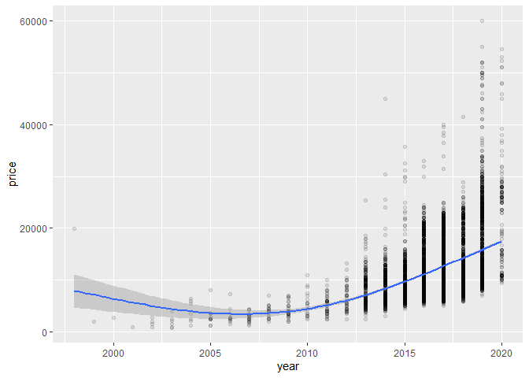

Actividad Ayudantia 9
================

# Actividad

Para la actividad de esta ayudantía tendrá que utilizar dos datasets, el
primer dataset que utilizar para la regresión lineal será la data de los
autos usados del fabricante toyota. El segundo dataset para la regresión
logística será el dataset de los vinos que hemos utilizado antes, donde
se busca clasificar según la calidad del vino. (Entrega límite:
6/06/2021 23:59)

## Cargar Librerias

``` r
library(tidyverse)
library(GGally)
library(regclass)
library(pROC)
library(rsample)
```

## Cargar Datos

``` r
setwd("C:/Users/amanh/OneDrive/Documentos/GitHub/Actividades-Ayudantia/Actividad9")
toyota <- read.csv("toyota.csv", sep = ",")
wine <- read.csv("winequality-red.csv", sep = ",")
```

# Limpieza de datos

## Búsqueda de datos faltantes

``` r
summary(toyota)
```

    ##     model                year          price       transmission      
    ##  Length:6738        Min.   :1998   Min.   :  850   Length:6738       
    ##  Class :character   1st Qu.:2016   1st Qu.: 8290   Class :character  
    ##  Mode  :character   Median :2017   Median :10795   Mode  :character  
    ##                     Mean   :2017   Mean   :12522                     
    ##                     3rd Qu.:2018   3rd Qu.:14995                     
    ##                     Max.   :2020   Max.   :59995                     
    ##     mileage         fuelType              tax             mpg        
    ##  Min.   :     2   Length:6738        Min.   :  0.0   Min.   :  2.80  
    ##  1st Qu.:  9446   Class :character   1st Qu.:  0.0   1st Qu.: 55.40  
    ##  Median : 18513   Mode  :character   Median :135.0   Median : 62.80  
    ##  Mean   : 22857                      Mean   : 94.7   Mean   : 63.04  
    ##  3rd Qu.: 31064                      3rd Qu.:145.0   3rd Qu.: 69.00  
    ##  Max.   :174419                      Max.   :565.0   Max.   :235.00  
    ##    engineSize   
    ##  Min.   :0.000  
    ##  1st Qu.:1.000  
    ##  Median :1.500  
    ##  Mean   :1.471  
    ##  3rd Qu.:1.800  
    ##  Max.   :4.500

Al aplicar la función “summary” podemos corroborar que ninguna base de
datos tiene valores faltantes, por ende, se procede con la actividad.

# Regresion Lineal con database Toyota

Lo que buscamos en esta primera actividad, es predecir el precio al que
venderíamos nuestro auto en caso de que este fuese un Toyota.

Para esto transformamos las variables del modelo, transmision y tipo de
combustible, a factores para trabajar con dichos valores como
“etiquetas”

``` r
toyota$model <- as.factor(toyota$model)
toyota$transmission <- as.factor(toyota$transmission)
toyota$fuelType <- as.factor(toyota$fuelType)
summary(toyota)
```

    ##       model           year          price          transmission 
    ##   Yaris  :2122   Min.   :1998   Min.   :  850   Automatic:2657  
    ##   Aygo   :1961   1st Qu.:2016   1st Qu.: 8290   Manual   :3826  
    ##   Auris  : 712   Median :2017   Median :10795   Other    :   1  
    ##   C-HR   : 479   Mean   :2017   Mean   :12522   Semi-Auto: 254  
    ##   RAV4   : 473   3rd Qu.:2018   3rd Qu.:14995                   
    ##   Corolla: 267   Max.   :2020   Max.   :59995                   
    ##  (Other) : 724                                                  
    ##     mileage         fuelType         tax             mpg        
    ##  Min.   :     2   Diesel: 503   Min.   :  0.0   Min.   :  2.80  
    ##  1st Qu.:  9446   Hybrid:2043   1st Qu.:  0.0   1st Qu.: 55.40  
    ##  Median : 18513   Other : 105   Median :135.0   Median : 62.80  
    ##  Mean   : 22857   Petrol:4087   Mean   : 94.7   Mean   : 63.04  
    ##  3rd Qu.: 31064                 3rd Qu.:145.0   3rd Qu.: 69.00  
    ##  Max.   :174419                 Max.   :565.0   Max.   :235.00  
    ##                                                                 
    ##    engineSize   
    ##  Min.   :0.000  
    ##  1st Qu.:1.000  
    ##  Median :1.500  
    ##  Mean   :1.471  
    ##  3rd Qu.:1.800  
    ##  Max.   :4.500  
    ## 

Podemos ver que un valor en el tamaño del motor de 0 no tiene mucho
sentido por lo que revisaremos cuantas observaciones presentan este este
valor, y en caso de haber datos con valor 0 los eliminamos de nuestro
dataset

``` r
toyota %>% filter(engineSize == 0) %>% nrow()
```

    ## [1] 6

``` r
toyota <- toyota %>%  filter(engineSize != 0)
summary(toyota)
```

    ##       model           year          price          transmission 
    ##   Yaris  :2120   Min.   :1998   Min.   :  850   Automatic:2656  
    ##   Aygo   :1958   1st Qu.:2016   1st Qu.: 8290   Manual   :3821  
    ##   Auris  : 712   Median :2017   Median :10795   Other    :   1  
    ##   C-HR   : 478   Mean   :2017   Mean   :12524   Semi-Auto: 254  
    ##   RAV4   : 473   3rd Qu.:2018   3rd Qu.:14995                   
    ##   Corolla: 267   Max.   :2020   Max.   :59995                   
    ##  (Other) : 724                                                  
    ##     mileage         fuelType         tax              mpg        
    ##  Min.   :     2   Diesel: 503   Min.   :  0.00   Min.   :  2.80  
    ##  1st Qu.:  9448   Hybrid:2041   1st Qu.:  0.00   1st Qu.: 55.40  
    ##  Median : 18516   Other : 105   Median :135.00   Median : 62.80  
    ##  Mean   : 22861   Petrol:4083   Mean   : 94.69   Mean   : 63.04  
    ##  3rd Qu.: 31061                 3rd Qu.:145.00   3rd Qu.: 69.00  
    ##  Max.   :174419                 Max.   :565.00   Max.   :235.00  
    ##                                                                  
    ##    engineSize   
    ##  Min.   :1.000  
    ##  1st Qu.:1.000  
    ##  Median :1.500  
    ##  Mean   :1.473  
    ##  3rd Qu.:1.800  
    ##  Max.   :4.500  
    ## 

Una vez ya listo nuestro datos, realizamos una visualizacion de nuestro
datos numericos, para ver la correlacion que pueda existir entre las
variables y la distribucion de los datos.

``` r
toyota %>% select(year, mileage, tax, mpg, engineSize, price) %>% 
  ggpairs(lower = list(continuous = wrap("points", alpha = 0.3, size = 0.5)))
```

<!-- -->

Lo que nos interesa ahora es elegir aquellas variables que presenten una
alta correlación con el precio (da lo mismo el signo de esta) para de
esta manera entregar una predicción lo más certera

Revisamos como se distribuyen los datos que pasamos a factor en relacion
al precio, para esto utilizamos los boxplot lo que tambien nos ayudara a
ver si existen valores atipicos que puedan alterar nuestro modelo.

``` r
toyota %>% ggplot(aes(transmission, price)) +geom_boxplot()
```

<!-- -->

``` r
toyota %>% ggplot(aes(fuelType, price)) + geom_boxplot()
```

<!-- -->

``` r
toyota %>% mutate(model = reorder(model, price)) %>% ggplot(aes(price, model)) + geom_boxplot()
```

<!-- -->

Podemos ver que hay diversos datos atípicos, todo esto por medio de
inspección visual.

Graficamos las cuatro variables con mayores valores, para ver como se
distribuyen de acuerdo al precio.

``` r
toyota %>% ggplot(aes(mileage, price)) +
  geom_point(alpha = .1) +
  stat_smooth(method = "gam", formula = y ~ s(x, k=3))
```

<!-- -->

``` r
toyota %>% ggplot(aes(year, price)) +
  geom_point(alpha = .1) +
  stat_smooth(method = "gam", formula = y ~ s(x, k=3))
```

<!-- -->

``` r
toyota %>% ggplot(aes(mpg, price)) +
  geom_point(alpha = .1) +
  stat_smooth(method = "gam", formula = y ~ s(x, k=3))
```

<!-- -->

``` r
toyota %>% ggplot(aes(engineSize, price)) +
  geom_point(alpha = .1) +
  stat_smooth(method = "gam", formula = y ~ s(x, k=3))
```

<!-- -->

``` r
toyota %>% filter(., year >= 2005) %>% ggplot(aes(year, price)) +
  geom_point(alpha = .1) +
  stat_smooth(method = "gam", formula = y ~ s(x, k=3))
```

<!-- -->

Escalamos los datos antes de ralizar el analisis de regresion

``` r
toyota_sca <- toyota
toyota_sca[,c(2,3,5,7,8,9)] <- scale(toyota_sca[,c(2,3,5,7,8,9)])
toyota_sca %>%  head()
```

    ##   model       year     price transmission     mileage fuelType       tax
    ## 1  GT86 -0.3390016 0.5476207       Manual  0.06418306   Petrol 2.3050056
    ## 2  GT86  0.1146177 0.5468329       Manual -0.22202169   Petrol 0.6808592
    ## 3  GT86 -0.7926209 0.2322067       Manual  0.24090429   Petrol 2.3050056
    ## 4  GT86  0.1146177 1.0199538       Manual -0.42483283   Petrol 0.7485320
    ## 5  GT86  0.1146177 0.7836297       Manual  0.70179118   Petrol 0.6808592
    ## 6  GT86  0.1146177 0.5473056       Manual  0.21214788   Petrol 2.2373329
    ##         mpg engineSize
    ## 1 -1.694806   1.214812
    ## 2 -1.694806   1.214812
    ## 3 -1.694806   1.214812
    ## 4 -1.694806   1.214812
    ## 5 -1.694806   1.214812
    ## 6 -1.694806   1.214812

## Regresion simple: tamaño motor para predecir precio

``` r
reg_simp <- lm(price ~ engineSize, data = toyota)
summary(reg_simp)
```

    ## 
    ## Call:
    ## lm(formula = price ~ engineSize, data = toyota)
    ## 
    ## Residuals:
    ##      Min       1Q   Median       3Q      Max 
    ## -22860.9  -2245.0   -476.9   1733.1  31159.1 
    ## 
    ## Coefficients:
    ##             Estimate Std. Error t value Pr(>|t|)    
    ## (Intercept)  -3202.6      186.9  -17.14   <2e-16 ***
    ## engineSize   10679.5      121.7   87.74   <2e-16 ***
    ## ---
    ## Signif. codes:  0 '***' 0.001 '**' 0.01 '*' 0.05 '.' 0.1 ' ' 1
    ## 
    ## Residual standard error: 4335 on 6730 degrees of freedom
    ## Multiple R-squared:  0.5336, Adjusted R-squared:  0.5335 
    ## F-statistic:  7698 on 1 and 6730 DF,  p-value: < 2.2e-16

Solo se explica el 53% del modelo. Los resultados de la regresion nos
indican que los valores de los parametros son -3202.6 para el intercepto
y 10679.5 para el coeficiente asociado a la variable del tamaño del
motor.

## Regresion multiple con el tamaño del motor y el año para predecir el precio

``` r
reg_mult <- lm(price ~ engineSize + year*mileage, data = toyota_sca)
summary(reg_mult)
```

    ## 
    ## Call:
    ## lm(formula = price ~ engineSize + year * mileage, data = toyota_sca)
    ## 
    ## Residuals:
    ##     Min      1Q  Median      3Q     Max 
    ## -1.8963 -0.2812 -0.0483  0.2135  4.2299 
    ## 
    ## Coefficients:
    ##               Estimate Std. Error t value Pr(>|t|)    
    ## (Intercept)  -0.025365   0.006268  -4.047 5.25e-05 ***
    ## engineSize    0.782020   0.006023 129.831  < 2e-16 ***
    ## year          0.318898   0.009085  35.103  < 2e-16 ***
    ## mileage      -0.255628   0.008967 -28.507  < 2e-16 ***
    ## year:mileage -0.034854   0.003055 -11.409  < 2e-16 ***
    ## ---
    ## Signif. codes:  0 '***' 0.001 '**' 0.01 '*' 0.05 '.' 0.1 ' ' 1
    ## 
    ## Residual standard error: 0.4808 on 6727 degrees of freedom
    ## Multiple R-squared:  0.7689, Adjusted R-squared:  0.7688 
    ## F-statistic:  5597 on 4 and 6727 DF,  p-value: < 2.2e-16

Se aprecia un mejor rendimiento, al incluir una nueva variable. El
modelo dado como resultado, que ahora se explica un 76,8% de la
varianza. Ademas, todas las variables resultan ser significativas para
el modelo.

## VIF

Revisamos el valor del factor de inflacion de la varianza, este factor
nos permite entender la colinealidad de los datos. Un VIF por encima de
4 o una tolerancia por debajo de 0,25 indica que podría existir
multicolinealidad y se requiere más investigación.

``` r
VIF(reg_mult)
```

    ##   engineSize         year      mileage year:mileage 
    ##     1.056272     2.402696     2.341074     1.590928

Los valores referentes al estudio del VIF no presentan
multicolinealidad, ya que son menores a 0,25. Por ende, se concluye este
modelo.

# Regresion Logistica con data de Vinos

Lo que buscamos en esta segunda actividad, es predecir calidad del vino
a partir de características propias de este producto.

## Búsqueda de datos faltantes

``` r
summary(wine)
```

    ##  fixed.acidity   volatile.acidity  citric.acid    residual.sugar  
    ##  Min.   : 4.60   Min.   :0.1200   Min.   :0.000   Min.   : 0.900  
    ##  1st Qu.: 7.10   1st Qu.:0.3900   1st Qu.:0.090   1st Qu.: 1.900  
    ##  Median : 7.90   Median :0.5200   Median :0.260   Median : 2.200  
    ##  Mean   : 8.32   Mean   :0.5278   Mean   :0.271   Mean   : 2.539  
    ##  3rd Qu.: 9.20   3rd Qu.:0.6400   3rd Qu.:0.420   3rd Qu.: 2.600  
    ##  Max.   :15.90   Max.   :1.5800   Max.   :1.000   Max.   :15.500  
    ##    chlorides       free.sulfur.dioxide total.sulfur.dioxide    density      
    ##  Min.   :0.01200   Min.   : 1.00       Min.   :  6.00       Min.   :0.9901  
    ##  1st Qu.:0.07000   1st Qu.: 7.00       1st Qu.: 22.00       1st Qu.:0.9956  
    ##  Median :0.07900   Median :14.00       Median : 38.00       Median :0.9968  
    ##  Mean   :0.08747   Mean   :15.87       Mean   : 46.47       Mean   :0.9967  
    ##  3rd Qu.:0.09000   3rd Qu.:21.00       3rd Qu.: 62.00       3rd Qu.:0.9978  
    ##  Max.   :0.61100   Max.   :72.00       Max.   :289.00       Max.   :1.0037  
    ##        pH          sulphates         alcohol         quality     
    ##  Min.   :2.740   Min.   :0.3300   Min.   : 8.40   Min.   :3.000  
    ##  1st Qu.:3.210   1st Qu.:0.5500   1st Qu.: 9.50   1st Qu.:5.000  
    ##  Median :3.310   Median :0.6200   Median :10.20   Median :6.000  
    ##  Mean   :3.311   Mean   :0.6581   Mean   :10.42   Mean   :5.636  
    ##  3rd Qu.:3.400   3rd Qu.:0.7300   3rd Qu.:11.10   3rd Qu.:6.000  
    ##  Max.   :4.010   Max.   :2.0000   Max.   :14.90   Max.   :8.000

Al aplicar la función “summary” podemos corroborar que ninguna base de
datos tiene valores faltantes, por ende, se procede con la actividad.

## Visualización de la data

De comienzo, al realizar inspección visual sobre la base de datos de
vinos, apreicamos que hay una variable llamada “quality”. Por ende,
procedemos con graficar esta para ver de que manera se comporta.

``` r
glimpse(wine)
```

    ## Rows: 1,599
    ## Columns: 12
    ## $ fixed.acidity        <dbl> 7.4, 7.8, 7.8, 11.2, 7.4, 7.4, 7.9, 7.3, 7.8, 7.5~
    ## $ volatile.acidity     <dbl> 0.700, 0.880, 0.760, 0.280, 0.700, 0.660, 0.600, ~
    ## $ citric.acid          <dbl> 0.00, 0.00, 0.04, 0.56, 0.00, 0.00, 0.06, 0.00, 0~
    ## $ residual.sugar       <dbl> 1.9, 2.6, 2.3, 1.9, 1.9, 1.8, 1.6, 1.2, 2.0, 6.1,~
    ## $ chlorides            <dbl> 0.076, 0.098, 0.092, 0.075, 0.076, 0.075, 0.069, ~
    ## $ free.sulfur.dioxide  <dbl> 11, 25, 15, 17, 11, 13, 15, 15, 9, 17, 15, 17, 16~
    ## $ total.sulfur.dioxide <dbl> 34, 67, 54, 60, 34, 40, 59, 21, 18, 102, 65, 102,~
    ## $ density              <dbl> 0.9978, 0.9968, 0.9970, 0.9980, 0.9978, 0.9978, 0~
    ## $ pH                   <dbl> 3.51, 3.20, 3.26, 3.16, 3.51, 3.51, 3.30, 3.39, 3~
    ## $ sulphates            <dbl> 0.56, 0.68, 0.65, 0.58, 0.56, 0.56, 0.46, 0.47, 0~
    ## $ alcohol              <dbl> 9.4, 9.8, 9.8, 9.8, 9.4, 9.4, 9.4, 10.0, 9.5, 10.~
    ## $ quality              <int> 5, 5, 5, 6, 5, 5, 5, 7, 7, 5, 5, 5, 5, 5, 5, 5, 7~

``` r
attach(wine)
ggplot(wine,aes(x=factor(quality))) +
  geom_bar(col ="black",fill="#993333",alpha=0.5) +
  theme(axis.text.x = element_text(face="bold", size=10)) +
  scale_x_discrete("Calidad") +
  scale_y_continuous("Count")
```

<!-- -->

Podemos ver que existen muchos vinos con una calidad “promedio”, hasta
cierto punto que distribuyen “normal”, pero no es tan así. De todas
maneras se procedera ahora con hacer el análisis de aquellas variables
que le dan la calidad que tiene a cada vino.

## Fallo al realizar el análisis según ayudantía

{r} set.seed(369) summary(wine) glm.fit &lt;- glm(quality\_01 \~ pH,
data = wine , family = “binomial”) summary(glm.fit)

Al hacer funcionar esta línea en un chunk, nos percatamos que para hacer
funcionar este código es necesario tener una variable para poder separar
de acuerdo a un rango la calidad. Ya que el modelo requiere que sean
varibles en 0 y 1. Esto fue visto en ayudantía, por ende se procede a
realizar una conversión.

## Falla arreglada para seguir con el análisis

## Segmentar variable Quality

Para esto se tomara la mitad del intervalo entre nota minima y maxima.
De esta manera podremos generar la variable necesaria para el analisis.

``` r
summary(wine)
```

    ##  fixed.acidity   volatile.acidity  citric.acid    residual.sugar  
    ##  Min.   : 4.60   Min.   :0.1200   Min.   :0.000   Min.   : 0.900  
    ##  1st Qu.: 7.10   1st Qu.:0.3900   1st Qu.:0.090   1st Qu.: 1.900  
    ##  Median : 7.90   Median :0.5200   Median :0.260   Median : 2.200  
    ##  Mean   : 8.32   Mean   :0.5278   Mean   :0.271   Mean   : 2.539  
    ##  3rd Qu.: 9.20   3rd Qu.:0.6400   3rd Qu.:0.420   3rd Qu.: 2.600  
    ##  Max.   :15.90   Max.   :1.5800   Max.   :1.000   Max.   :15.500  
    ##    chlorides       free.sulfur.dioxide total.sulfur.dioxide    density      
    ##  Min.   :0.01200   Min.   : 1.00       Min.   :  6.00       Min.   :0.9901  
    ##  1st Qu.:0.07000   1st Qu.: 7.00       1st Qu.: 22.00       1st Qu.:0.9956  
    ##  Median :0.07900   Median :14.00       Median : 38.00       Median :0.9968  
    ##  Mean   :0.08747   Mean   :15.87       Mean   : 46.47       Mean   :0.9967  
    ##  3rd Qu.:0.09000   3rd Qu.:21.00       3rd Qu.: 62.00       3rd Qu.:0.9978  
    ##  Max.   :0.61100   Max.   :72.00       Max.   :289.00       Max.   :1.0037  
    ##        pH          sulphates         alcohol         quality     
    ##  Min.   :2.740   Min.   :0.3300   Min.   : 8.40   Min.   :3.000  
    ##  1st Qu.:3.210   1st Qu.:0.5500   1st Qu.: 9.50   1st Qu.:5.000  
    ##  Median :3.310   Median :0.6200   Median :10.20   Median :6.000  
    ##  Mean   :3.311   Mean   :0.6581   Mean   :10.42   Mean   :5.636  
    ##  3rd Qu.:3.400   3rd Qu.:0.7300   3rd Qu.:11.10   3rd Qu.:6.000  
    ##  Max.   :4.010   Max.   :2.0000   Max.   :14.90   Max.   :8.000

``` r
for(i in 1:dim(wine)){
  if (quality[i]>= 5.5)
     wine$quality_01[i]=1
  if (quality[i]< 5.5)
    wine$quality_01[i]=0
}
```

    ## Warning in 1:dim(wine): numerical expression has 2 elements: only the first used

``` r
attach(wine)
```

    ## The following objects are masked from wine (pos = 3):
    ## 
    ##     alcohol, chlorides, citric.acid, density, fixed.acidity,
    ##     free.sulfur.dioxide, pH, quality, residual.sugar, sulphates,
    ##     total.sulfur.dioxide, volatile.acidity

## Regresión Logistica Simple: predecir Calidad por el pH

Decido utilizar esta varible, ya que creo que a partir del pH de un
vino, es posible de alguna manera determinar, o dar luces respecto de su
calidad.

``` r
set.seed(369)
summary(wine)
```

    ##  fixed.acidity   volatile.acidity  citric.acid    residual.sugar  
    ##  Min.   : 4.60   Min.   :0.1200   Min.   :0.000   Min.   : 0.900  
    ##  1st Qu.: 7.10   1st Qu.:0.3900   1st Qu.:0.090   1st Qu.: 1.900  
    ##  Median : 7.90   Median :0.5200   Median :0.260   Median : 2.200  
    ##  Mean   : 8.32   Mean   :0.5278   Mean   :0.271   Mean   : 2.539  
    ##  3rd Qu.: 9.20   3rd Qu.:0.6400   3rd Qu.:0.420   3rd Qu.: 2.600  
    ##  Max.   :15.90   Max.   :1.5800   Max.   :1.000   Max.   :15.500  
    ##    chlorides       free.sulfur.dioxide total.sulfur.dioxide    density      
    ##  Min.   :0.01200   Min.   : 1.00       Min.   :  6.00       Min.   :0.9901  
    ##  1st Qu.:0.07000   1st Qu.: 7.00       1st Qu.: 22.00       1st Qu.:0.9956  
    ##  Median :0.07900   Median :14.00       Median : 38.00       Median :0.9968  
    ##  Mean   :0.08747   Mean   :15.87       Mean   : 46.47       Mean   :0.9967  
    ##  3rd Qu.:0.09000   3rd Qu.:21.00       3rd Qu.: 62.00       3rd Qu.:0.9978  
    ##  Max.   :0.61100   Max.   :72.00       Max.   :289.00       Max.   :1.0037  
    ##        pH          sulphates         alcohol         quality     
    ##  Min.   :2.740   Min.   :0.3300   Min.   : 8.40   Min.   :3.000  
    ##  1st Qu.:3.210   1st Qu.:0.5500   1st Qu.: 9.50   1st Qu.:5.000  
    ##  Median :3.310   Median :0.6200   Median :10.20   Median :6.000  
    ##  Mean   :3.311   Mean   :0.6581   Mean   :10.42   Mean   :5.636  
    ##  3rd Qu.:3.400   3rd Qu.:0.7300   3rd Qu.:11.10   3rd Qu.:6.000  
    ##  Max.   :4.010   Max.   :2.0000   Max.   :14.90   Max.   :8.000  
    ##    quality_01    
    ##  Min.   :0.0000  
    ##  1st Qu.:0.0000  
    ##  Median :1.0000  
    ##  Mean   :0.5347  
    ##  3rd Qu.:1.0000  
    ##  Max.   :1.0000

``` r
glm.fit <- glm(quality_01 ~ pH, data = wine , family = "binomial")
summary(glm.fit)
```

    ## 
    ## Call:
    ## glm(formula = quality_01 ~ pH, family = "binomial", data = wine)
    ## 
    ## Deviance Residuals: 
    ##    Min      1Q  Median      3Q     Max  
    ## -1.247  -1.237   1.115   1.119   1.131  
    ## 
    ## Coefficients:
    ##             Estimate Std. Error z value Pr(>|z|)
    ## (Intercept)   0.2794     1.0768   0.260    0.795
    ## pH           -0.0424     0.3248  -0.131    0.896
    ## 
    ## (Dispersion parameter for binomial family taken to be 1)
    ## 
    ##     Null deviance: 2209  on 1598  degrees of freedom
    ## Residual deviance: 2209  on 1597  degrees of freedom
    ## AIC: 2213
    ## 
    ## Number of Fisher Scoring iterations: 3

## Curva ROC

``` r
prob <- predict(glm.fit, type = c("response"))
wine$prob <- prob
curva_roc <- roc(quality_01 ~ prob, data = wine)
```

    ## Setting levels: control = 0, case = 1

    ## Setting direction: controls < cases

``` r
plot(curva_roc)
```

<!-- -->

``` r
auc(curva_roc)
```

    ## Area under the curve: 0.503

La curva ROC muestra un valor de 50%, lo cual indica una explicación que
deja bastante desear, ya que nos interesaría que este valor estuviese
cercano a algo como 70%

## Regresión Logistica Multiple para predecir Calidad desde todas las variables restantes

Para mejorar, o intentarlo, utilizaremos el resto de variables presentes
en la base de datos.

``` r
wine$prob <- NULL
modelo_log_multi <- glm(quality_01 ~ alcohol + sulphates  + pH + density + total.sulfur.dioxide + free.sulfur.dioxide + chlorides + residual.sugar + citric.acid + volatile.acidity, wine, family = "binomial")
summary(modelo_log_multi)
```

    ## 
    ## Call:
    ## glm(formula = quality_01 ~ alcohol + sulphates + pH + density + 
    ##     total.sulfur.dioxide + free.sulfur.dioxide + chlorides + 
    ##     residual.sugar + citric.acid + volatile.acidity, family = "binomial", 
    ##     data = wine)
    ## 
    ## Deviance Residuals: 
    ##     Min       1Q   Median       3Q      Max  
    ## -3.2543  -0.8439   0.3219   0.8368   2.3509  
    ## 
    ## Coefficients:
    ##                        Estimate Std. Error z value Pr(>|z|)    
    ## (Intercept)          -41.445194  50.905509  -0.814  0.41555    
    ## alcohol                0.939250   0.090415  10.388  < 2e-16 ***
    ## sulphates              2.702183   0.447817   6.034 1.60e-09 ***
    ## pH                    -1.110919   0.487590  -2.278  0.02270 *  
    ## density               36.656568  50.718213   0.723  0.46983    
    ## total.sulfur.dioxide  -0.017337   0.002819  -6.151 7.72e-10 ***
    ## free.sulfur.dioxide    0.023612   0.008164   2.892  0.00383 ** 
    ## chlorides             -4.447433   1.522762  -2.921  0.00349 ** 
    ## residual.sugar         0.022506   0.048312   0.466  0.64133    
    ## citric.acid           -1.001091   0.526949  -1.900  0.05746 .  
    ## volatile.acidity      -3.241689   0.487581  -6.649 2.96e-11 ***
    ## ---
    ## Signif. codes:  0 '***' 0.001 '**' 0.01 '*' 0.05 '.' 0.1 ' ' 1
    ## 
    ## (Dispersion parameter for binomial family taken to be 1)
    ## 
    ##     Null deviance: 2209.0  on 1598  degrees of freedom
    ## Residual deviance: 1657.5  on 1588  degrees of freedom
    ## AIC: 1679.5
    ## 
    ## Number of Fisher Scoring iterations: 4

``` r
prob_multi <- predict(modelo_log_multi, type = c("response"))
wine$prob_multi <- prob_multi
curva_roc_multi <- roc(quality_01 ~ prob_multi, data = wine)
```

    ## Setting levels: control = 0, case = 1

    ## Setting direction: controls < cases

``` r
plot(curva_roc_multi)
```

<!-- -->

``` r
auc(curva_roc_multi)
```

    ## Area under the curve: 0.8213

Vemos una mejora iimportante, ya que el modelo se explica en un 82%.

## Ocupando Modelos de Entrenamiento

``` r
set.seed(369)
data_split <- initial_split(wine,prop = 0.7,strata = NULL)
train_data <- training(data_split) %>% as.data.frame() 
test_data <- testing(data_split) %>%  as.data.frame()
modelo_log_multi1 <- glm(quality_01 ~ alcohol + sulphates  + pH + density + total.sulfur.dioxide + free.sulfur.dioxide + chlorides + residual.sugar + citric.acid + volatile.acidity, wine, family = "binomial")
summary(modelo_log_multi1)
```

    ## 
    ## Call:
    ## glm(formula = quality_01 ~ alcohol + sulphates + pH + density + 
    ##     total.sulfur.dioxide + free.sulfur.dioxide + chlorides + 
    ##     residual.sugar + citric.acid + volatile.acidity, family = "binomial", 
    ##     data = wine)
    ## 
    ## Deviance Residuals: 
    ##     Min       1Q   Median       3Q      Max  
    ## -3.2543  -0.8439   0.3219   0.8368   2.3509  
    ## 
    ## Coefficients:
    ##                        Estimate Std. Error z value Pr(>|z|)    
    ## (Intercept)          -41.445194  50.905509  -0.814  0.41555    
    ## alcohol                0.939250   0.090415  10.388  < 2e-16 ***
    ## sulphates              2.702183   0.447817   6.034 1.60e-09 ***
    ## pH                    -1.110919   0.487590  -2.278  0.02270 *  
    ## density               36.656568  50.718213   0.723  0.46983    
    ## total.sulfur.dioxide  -0.017337   0.002819  -6.151 7.72e-10 ***
    ## free.sulfur.dioxide    0.023612   0.008164   2.892  0.00383 ** 
    ## chlorides             -4.447433   1.522762  -2.921  0.00349 ** 
    ## residual.sugar         0.022506   0.048312   0.466  0.64133    
    ## citric.acid           -1.001091   0.526949  -1.900  0.05746 .  
    ## volatile.acidity      -3.241689   0.487581  -6.649 2.96e-11 ***
    ## ---
    ## Signif. codes:  0 '***' 0.001 '**' 0.01 '*' 0.05 '.' 0.1 ' ' 1
    ## 
    ## (Dispersion parameter for binomial family taken to be 1)
    ## 
    ##     Null deviance: 2209.0  on 1598  degrees of freedom
    ## Residual deviance: 1657.5  on 1588  degrees of freedom
    ## AIC: 1679.5
    ## 
    ## Number of Fisher Scoring iterations: 4

``` r
test_data$prob_multi <- predict(modelo_log_multi1, test_data, type = c("response"))
auc(roc(quality_01 ~ prob_multi, data = test_data))
```

    ## Setting levels: control = 0, case = 1

    ## Setting direction: controls < cases

    ## Area under the curve: 0.8467

La predicción mejora dado que el modelo se explica en un 85%, lo cual es
mejor que lo anterior.
